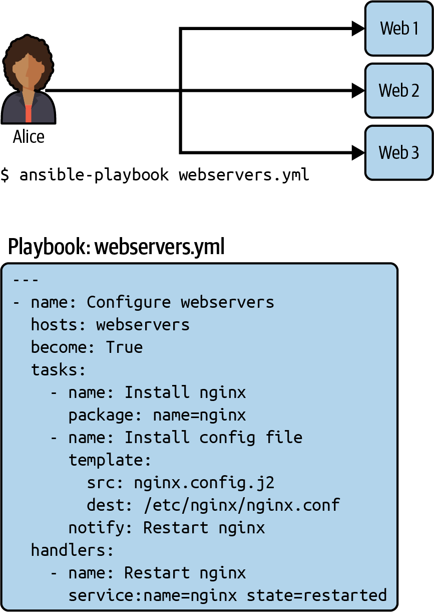

## How has the shift to cloud-based infrastructure changed the way IT professionals deploy and manage software applications, and how does Ansible help streamline this process?
- **Shift in IT Industry**: IT is evolving from single-machine software installations to cloud-based solutions.  
- **Modern Software Deployment**: Applications now consist of multiple distributed services (web servers, databases, queues, caching, etc.).  
- **Redundancy & Resilience**: IT systems must handle failures gracefully with proper redundancies.  
- **Supporting Services**: Logging, monitoring, analytics, and third-party integrations are crucial.  
- **Manual Setup Challenges**: Configuring servers manually is tedious, error-prone, and inefficient.  
- **Need for Automation**: Configuration management tools like Ansible streamline deployments.  
- **Ansible as a Solution**: Ideal for both developers and sysadmins to automate and manage infrastructure efficiently.  


## **Ansible Versions & Evolution**  
- Example code tested across multiple Ansible versions.  
- Latest version at the time: **Ansible 5.9.0**, while **Ansible Tower** includes **2.9.27**.  
- **Ansible 2.8** reached **End of Life** on **April 13, 2021**.  
- Ongoing evolution of Ansible is expected.  

## **Ansible Content Organization**  
- Due to its large scale, Ansible content is divided into three parts:  
  - **Core components** (by Ansible team).  
  - **Certified content** (by Red Hat’s business partners).  
  - **Community content** (by global contributors).  
- **Ansible 2.9** had many built-in features; later versions are more modular and maintainable.  

## **Version Compatibility**  
- Examples in the book should work across different Ansible versions.  
- **Version updates require testing**, which is covered in Chapter 14.  

## **Origin of the Name "Ansible"**  
- Inspired by a **science-fiction concept** of **faster-than-light communication**.  
- First appeared in **Ursula K. Le Guin’s** *Rocannon’s World* (1966).  
- **Michael DeHaan**, Ansible’s cofounder, took the name from *Ender’s Game* (1985) by **Orson Scott Card**.  
- The ansible in *Ender’s Game* controlled **many remote ships**, similar to how Ansible manages remote servers.


# How Ansible works

- digram below show how ansible work
- Alice use Ansible to configure three ubuntu-based eb server to run NGINX
-  she has written a script called webservers.yml.
- In Ansible a script is called playbook describe which hosts ( what Ansible call remote servr)  to configure an ordered list of tasks to perform on those hosts.
- the host are web1,.., web3
- thre task are
	- Instrall NGINX
	- Generate a NGINX configuration file
	- Copy over the security certificate 
	- Start the NGINX services



we can run this playbook with

```bash
$  ansible-playbook webservers.yml
```

- Ansible gonna connect in parallel with the servers list in webservers.
- It gonna execute the first task (installing nginx)
- the task look like this

```yml
- name: Install nginx
  package:
    name: nginx
```

Ansible will do the following:  

- Generate a Python script that installs the NGINX package.  
- Copy the script to `web1`, `web2`, and `web3`.  
- Execute the script on `web1`, `web2`, and `web3`.  
- Wait for the script to complete execution on all hosts.  

Ansible will then move to the next task in the list and go through these same four steps.  

### Important Notes:  
- Ansible runs each task **in parallel** across all hosts.  
- Ansible **waits** until all hosts have completed a task before moving to the next one.  
- Ansible runs the tasks **in the order** that you specify them.  

## What's So Great About Ansible?

- **Simple**  
  - Minimal setup and easy learning curve.
  - Uses YAML syntax and Jinja2 templating, making it human-readable.
  - Easy to audit with built-in logging.
  - No need for additional software on remote hosts (just SSH/Python for Linux, WinRM for Windows).
  - Scales down well to modest hardware (e.g., Raspberry Pi).
  - Easy to share playbooks through roles and collections.

- **System Abstraction**  
  - Ansible abstracts system resources like files, users, services, and packages into simple modules.
  - Can work across different OS types, reducing complexity in managing servers.

- **Top-to-Bottom Tasks**  
  - Ansible modules work to bring servers to a desired state in a single run, no need for multiple runs.

- **Powerful**  
  - A wide range of modules for various tasks, enabling high productivity.
  - Push-based approach: Control when changes happen, unlike pull-based systems like Chef and Puppet.
  - Supports multitier orchestration (coordinating different server groups).
  - **Masterless system**, doesn’t require a central server for operation.

- **Pluggable and Embeddable**  
  - Allows integration with other systems like Kubernetes.
  - Custom plugins and modules can be written in Python.

- **Works with Many Systems**  
  - Modules cover a range of system administration tasks (e.g., cloud, networking, monitoring, database, packaging, etc.).

- **Scalable**  
  - Used by large enterprises with tens of thousands of nodes.
  - Optimized SSH multiplexing for large environments.

- **Secure**  
  - Helps improve system security and maintain compliance standards.
  - Playbooks serve as executable documentation, ensuring reproducibility.
  - Encrypted variables with **ansible-vault** for sensitive data.
  - Secure transport via SSH and WinRM.
  - **Idempotent** operations to avoid unintended changes when rerunning playbooks.
  - No agents or daemons, reducing attack surface.

### Ansible, Inc. and the Relationship to Ansible  
- Ansible is both the software and the company behind it, which provides training, consulting, and a web-based management tool called Ansible Tower (now part of Red Hat after acquisition).


## Is Ansible Too Simple?

- **Misconception**: Some people compare Ansible to "a for-loop over SSH scripts," which may make it seem too simple.
- **Ansible's True Power**: 
  - More than just shell scripts, it includes advanced functionality.
  - Offers **idempotence** to ensure consistency on each run.
  - Excellent **templating** support for dynamic content.
  - Allows for defining **variables at different scopes** for flexibility.
- **Why Choose Ansible**: It's preferred over shell scripts for configuration management, especially for nontrivial tasks that would be hard to maintain with shell scripting.

Here are the key points:

### What Isn’t Covered

- **Scope of the Book**:
  - Not an exhaustive guide to Ansible.
  - Focuses on getting users up to speed quickly and covering tasks not obvious from official documentation.
- **Modules**:
  - With over 3,500 modules, not all are covered in detail.
  - Use `ansible-doc` to access the reference documentation and module index.
- **Jinja2 Templates**:
  - Only basic features of Jinja2 are covered.
  - For more advanced usage, refer to the official Jinja2 documentation.
- **Older Linux Features**:
  - Some features for older Linux versions are not discussed.
- **Book Length**:
  - Some Ansible features are excluded to keep the book manageable.
  - Users are encouraged to explore the official documentation for further information.

### Moving Forward
- The book introduces Ansible concepts and how it interacts with remote servers.
- The following chapters focus on hands-on practice with Ansible.


