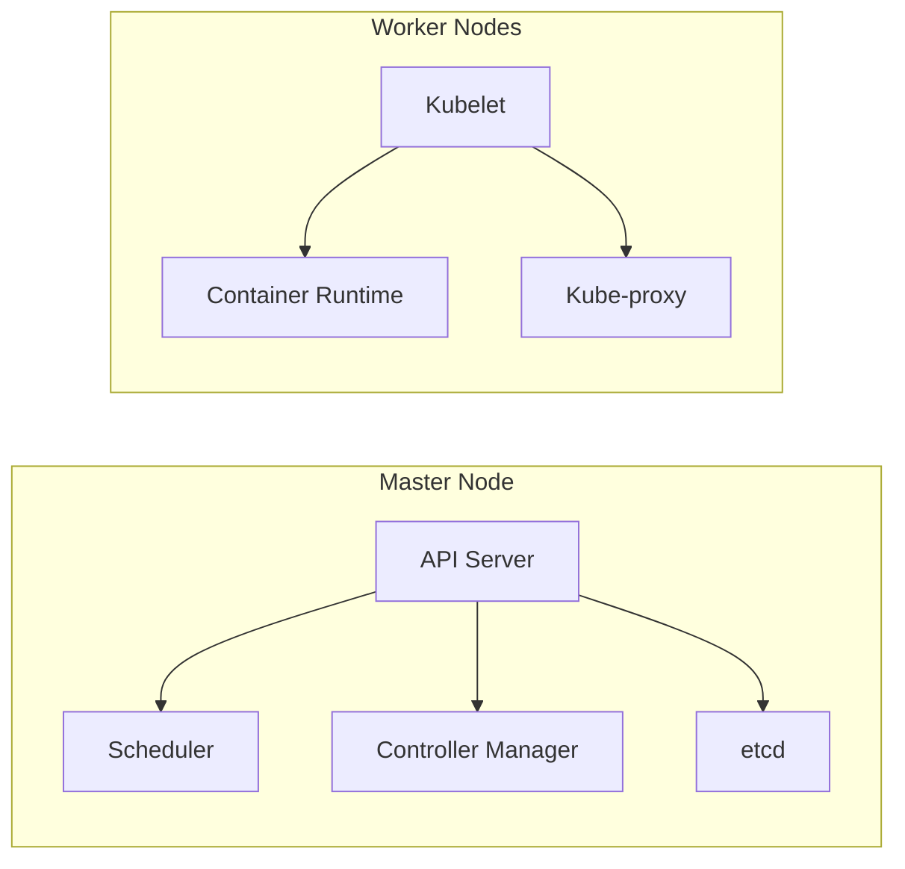

# Official Kubernetes definition 
- open source container orchestration tool
- Developed by Google
- Help manage containerized applications in different deployment environments
# Neeed for container orchestration tool
- Trend from Monolith to  Microservice
- Increases usage containers
# What feature do orchestration tools offer ?
- High Availability or no downtime 
- Scalability or High performance
- Disaster recovery - backup and restore*
# Kubernetes Architecture 
Kubernetes architecture consists of several key components that work together to manage and orchestrate containerized applications:
**Master Node** (control plane 🎛️):
- **API Server**: The central control plane that exposes the Kubernetes API and handles all internal and external communications.
- **Scheduler**: Responsible for assigning Pods to appropriate Nodes based on resource availability and constraints.
- **Controller Manager**: Manages various controllers that regulate the state of the cluster, such as the Replication Controller, Node Controller, and Endpoint Controller.
- **etcd**: A distributed key-value store that holds the current state of the cluster.
**Worker Nodes** 💻:
- **Kubelet**: The primary "node agent" that runs on each Node and is responsible for managing the Pods and their containers.
- **Container Runtime**: The software responsible for running containers, such as Docker or containerd.
- **Kube-proxy**: Manages network rules on each Node, enabling communication between Pods and the outside world.
**Virtual Network 🌐**:
- Kubernetes uses a virtual network to provide connectivity between Pods, Services, and the outside world.,
- This virtual network is implemented using various networking plugins, such as Flannel, Calico, or Weave Net.
- The virtual network ensures that each Pod has a unique, routable IP address, and that Pods can communicate with each other and with the outside world.
- Kube-proxy plays a crucial role in managing the network rules and forwarding traffic to the appropriate Pods.
- The virtual network also supports features like Service discovery, load balancing, and Network Policies to control and secure the network traffic.
By providing a reliable and scalable virtual network, Kubernetes simplifies the networking challenges often encountered in container-based environments, allowing developers to focus on building and deploying their applications.

The Kubernetes architecture follows a declarative model, where users define the desired state of the system, and the control plane components work to maintain that state. This design ensures high availability, scalability, and resilience of the deployed applications.