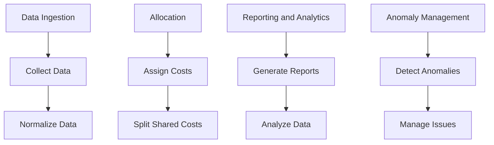

The Microsoft Learn module on understanding cloud usage and costs covers four main areas:

1. **Data Ingestion**: Collecting and normalizing data from various sources for analysis.
2. **Allocation**: Assigning and splitting shared cloud costs using accounts, tags, labels, etc.
3. **Reporting and Analytics**: Analyzing cloud data to identify cost optimization opportunities.
4. **Anomaly Management**: Detecting and managing unexpected cost and usage irregularities to mitigate risks.

Let's break down the information from the Microsoft Learn module into simple ideas, like a story for a 5-year-old:

### Data Ingestion

Imagine you have a toy box where you put all your toys from different places. This is like collecting data from various sources. Just like sorting toys, you need to organize this data so you can understand it.

### Allocation

When you share a big cookie with friends, you decide how much each friend gets. In cloud usage, you do the same by dividing costs among different teams or projects, so everyone knows their part of the bill.

### Reporting and Analytics

Think of a treasure map that helps you find hidden treasures. Reports and analytics are like this map, showing where you spend too much money and where you can save.

### Anomaly Management

Sometimes, you find something unexpected, like a toy in the wrong place. Anomalies in cloud costs are like these surprises. You need to spot and fix them so you don’t waste money.

By understanding these steps, you can manage cloud costs wisely, just like keeping your toys and cookie-sharing fair and organized.

### Explanation:

- **Data Ingestion**: Collect and organize data.
    - **Collect Data**: Gather data from different cloud services.
    - **Normalize Data**: Organize data in a standard format.
- **Allocation**: Distribute costs.
    - **Assign Costs**: Allocate costs to specific teams or projects using tags and labels.
    - **Split Shared Costs**: Divide shared resource costs among users.
- **Reporting and Analytics**: Create and analyze reports.
    - **Generate Reports**: Create reports to track spending.
    - **Analyze Data**: Use tools to find cost-saving opportunities.
- **Anomaly Management**: Handle unexpected costs.
    - **Detect Anomalies**: Set alerts for unusual spending.
    - **Manage Issues**: Investigate and resolve unexpected costs.

These steps help manage cloud costs efficiently