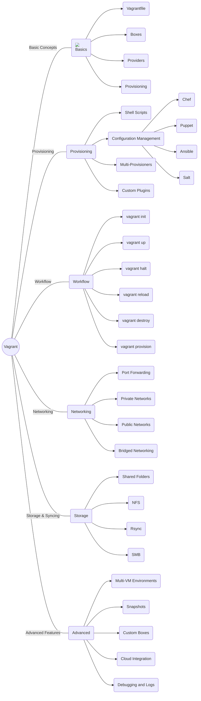

# Table of Contents

1. [[1. An Introduction to Vagrant|1 - An Introduction to Vagrant]]  
2. [[2. Your First Vagrant Machine|2 - Your First Vagrant Machine]]  
3. [3. [Provisioning Your Vagrant VM|3 - Provisioning Your Vagrant VM]]  
4. [4. [Networking in Vagrant|4 - Networking in Vagrant]]  
5. [[5. Modeling Multimachine Clusters|5 - Modeling Multimachine Clusters]]  
6. [[6. Boxes|6 - Boxes]]  
7. [[7. Extending Vagrant with Plug-Ins|7 - Extending Vagrant with Plug-Ins]]  
8. [[7. Vagrant Environmental Variables|A - Vagrant Environmental Variables]]  
9. [[8. Vagrant Configuration Reference|B - Vagrant Configuration Reference]]  
10. [[9. Troubleshooting and Debugging|C - Troubleshooting and Debugging]]  

