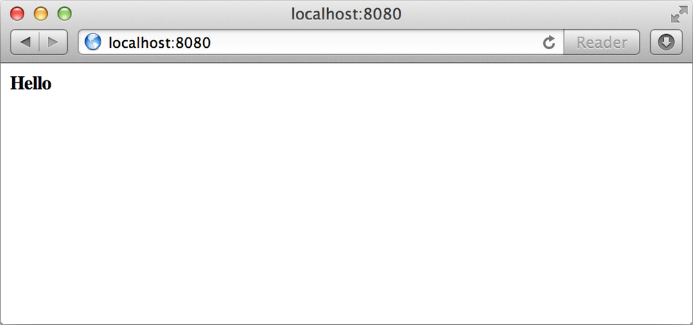

Vagrant allows developers to quickly set up a complete development environment with a single `vagrant up` command. To achieve this, all required software should be installed on the guest machine. This can be done by either pre-installing software in the base box or provisioning it automatically during setup. Provisioning ensures that necessary configurations and software are installed each time the environment is created.  

Base boxes in Vagrant are typically minimal, containing only essential components like SSH. Installing additional software on a running system is known as provisioning, which can be done using shell scripts, configuration management tools like Chef or Puppet, or manual commands. Vagrant automates provisioning by running configured provisioners on every `vagrant up`.  

By default, Vagrant supports shell scripts, Chef, and Puppet for provisioning, but additional tools can be integrated via plugins. As an example, this chapter sets up Apache to serve static files from the shared folder automatically, eliminating the need for manual commands. This approach can be extended to configure more complex environments, such as a full LAMP stack.

## Why Automated Provisioning

Automated provisioning simplifies server setup by ensuring consistency, repeatability, and alignment between development and production environments. Many developers manually configure servers using online guides, leading to inconsistencies when setting up new machines. These differences can cause significant issues, such as misconfigured databases or resource limitations.  

Before Vagrant, developers relied on complex setup guides or trial and error to install dependencies, often resulting in the classic “it worked on my machine” problem. Vagrant, combined with automated provisioning, eliminates this issue by providing a consistent environment across different operating systems. This ensures that bugs are reproducible and exist in both development and production.  

Another advantage is that provisioning scripts used for production can be adapted for development, streamlining workflows for both developers and operations teams. Vagrant also allows for easy local testing of infrastructure changes. While there is an initial time investment in setting up automated provisioning, the long-term productivity benefits grow as more team members adopt Vagrant.


## Supported Provisioners

Vagrant natively supports provisioning using shell scripts, Chef, or Puppet. Many beginners wonder which provisioner to use, often feeling that Chef or Puppet is the "right" choice but are intimidated by their complexity. While Vagrant is an excellent environment for learning these tools due to its ability to quickly create and destroy virtual machines, starting with shell scripts is recommended. They are simpler, provide quick results, and help users get comfortable with Vagrant before diving into more advanced configuration management tools.  

For those interested in Chef, Vagrant supports both Chef Solo and Chef Client. Chef Solo is ideal for small-scale deployments and testing cookbooks, while Chef Client integrates with an existing Chef Server, making it useful for organizations already using Chef infrastructure. Similarly, Vagrant supports Puppet in two ways: using a Puppet Master with the Puppet Agent or running masterless configurations via `puppet apply`. The masterless approach is easier for beginners and smaller deployments, whereas connecting to a Puppet Master is more beneficial when an existing Puppet infrastructure is in place.  

Beyond the built-in provisioners, Vagrant allows extending provisioning capabilities through plug-ins. If an organization uses a different configuration management tool, there is likely an existing Vagrant plug-in available, created by the open-source community. Additional details on plug-in development are covered in Chapter 7.


## Manually setting up Apache

- Before using a provsioner, manually install and configure Apache over SSH
- create a following vagrantFile looking like this

```ruby
Vagrant::Config.run do |config|
  config.vm.box = "precise64"
  config.vm.forward_port 80, 8080
end
```

-  then run the machine with `vagrant up`
-  connect to the machine using `vagrant ssh`
- once connect run `apt-get update`
- this command need to be run with sudo cause he need root privelege
- after run the command to install Apache `apt get install apache2`

By default, Ubuntu starts Apache on boot and serves files from `/var/www`. To simplify configuration, we replace `/var/www` with a symbolic link to `/vagrant`, the default shared folder. This ensures that any files placed in the shared folder are automatically served by Apache without modifying its configuration.


```bash
vagrant@precise64:~$ sudo rm -rf /var/www
vagrant@precise64:~$ sudo ln -fs /vagrant /var/www
```

If you visit http://localhost:8080 now, you should see a directory listing of the shared folder. To prove it works, create an index.html file on the host, and refresh to view it in your browser. Exit SSH and create the index file:

```bash
vagrant@precise64:~$ logout
Connection to 127.0.0.1 closed.
$ echo "<strong>Hello</strong>" > index.html
```




## Automated provisioner

After manually setting up Apache, we can now automate the process more efficiently. Before exploring configuration management tools like Chef or Puppet, we'll first use shell scripts for automation. Even if planning to use Chef or Puppet, starting with shell scripts helps in understanding the process before converting it. Now, let's create a script to automatically set up Apache.

### Shell script

- using a shell script we can autmated the installation of apache2 easily ;)


```bash
#!/usr/bin/env bash

echo "Installing Apache and setting it up..."
apt-get update >/dev/null 2>&1
apt-get install -y apache2 >/dev/null 2>&1
rm -rf /var/www
ln -fs /vagrant /var/www
```
- The script begins with a **shebang (`#!/bin/bash`)**, specifying that the commands should be executed using the Bash shell.  
- It includes **echo statements** to inform the user about what the script is doing while keeping command output minimal.  
- **`sudo` is removed** from all commands since Vagrant runs the script as root by default.  
- The **`-y` flag** is added to `apt-get install apache2`, ensuring automatic confirmation of installation prompts. This is crucial for automated provisioning, as it prevents the script from hanging or failing due to missing user input.  
- Once the shell script is created, the final step is to **configure Vagrant** to use it by adding a reference to it in the `Vagrantfile`.

```ruby
config.vm.provision "shell", path: "provision.sh"
```

-  the full vagrant file might just look like this

```bash
Vagrant::Config.run do |config|
  config.vm.box = "precise64"
  config.vm.forward_port 80, 8080
  config.vm.provision "shell", path: "provision.sh"
end
```

- Before verifying this work destroy the vagrant vm `vagrant destroy`

- Finally run `vagrant up`

# Multiple Provisioners

- **Multiple provisioners** can be used in a Vagrantfile by adding multiple `config.vm.provision` directives.  
- Vagrant executes provisioners **in the order they are specified**, allowing flexibility in setup.  
- You can use **different provisioners** (e.g., Shell, Puppet, Chef) or multiple instances of the same provisioner.  
- Example Vagrantfile:  
  ```ruby
  Vagrant::Config.run do |config|
    config.vm.box = "precise64"
    config.vm.provision "shell", inline: "apt-get update"
    config.vm.provision "puppet"
  end
  ```  
- You can **run specific provisioners** using the `--provision-with` flag, e.g.,  
  ```
  $ vagrant up --provision-with=chef
  ```  
- This is useful when you only want to run a particular provisioner, such as **bootstrapping with a shell script** and testing **Chef cookbooks separately**.


# "No provision" Mode

-  with this command you can loadVagant vm without using provision

```bash
$ vagrant up --no-provision
```

-  th is must be use with reloaf when configuration have been added to the Vagrantfile, but when you don't necessarily want to wait for all the povisionrs to run again.


