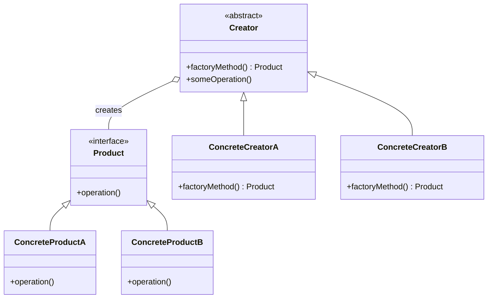

The **Factory Pattern** is a **creational design pattern** that provides a way to create objects without specifying their exact classes, promoting **loose coupling** between the client code and the object creation logic. Instead of directly instantiating objects, the client delegates this responsibility to a factory class or method, which determines the appropriate object type to create. Variants of this pattern include the Simple Factory (a single class handles object creation), Factory Method (subclasses decide the instantiation), and Abstract Factory (a factory that creates related object families). This approach makes the system more flexible, maintainable, and scalable.

