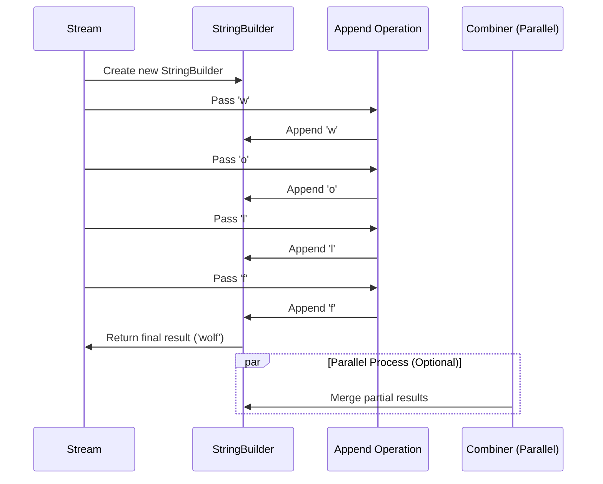
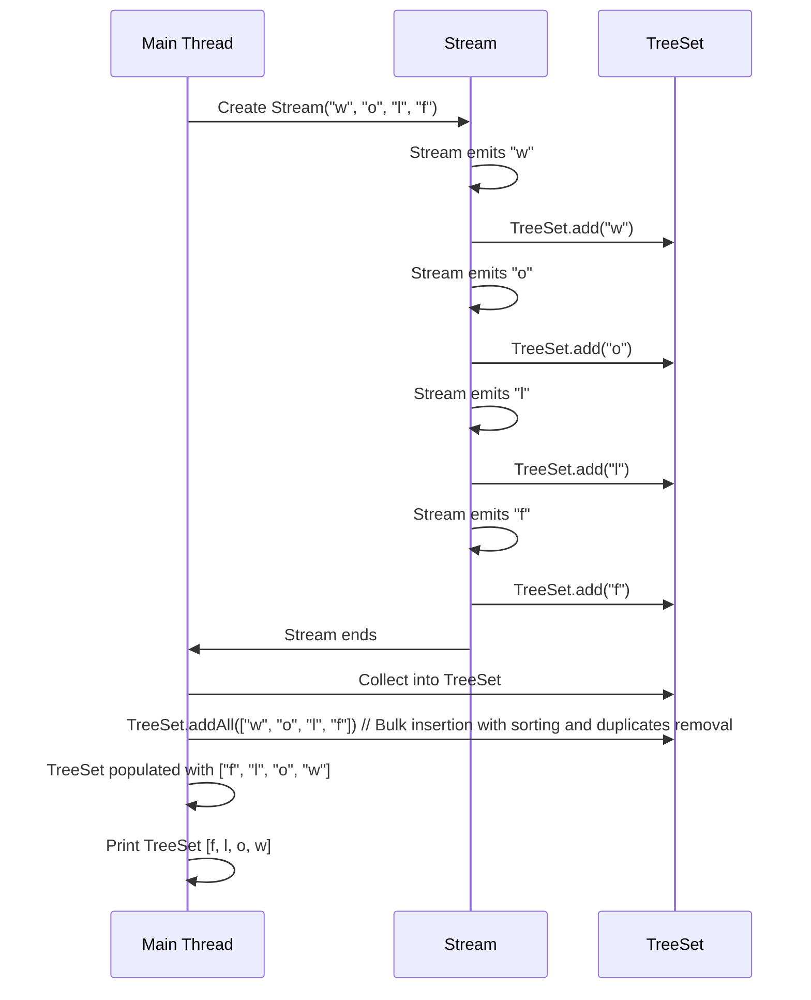

- [[#Returning optional|Returning optional]]
- [[#Using stream|Using stream]]
	- [[#Using stream#Creating Stream Sources|Creating Stream Sources]]
		- [[#Creating Stream Sources#Create finite stream|Create finite stream]]
		- [[#Creating Stream Sources#parallel stream|parallel stream]]
	- [[#Using stream#Creating Infinite Stream|Creating Infinite Stream]]
	- [[#Using stream#reviewving stream creation method|reviewving stream creation method]]
	- [[#Using stream#using common terminal operation|using common terminal operation]]
		- [[#using common terminal operation#Counting|Counting]]
		- [[#using common terminal operation#Finding the Minimum and Maximum|Finding the Minimum and Maximum]]
		- [[#using common terminal operation#finding value|finding value]]
		- [[#using common terminal operation#matching|matching]]
		- [[#using common terminal operation#iterating|iterating]]
		- [[#using common terminal operation#Reducing|Reducing]]
		- [[#using common terminal operation#collecting|collecting]]
			- [[#collecting#Key Points about `collect()`:|Key Points about `collect()`:]]
			- [[#collecting#How `collect()` Works:|How `collect()` Works:]]
			- [[#collecting#Common `Collector` Implementations:|Common `Collector` Implementations:]]
			- [[#collecting#Custom Collector Example:|Custom Collector Example:]]
	- [[#Using stream#How `collect()` Differs from `reduce()`:|How `collect()` Differs from `reduce()`:]]
			- [[#collecting#Example Code:|Example Code:]]
			- [[#collecting#Summary:|Summary:]]
	- [[#Using stream#Using Common Intermediate Operations|Using Common Intermediate Operations]]
	- [[#Using stream#Using Common Intermediate Operations|Using Common Intermediate Operations]]
	- [[#Using stream#Removing duplicate|Removing duplicate]]
	- [[#Using stream#Restriciting by position|Restriciting by position]]
	- [[#Using stream#Mapping|Mapping]]
	- [[#Using stream#USing flatMap|USing flatMap]]
	- [[#Using stream#Sorting|Sorting]]
	- [[#Using stream#Taking a peek|Taking a peek]]
	- [[#Using stream#Putting Together the Pipeline|Putting Together the Pipeline]]
- [[#Working with Primitive Streams|Working with Primitive Streams]]


## Returning optional 

- `Optional` in Java is a container that may hold a non-null value, used to avoid `NullPointerException` by handling nullability more explicitly and safely.


![[Pasted image 20241115063100.png]]

```java
10: public static Optional<Double> average(int… scores) {
11:    if (scores.length == 0) return Optional.empty();
12:    int sum = 0;
13:    for (int score: scores) sum += score;
14:    return Optional.of((double) sum / scores.length);
15: }
```


```java
Optional<Double> opt = average(90, 100);
if (opt.isPresent())
   
![[Recording 20241115131054.webm]]
 // 95.0
```


| Method                                                   | When `Optional` is empty                       | When `Optional` contains value |
| -------------------------------------------------------- | ---------------------------------------------- | ------------------------------ |
| `get()`                                                  | Throws exception                               | Returns value                  |
| `ifPresent(Consumer c)`                                  | Does nothing                                   | Calls `Consumer` with value    |
| `i![[recording-multitrack-2024-11-15T12-02-51-323Z.wav]] | Returns `false`                                | Returns `true`                 |
| `orElse(T other)`                                        | Returns other parameter                        | Returns value                  |
| `orElseGet(Supplier s)`                                  | Returns result of calling `Supplier`           | Returns value                  |
| `orElseThrow()`                                          | Throws `NoSuchElementException`                | Returns value                  |
| `orElseThrow(Supplier s)`                                | Throws exception created by calling `Supplier` | Returns value                  |

## Using stream

- A `Stream` in Java is a sequence of elements that supports functional-style operations for processing data, such as filtering, mapping, and reducing, allowing for more concise and readable code.

A **terminal operation** in Java Streams is an operation that triggers the processing of the stream and produces a final result or side effect. Terminal operations consume the elements of a stream, and after their execution, the stream is considered closed and cannot be reused. Examples of terminal operations include `collect()`, `forEach()`, `reduce()`, `count()`, and `anyMatch()`. These operations are used to aggregate, print, or otherwise handle the elements of the stream after intermediate operations have been applied.

An **intermediate operation** in Java Streams is an operation that processes elements from a stream and returns a new stream, allowing further operations to be chained. These operations are lazy, meaning they do not trigger the processing of the stream immediately; instead, they set up a pipeline that is executed only when a terminal operation is called.
Common examples of intermediate operations include:

- **`filter()`**: Filters elements based on a condition.
- **`map()`**: Transforms each element to another object.
- **`sorted()`**: Sorts the elements of the stream.
- **`distinct()`**: Removes duplicate elements.
- **`limit()`** and **`skip()`**: Limit or skip elements in the stream.

|Scenario|Intermediate operation|Terminal operation|
|---|---|---|
|Required part of useful pipeline?|No|Yes|
|Can exist multiple times in pipeline?|Yes|No|
|Return type is stream type?|Yes|No|
|Executed upon method call?|No|Yes|
|Stream valid after call?|Yes|No|
![[Pasted image 20241115070925.png]]

### Creating Stream Sources

- In Java, the streams we have been talking about are represented by the `Stream<T>` interface, defined in the `java.util.stream` package.

#### Create finite stream

```java
11: Stream<String> empty = Stream.empty();            // count = 0
12: Stream<Integer> singleElement = Stream.of(1);     // count = 1
13: Stream<Integer> fromArray = Stream.of(1, 2, 3);   // count = 3
```


#### parallel stream

```java
24: var list = List.of("a", "b", "c");
25: Stream<String> fromListParallel = list.parallelStream();
```

### Creating Infinite Stream

```JAVA
17: Stream<Double> randoms = Stream.generate(Math::random);
18: Stream<Integer> oddNumbers = Stream.iterate(1, n -> n + 2);
```


- Line 17 generates a stream of random numbers. How many random numbers? However many you need. If you call `randoms.forEach(System.out::println)`, the program will print random numbers until you kill it. Later in the chapter, you learn about operations like `limit()` to turn the infinite stream into a finite stream.

- Line 18 gives you more control. The `iterate()` method takes a seed or starting value as the first parameter. This is the first element that will be part of the stream. The other parameter is a lambda expression that is passed the previous value and generates the next value. As with the random numbers example, it will keep on producing odd numbers as long as you need them.

What if you wanted just odd numbers less than 100? There's an overloaded version of `iterate()` that helps:

```java
19: Stream<Integer> oddNumberUnder100 = Stream.iterate(
20:    1,                // seed
21:    n -> n < 100,     // Predicate to specify when done
22:    n -> n + 2);      // UnaryOperator to get next value
```


### reviewving stream creation method 

|Method|Finite or infinite?|Notes|
|---|---|---|
|`Stream.empty()`|Finite|Creates `Stream` with zero elements.|
|`Stream.of(varargs)`|Finite|Creates `Stream` with elements listed.|
|`coll.stream()`|Finite|Creates `Stream` from `Collection`.|
|`coll.parallelStream()`|Finite|Creates `Stream` from `Collection` where the stream can run in parallel.|
|`Stream.generate(supplier)`|Infinite|Creates `Stream` by calling `Supplier` for each element upon request.|
|`Stream.iterate(seed,`  <br>`unaryOperator)`|Infinite|Creates `Stream` by using seed for first element and then calling `UnaryOperator` for each subsequent element upon request.|
|`Stream.iterate(seed,`  <br>`predicate, unaryOperator)`|Finite or infinite|Creates `Stream` by using seed for first element and then calling `UnaryOperator` for each subsequent element upon request. Stops if `Predicate` returns false.|

### using common terminal operation

| Method       | What happens for infinite streams | Return value  | Reduction |
|--------------|-----------------------------------|---------------|-----------|
| `count()`    | Does not terminate                | `long`        | Yes       |
| `min()`      | Does not terminate                | `Optional<T>` | Yes       |
| `max()`      | Does not terminate                | `Optional<T>` | Yes       |
| `findAny()`  | Terminates                        | `Optional<T>` | No        |
| `findFirst()`| Terminates                        | `Optional<T>` | No        |
| `allMatch()` | Sometimes terminates              | `boolean`     | No        |
| `anyMatch()` | Sometimes terminates              | `boolean`     | No        |
| `noneMatch()`| Sometimes terminates              | `boolean`     | No        |
| `forEach()`  | Does not terminate                | `void`        | No        |
| `reduce()`   | Does not terminate                | Varies        | Yes       |
| `collect()`  | Does not terminate                | Varies        | Yes       |
#### Counting
- ``count()`` determines the nbr of ele in a finite stream
- example :
```java
Stream<String> s = Stream.of("monkey", "gorilla", "bonobo");
System.out.println(s.count()); // 3
```

#### Finding the Minimum and Maximum

- min() and max() allow to pass custom comparator, find largest or smallest value in a finite stream.

```java
public Optional<T> min(Comparator<? super T> comparator)
public Optional<T> max(Comparator<? super T> comparator)
```

example :

```
Stream<String> s = Stream.of("monkey", "ape", "bonobo");
Optional<String> min = s.min((s1, s2) -> s1.length()-s2.length());
min.ifPresent(System.out::println); // ape
```

#### finding value

The `findAny()` and `findFirst()` methods are used to retrieve an element from a stream:

- **`findAny()`**: Returns an `Optional` containing any element from the stream, with no guarantee on which element is returned, making it useful in parallel streams for better performance.
- **`findFirst()`**: Returns an `Optional` containing the first element in the stream, maintaining the order of elements, which is more predictable but may be less efficient in parallel processing.

Both methods return an empty `Optional` if the stream is empty.
```java
Stream<String> s = Stream.of("monkey", "gorilla", "bonobo");
Stream<String> infinite = Stream.generate(() -> "chimp");
 
s.findAny().ifPresent(System.out::println); // monkey (usually)
infinite.findAny().ifPresent(System.out::println); // chimp
```

#### matching

The `allMatch()`, `anyMatch()`, and `noneMatch()` methods are used to evaluate whether elements in a stream match a given predicate:

- **`allMatch()`**: Returns `true` if all elements in the stream match the given predicate; otherwise, it returns `false`. It stops checking as soon as a non-matching element is found.
- **`anyMatch()`**: Returns `true` if any element in the stream matches the given predicate and stops as soon as a match is found; otherwise, it returns `false`.
- **`noneMatch()`**: Returns `true` if no elements in the stream match the given predicate and stops as soon as a matching element is found; otherwise, it returns `false`.

These methods can short-circuit, meaning they may not need to evaluate all elements in the stream.pty.

```java
var list = List.of("monkey", "2", "chimp");
Stream<String> infinite = Stream.generate(() -> "chimp");
Predicate<String> pred = x -> Character.isLetter(x.charAt(0));
 
System.out.println(list.stream().anyMatch(pred));   // true
System.out.println(list.stream().allMatch(pred));   // false
System.out.println(list.stream().noneMatch(pred));  // false
System.out.println(infinite.anyMatch(pred));        // true
```

#### iterating
The `forEach()` method in streams is used to iterate over each element of the stream and perform a given action, specified by a `Consumer`. It processes each element sequentially in the order they appear (unless used with a parallel stream, where the order may be unpredictable). This method is typically used for side effects, such as printing or modifying external state.

Example:
```java
Stream.of("apple", "banana", "cherry").forEach(System.out::println);
```
This code prints each element of the stream to the console. Unlike most terminal operations, `forEach()` does not produce a return value and does not collect elements; it simply processes them.

#### Reducing

The `reduce()` method in streams is used to combine elements of the stream into a single result by repeatedly applying a binary operator, such as summing or multiplying values. It takes an initial value and a combining function, or just a 
combining function that returns an `Optional` if the stream is empty.
```java
public T reduce(T identity, BinaryOperator<T> accumulator)
 
public Optional<T> reduce(BinaryOperator<T> accumulator)
 
public <U> U reduce(U identity,
   BiFunction<U,? super T,U> accumulator,
   BinaryOperator<U> combiner)
```

example 

```java
Stream<String> stream = Stream.of("w", "o", "l", "f");
String word = stream.reduce("", (s, c) -> s + c);
System.out.println(word); // wolf
```


<mark style="background: #FF5582A6;">The exam expects you to know about common predefined collectors in addition to being able to write your own by passing a supplier, accumulator, and combiner.</mark>


#### collecting

The `collect()` method is a terminal operation in the Java **Stream API** that is used to transform the elements of a stream into a different form, such as a `List`, `Set`, `Map`, or other collection. It is part of the `java.util.stream` package and provides a way to accumulate the elements of a stream into a single result, often by using a `Collector`.

##### Key Points about `collect()`:
- **Terminal Operation**: Once `collect()` is called, the stream is consumed and cannot be reused.
- **Flexible**: It can be used to create different types of results, like lists, sets, maps, strings, or even custom data structures.
- **Customizable**: With custom `Collector` implementations, `collect()` can perform a wide variety of operations.

##### How `collect()` Works:
The `collect()` method takes a `Collector` as an argument, which defines how the elements are accumulated. The `Collector` interface provides a way to define various reduction strategies (e.g., collecting to a list, grouping by a property, etc.).

##### Common `Collector` Implementations:
Java provides a utility class called `Collectors` that includes many useful implementations of the `Collector` interface. Some common ones are:

1. **Collecting to a `List`**:
   ```java
   List<String> names = Stream.of("Alice", "Bob", "Charlie")
                              .collect(Collectors.toList());
   ```

2. **Collecting to a `Set`**:
   ```java
   Set<String> uniqueNames = Stream.of("Alice", "Bob", "Alice")
                                   .collect(Collectors.toSet());
   ```

3. **Joining Elements**:
   ```java
   String concatenated = Stream.of("Alice", "Bob", "Charlie")
                               .collect(Collectors.joining(", "));
   // Result: "Alice, Bob, Charlie"
   ```

4. **Collecting to a `Map`**:
```java
   Map<Integer, String> nameLengthMap = Stream.of("Alice", "Bob", "Charlie")
.collect(Collectors.toMap(                                                  String::length, 
name -> name,                                                   (existing, replacement) -> existing));
   ```

5. **Grouping By a Property**:
   ```java
   Map<Integer, List<String>> groupedByLength = Stream.of("Alice", "Bob", "Charlie")
                                                      .collect(Collectors.groupingBy(String::length));
   // Result: {3=[Bob], 5=[Alice], 7=[Charlie]}
   ```

##### Custom Collector Example:
While `Collectors` provides built-in collectors, you can also create custom collectors using `Collector.of()`:

```java
Collector<String, StringBuilder, String> customCollector = Collector.of(
    StringBuilder::new,                  // Supplier (creates the result container)
    StringBuilder::append,               // Accumulator (adds an element to the container)
    StringBuilder::append,               // Combiner (merges two containers in parallel processing)
    StringBuilder::toString              // Finisher (final transformation of the result)
);

String result = Stream.of("A", "B", "C").collect(customCollector);
// Result: "ABC"
```

### How `collect()` Differs from `reduce()`:

- **`collect()`**: More powerful and flexible, especially when working with mutable containers like lists or sets. It uses `Collector` to manage the accumulation, which can involve complex operations like grouping or partitioning.
- **`reduce()`**: Used for simple aggregation operations that reduce the stream to a single value (e.g., summing integers, finding max or min).

##### Example Code:
```java
import java.util.*;
import java.util.stream.*;

public class CollectExample {
    public static void main(String[] args) {
        // Example: Collecting names into a list
        List<String> names = Stream.of("Alice", "Bob", "Charlie")
                                   .collect(Collectors.toList());
        System.out.println("Names List: " + names);

        // Example: Grouping by string length
        Map<Integer, List<String>> namesByLength = Stream.of("Alice", "Bob", "Charlie")
                                                         .collect(Collectors.groupingBy(String::length));
        System.out.println("Grouped by Length: " + namesByLength);

        // Example: Joining strings with delimiter
        String joinedNames = Stream.of("Alice", "Bob", "Charlie")
                                   .collect(Collectors.joining(", "));
        System.out.println("Joined Names: " + joinedNames);
    }
}
```

##### Summary:
- `collect()` is used in Java's Stream API to accumulate elements into a collection or apply complex reduction strategies.
- The method works with `Collector` implementations provided by the `Collectors` class or custom implementations.
- It is a powerful and versatile way to transform streams into collections or other types of results.


`ris:FileWarning`<mark style="background: #FFB8EBA6;">The exam expects you to know about common predefined collectors in addition to being able to write your own by passing a supplier, accumulator, and combiner.</mark>


### Using Common Intermediate Operations

- collect() special type of reduction called mutable reduction
- common mutable -> StringBuilder & ArrayList


```java
public <R> R collect(Supplier<R> supplier,
   BiConsumer<R, ? super T> accumulator,
   BiConsumer<R, R> combiner)
 
public <R,A> R collect(Collector<? super T, A,R> collector)
```

**Example :**

```java
// Create a Stream of Strings containing the elements "w", "o", "l", "f"
Stream<String> stream = Stream.of("w", "o", "l", "f");

// Use the collect() method to combine elements of the Stream into a single StringBuilder
StringBuilder word = stream.collect(
   StringBuilder::new,    // Supplier: Provides a new instance of StringBuilder (acts as a factory for the accumulator)
   StringBuilder::append, // BiConsumer: Takes the StringBuilder (accumulator) and the next string element from the stream, and appends the string to the StringBuilder
   StringBuilder::append  // Combiner: Used when the stream is parallel; combines two partial results (StringBuilders) into one
);

// Print the result, which is "wolf"
System.out.println(word);

```

Certainly! Let's break down the code with detailed comments and explanations:

```java
// Create a Stream of Strings containing the elements "w", "o", "l", "f"
Stream<String> stream = Stream.of("w", "o", "l", "f");

// Use the collect() method to combine elements of the Stream into a single StringBuilder
StringBuilder word = stream.collect(
   StringBuilder::new,    // Supplier: Provides a new instance of StringBuilder (acts as a factory for the accumulator)
   StringBuilder::append, // BiConsumer: Takes the StringBuilder (accumulator) and the next string element from the stream, and appends the string to the StringBuilder
   StringBuilder::append  // Combiner: Used when the stream is parallel; combines two partial results (StringBuilders) into one
);

// Print the result, which is "wolf"
System.out.println(word);
```

**Execution Process:**

1. **Stream Creation:**
    
    - A `Stream<String>` is created with the elements "w", "o", "l", "f". This stream represents a sequence of strings.
2. **`collect()` Method Invocation:**
    
    - The `collect()` method is called on the stream with three arguments:
        - **Supplier:** `StringBuilder::new` - This creates a new, empty `StringBuilder` to store the result.
        - **BiConsumer:** `StringBuilder::append` - This function takes the current `StringBuilder` and the next string element from the stream. It appends the string to the `StringBuilder`.
        - **Combiner:** `StringBuilder::append` - This is used in parallel streams to combine multiple partial results. However, since this is a sequential stream, it's not used here.
3. **Sequential Processing:**
    
    - The stream is processed sequentially, element by element.
    - For each element:
        - The `BiConsumer` is invoked with the current `StringBuilder` and the element.
        - The element is appended to the `StringBuilder`.
4. **Final Result:**
    
    - After processing all elements, the final `StringBuilder` contains the concatenated string "wolf".
    - This `StringBuilder` is assigned to the `word` variable.
    - The contents of `word` are printed to the console.

**Logic Behind the `collect()` Method:**

- The `collect()` method is a powerful tool for reducing a stream to a single value or a different data structure.
- It provides a flexible way to accumulate elements from the stream into a desired result.
- The three arguments to `collect()` define the reduction process:
    - **Supplier:** Creates the initial accumulator.
    - **BiConsumer:** Processes each element and updates the accumulator.
    - **Combiner:** Merges multiple partial results in parallel streams (not used here).

By understanding the `collect()` method and its arguments, you can effectively use it to perform various reductions on streams, such as summing numbers, concatenating strings, or collecting elements into lists or sets.



Another example : 

```java
Stream<String> stream = Stream.of("w", "o", "l", "f");
 
TreeSet<String> set = stream.collect(
   TreeSet::new,
   TreeSet::add,
   TreeSet::addAll);
 
System.out.println(set); // [f, l, o, w]
```





- Code who do the same implementation 
```java
Stream<String> stream = Stream.of("w", "o", "l", "f");
TreeSet<String> set =
   stream.collect(Collectors.toCollection(TreeSet::new));
System.out.println(set); // [f, l, o, w]
```


`ris:AlarmWarning`<mark style="background: #FFB8EBA6;">The exam expects you to know about common predefined collectors in addition to being able to write your own by passing a supplier, accumulator, and combiner.
</mark>


### Using Common Intermediate Operations

- `filter()` return a Stream with element matching given expression
```java
public Stream<T> filter(Predicate<? super T> predicate)
```


ex : 

```java
Stream<String> s = Stream.of("monkey", "gorilla", "bonobo");
s.filter(x -> x.startsWith("m"))
   .forEach(System.out::print); // monkey
```


### Removing duplicate

- Return a stream with duplicate value removed.

```java
public Stream<T> distinct()
```

```java
Stream<String> s = Stream.of("duck", "duck", "duck", "goose");
s.distinct()
   .forEach(System.out::print); // duckgoose
```


### Restriciting by position
- ``skip()``  and limit()  can make stream smaller
- `limit()` can convert infinites stream to finite stream)
```java
public Stream<T> limit(long maxSize)
public Stream<T> skip(long n)
```


```java
Stream<Integer> s = Stream.iterate(1, n -> n + 1);
s.skip(5)
   .limit(2)
   .forEach(System.out::print); // 67
```


### Mapping

-  `map()`  method creates a one-to-one mapping from the elements in the stream to the elements of the next step in the stream
```java
public <R> Stream<R> map(Function<? super T, ? extends R> mapper)
```

The map() method on streams is for transforming data. Don't confuse it with the Map interface, which maps keys to values.

```java
Stream<String> s = Stream.of("monkey", "gorilla", "bonobo");
s.map(String::length)
   .forEach(System.out::print); // 676
```


### USing flatMap

- The `flatMap()` method in Java streams transforms each element into a stream of elements and then flattens all those individual streams into one continuous stream, making it useful for operations like combining multiple lists into one or removing empty elements.

```java
public <R> Stream<R> flatMap(
   Function<? super T, ? extends Stream<? extends R>> mapper)
```

```java
List<String> zero = List.of();
var one = List.of("Bonobo");
var two = List.of("Mama Gorilla", "Baby Gorilla");
Stream<List<String>> animals = Stream.of(zero, one, two);
 
animals.flatMap(m -> m.stream())
   .forEach(System.out::println);
```

output: 

```bash
Bonobo
Mama Gorilla
Baby Gorilla
```

As you can see, it removed the empty list completely and changed all elements of each list to be at the top level of the stream.


### Sorting

```java
public Stream<T> sorted()
public Stream<T> sorted(Comparator<? super T> comparator)
```


```java
Stream<String> s = Stream.of("brown-", "bear-");
s.sorted()
   .forEach(System.out::print); // bear-brown-
```


- we can use comparator to precise the sorting logic

```java
Stream<String> s = Stream.of("brown bear-", "grizzly-");
s.sorted(Comparator.reverseOrder())
   .forEach(System.out::print); // grizzly-brown bear-
```


### Taking a peek

- The `peek()` method in a stream allows you to perform a non-terminal operation that inspects the elements of the stream as they pass through, without modifying the stream itself, typically used for debugging or logging.

```java
public Stream<T> peek(Consumer<? super T> action)
```


```java
var stream = Stream.of("black bear", "brown bear", "grizzly");
long count = stream.filter(s -> s.startsWith("g"))
   .peek(System.out::println).count();              // grizzly
System.out.println(count);          
```

- **Stream Creation**: A stream of strings is created using `Stream.of()` containing "black bear", "brown bear", and "grizzly".
- **Filtering**: The `filter()` method is applied to select only the strings that start with the letter "g", resulting in the stream containing just "grizzly".
- **Peek for Debugging**: The `peek()` method is used to print the filtered elements (in this case, "grizzly") to the console for debugging or logging purposes.
- **Count and Output**: The `count()` method counts the number of elements in the filtered stream (which is 1) and prints the count value (`1`).

```java
    var numbers = new ArrayList<>();
    var letters = new ArrayList<>();
    numbers.add(1);
    letters.add('a');
 
    Stream<List<?>> stream = Stream.of(numbers, letters);
    stream.map(List::size).forEach(System.out::print); // 11
```


```java
    Stream<List<?>> bad = Stream.of(numbers, letters);
    bad.peek(x -> x.remove(0))
       .map(List::size)
       .forEach(System.out::print); // 00
```

Here's an explanation of the code:

- **Stream Creation**: `Stream.of(numbers, letters)` creates a stream containing two lists: `numbers` and `letters`. The `<?>` in `List<?>` means that the stream can hold lists of any type (generic wildcard).
    
- **Peek and Modify**: `peek(x -> x.remove(0))` is an intermediate operation that modifies the lists by removing the first element (index `0`). Since `peek()` is used for debugging, it modifies the lists without affecting the flow of the stream's other operations.
    
- **Mapping to Size**: `map(List::size)` transforms each list in the stream into its size after the first element has been removed. This results in the sizes of the lists after modification.
    
- **Output**: `forEach(System.out::print)` prints the sizes of the modified lists. Since both lists originally had at least one element and after removal they become empty, the sizes printed are `0` for both lists, resulting in the output `00`.
    

**Key Point**: The use of `peek()` is inappropriate here because it's meant for debugging, not modifying the stream elements. The operation `remove(0)` mutates the original lists, which can lead to unexpected behavior.


### Putting Together the Pipeline
Streams allow you to use chaining and express what you want to accomplish rather than how to do so. Let's say that we wanted to get the first two names of our friends alphabetically that are four characters long. Without streams, we'd have to write something like the following:
 Code without stream :
 
```java
var list = List.of("Toby", "Anna", "Leroy", "Alex");
List<String> filtered = new ArrayList<>();
for (String name: list)
   if (name.length() == 4) filtered.add(name);
 
Collections.sort(filtered);
var iter = filtered.iterator();
if (iter.hasNext()) System.out.println(iter.next());
if (iter.hasNext()) System.out.println(iter.next());
```


```java
var list = List.of("Toby", "Anna", "Leroy", "Alex");
list.stream().filter(n -> n.length() == 4).sorted()
   .limit(2).forEach(System.out::println);
```

![[Pasted image 20241116053109.png]]

## Working with Primitive Streams

### Creating Primitive Streams
- Java provides specialized stream classes like `IntStream`, `DoubleStream`, and `LongStream` for working with primitive data types (int, double, long), avoiding the need for wrapper classes.
- Primitive streams offer methods like `mapToInt()` and `sum()` that simplify numeric operations, improving performance by avoiding autoboxing.
- A common use case, such as calculating the sum, can be done directly with `IntStream` using `sum()` after converting from `Stream<Integer>`.
- Java's primitive streams also provide specialized methods like `average()` to calculate averages efficiently without manually dividing by the element count.
- Using primitive streams enhances efficiency for numeric data processing by offering built-in methods for common tasks, reducing the need for manual calculations and multiple passes over the data.

|Method|Primitive stream|Description|
|---|---|---|
|`OptionalDouble average()`|`IntStream`  <br>`LongStream`  <br>`DoubleStream`|Arithmetic mean of elements|
|`Stream<T> boxed()`|`IntStream`  <br>`LongStream`  <br>`DoubleStream`|`Stream<T>` where `T` is wrapper class associated with primitive value|
|`OptionalInt max()`|`IntStream`|Maximum element of stream|
|`OptionalLong max()`|`LongStream`|
|`OptionalDouble max()`|`DoubleStream`|
|`OptionalInt min()`|`IntStream`|Minimum element of stream|
|`OptionalLong min()`|`LongStream`|
|`OptionalDouble min()`|`DoubleStream`|
|`IntStream range(int a, int b)`|`IntStream`|Returns primitive stream from `a` (inclusive) to `b` (exclusive)|
|`LongStream range(long a, long b)`|`LongStream`|
|`IntStream rangeClosed(int a, int b)`|`IntStream`|Returns primitive stream from `a` (inclusive) to `b` (inclusive)|
|`LongStream rangeClosed(long a, long b)`|`LongStream`|
|`int sum()`|`IntStream`|Returns sum of elements in stream|
|`long sum()`|`LongStream`|
|`double sum()`|`DoubleStream`|
|`IntSummaryStatistics summaryStatistics()`|`IntStream`|Returns object containing numerous stream statistics such as average, min, max, etc.|
|`LongSummaryStatistics summaryStatistics()`|`LongStream`|
|`DoubleSummaryStatistics summaryStatistics()`|`DoubleStream`|

### Mapping Streams

Another way to create a primitive stream is by mapping from another stream type. [Table 10.6](https://learning.oreilly.com/library/view/ocp-oracle-certified/9781119864585/c10.xhtml#c10-tbl-0006) shows that there is a method for mapping between any stream types.

|ource stream class|To create `Stream`|To create `DoubleStream`|To create `IntStream`|To create `LongStream`|
|---|---|---|---|---|
|`Stream<T>`|`map()`|`mapToDouble()`|`mapToInt()`|`mapToLong()`|
|`DoubleStream`|`mapToObj()`|`map()`|`mapToInt()`|`mapToLong()`|
|`IntStream`|`mapToObj()`|`mapToDouble()`|`map()`|`mapToLong()`|
|`LongStream`|`mapToObj()`|`mapToDouble()`|`mapToInt()`|`map()`|

exmaple

```java
Stream<String> objStream = Stream.of("penguin", "fish");
IntStream intStream = objStream.mapToInt(s -> s.length());
```

### Using _Optional_ with Primitive Streams

```java
var stream = IntStream.rangeClosed(1,10);
OptionalDouble optional = stream.average();
```

| `OptionalDouble`                   | `OptionalInt`    | `OptionalLong`   |                  |
| ---------------------------------- | ---------------- | ---------------- | ---------------- |
| Getting as primitive               | `getAsDouble()`  | `getAsInt()`     | `getAsLong()`    |
| `orElseGet()` parameter type       | `DoubleSupplier` | `IntSupplier`    | `LongSupplier`   |
| Return type of `max()` and `min()` | `OptionalDouble` | `OptionalInt`    | `OptionalLong`   |
| Return type of `sum()`             | `double`         | `int`            | `long`           |
| Return type of `average()`         | `OptionalDouble` | `OptionalDouble` | `OptionalDouble` |

## Working with Advanced Stream Pipeline Concepts

Congrats, you only have a few more topics left! In this last stream section, we learn about the relationship between streams and the underlying data, chaining `Optional`, and grouping collectors. After this, you should be a pro with streams!

```java
private static void threeDigit(Optional<Integer> optional) {
   if (optional.isPresent()) {  // outer if
      var num = optional.get();
      var string = "" + num;
      if (string.length() == 3) // inner if
         System.out.println(string);
   }
}
```
						`ris:ArrowDown`
```java
private static void threeDigit(Optional<Integer> optional) {
   optional.map(n -> "" + n)            // part 1
      .filter(s -> s.length() == 3)     // part 2
      .ifPresent(System.out::println);  // part 3
}
```

### Checked Exceptions and Functional Interfaces

```java
import java.io.*;
import java.util.*;
public class ExceptionCaseStudy {
   private static List<String> create() throws IOException {
      throw new IOException();
   }
}
```

........  not not finished


