- [[#TODO List|TODO List]]
	- [[#TODO List#Exception definition|Exception definition]]
		- [[#Exception definition#Ex of checked exception|Ex of checked exception]]
		- [[#Exception definition#Ex of unchecked exception|Ex of unchecked exception]]
		- [[#Exception definition#Error and Throwable|Error and Throwable]]
	- [[#TODO List#Overriding Methods with Exceptions|Overriding Methods with Exceptions]]
	- [[#TODO List#Print an Exception|Print an Exception]]
	- [[#TODO List#Runtime exception classes|Runtime exception classes]]
	- [[#TODO List#Checked Exception Classes|Checked Exception Classes]]
	- [[#TODO List#Error Classes|Error Classes]]
	- [[#TODO List#Handling Exceptions|Handling Exceptions]]
	- [[#TODO List#chaining  catch block|chaining  catch block]]
		- [[#chaining  catch block#🚨traps than can happen during the exam|🚨traps than can happen during the exam]]
	- [[#TODO List#Adding a _finally_ Block|Adding a _finally_ Block]]
- [[#Automating Resource Management|Automating Resource Management]]
	- [[#Automating Resource Management#Introducing Try-with-Resources|Introducing Try-with-Resources]]
		- [[#Introducing Try-with-Resources#Following Order of Operations|Following Order of Operations]]
	- [[#Automating Resource Management#Applying Effectively Final|Applying Effectively Final]]
	- [[#Automating Resource Management#Understanding Suppressed Exceptions|Understanding Suppressed Exceptions]]
- [[#Formatting Values|Formatting Values]]
	- [[#Formatting Values#Formatting numbers|Formatting numbers]]
		- [[#Formatting numbers#decimal format symbols|decimal format symbols]]
	- [[#Formatting Values#formatting date and  times|formatting date and  times]]
		- [[#formatting date and  times#Learning the Standard Date/Time Symbols|Learning the Standard Date/Time Symbols]]
		- [[#formatting date and  times#supported date formating|supported date formating]]
		- [[#formatting date and  times#Selecting a format() Method|Selecting a format() Method]]
		- [[#formatting date and  times#Adding Custom Text Values|Adding Custom Text Values]]
- [[#Supporting Internationalization and Localization|Supporting Internationalization and Localization]]
	- [[#Supporting Internationalization and Localization#Picking a Locale|Picking a Locale]]
	- [[#Supporting Internationalization and Localization#Localizing Numbers|Localizing Numbers]]
		- [[#Localizing Numbers#Factory methos to get a `NumberFormat`|Factory methos to get a `NumberFormat`]]
	- [[#Supporting Internationalization and Localization#Formatting  Number|Formatting  Number]]
		- [[#Formatting  Number#Parsing Numbers|Parsing Numbers]]
		- [[#Formatting  Number#Formatting with _CompactNumberFormat_|Formatting with _CompactNumberFormat_]]
	- [[#Supporting Internationalization and Localization#Localizing Dates|Localizing Dates]]
	- [[#Supporting Internationalization and Localization#Specifying a Locale Category|Specifying a Locale Category]]
- [[#Loading Properties with Resource Bundles|Loading Properties with Resource Bundles]]
	- [[#Loading Properties with Resource Bundles#Creating a Resource Bundle|Creating a Resource Bundle]]
	- [[#Loading Properties with Resource Bundles#Formatting Messages|Formatting Messages]]
	- [[#Loading Properties with Resource Bundles#using the properties class|using the properties class]]
	- [[#Loading Properties with Resource Bundles#Exam Essentials|Exam Essentials]]


# OCP Exam Objectives Covered in This Chapter

## TODO List

- [x] **Handling Exceptions**
  - [x] Handle exceptions using `try/catch/finally` blocks
  - [x] Implement `try-with-resources` for automatic resource management
  - [x] Use multi-catch blocks to handle multiple exception types
  - [x] Create and handle custom exceptions

- [ ] **Implementing Localization**
  - [x] Implement localization using `Locale` objects
  - [ ] Work with `ResourceBundle` for managing localized resources
  - [ ] Parse and format messages for different locales
  - [ ] Parse and format dates, times, and numbers according to locale settings
  - [ ] Work with currency and percentage formatting

### Exception definition

- An exception in Java is an event that disrupts the normal flow of a program's execution, usually indicating an error or unexpected condition that must be handled to prevent the program from crashing.

Exception Types


An exception is an event that alters program flow. Java has a `Throwable` class for all objects that represent these events. Not all of them have the word _exception_ in their class name, which can be confusing. [Figure 11.1](https://learning.oreilly.com/library/view/ocp-oracle-certified/9781119864585/c11.xhtml#c11-fig-0001) shows the key subclasses of `Throwable`.

- Checked exceptions in Java are exceptions that must either be declared in a method's `throws` clause or handled within a `try-catch` block, and are typically used for recoverable conditions like I/O or database errors.
- Unchecked exceptions in Java are exceptions that do not need to be declared or handled, typically representing programming errors like `NullPointerException` or `ArrayIndexOutOfBoundsException`, and are subclasses of `RuntimeException`.


#### Ex of checked exception 

```java
void fall(int distance) throws IOException {
   if(distance> 10) {
      throw new IOException();
   }
}
```

- `throw` keyword tell java to throw an exception
- `throws` keyword declare that the method might throw an exception

#### Ex of unchecked exception

```java
void fall(String input) {
   System.out.println(input.toLowerCase());
}
```

`NullPointerException` can happen almost anywhere.

#### Error and Throwable

`Error` means something went so horribly wrong that your program should not attempt to recover from it. For example, the disk drive disappeared or the program ran out of memory. These are abnormal conditions that you aren't likely to encounter and cannot recover from.

| **Type**            | **How to recognize**                                           | **Okay for program to catch?** | **Is program required to handle or declare?** |
| ------------------- | -------------------------------------------------------------- | ------------------------------ | --------------------------------------------- |
| Unchecked exception | Subclass of `RuntimeException`                                 | Yes                            | No                                            |
| Checked exception   | Subclass of `Exception` but not subclass of `RuntimeException` | Yes                            | Yes                                           |
| Error               | Subclass of `Error`                                            | No                             | No                                            |
### Overriding Methods with Exceptions

```java
class CanNotHopException extends Exception {}
 
class Hopper {
   public void hop() {}
}
 
class Bunny extends Hopper {
   public void hop() throws CanNotHopException {} // DOES NOT COMPILE
}
```

- **Checked Exception Compatibility**: Overriding methods cannot declare new checked exceptions not declared in the parent method to ensure client code using the parent reference does not encounter unexpected exceptions.
    
- **Polymorphism and Substitution**: Introducing new exceptions in overriding methods would break the **Liskov Substitution Principle**, as subclass instances might no longer be seamlessly substitutable for their parent.
    
- **Runtime Exceptions Flexibility**: Overriding methods can declare new runtime exceptions (`RuntimeException`) because they are unchecked and do not disrupt the compile-time contract of the parent method.


### Print an Exception 

```java
5:  public static void main(String[] args) {
6:     try {
7:        hop();
8:     } catch (Exception e) {
9:        System.out.println(e + "\n");
10:       System.out.println(e.getMessage()+ "\n");
11:       e.printStackTrace();
12:    }
13: }
14: private static void hop() {
15:    throw new RuntimeException("cannot hop");
16: }
```


### Runtime exception classes

| Unchecked exception              | Description                                                                                                                                           |
| -------------------------------- | ----------------------------------------------------------------------------------------------------------------------------------------------------- |
| `ArithmeticException`            | Thrown when code attempts to divide by zero.                                                                                                          |
| `ArrayIndexOutOfBoundsException` | Thrown when code uses illegal index to access array.                                                                                                  |
| `ClassCastException`             | Thrown when attempt is made to cast object to class of which it is not an instance.                                                                   |
| `NullPointerException`           | Thrown when there is a `null` reference where an object is required.                                                                                  |
| `IllegalArgumentException`       | Thrown by programmer to indicate that method has been passed illegal or inappropriate argument.                                                       |
| `NumberFormatException`          | Subclass of `IllegalArgumentException`. Thrown when attempt is made to convert `String` to numeric type but `String` doesn't have appropriate format. |

### Checked Exception Classes

| Checked exception          | Description                                                                                                            |
| -------------------------- | ---------------------------------------------------------------------------------------------------------------------- |
| `FileNotFoundException`    | Subclass of `IOException`. Thrown programmatically when code tries to reference file that does not exist.              |
| `IOException`              | Thrown programmatically when problem reading or writing file.                                                          |
| `NotSerializableException` | Subclass of `IOException`. Thrown programmatically when attempting to serialize or deserialize non-serializable class. |
| `ParseException`           | Indicates problem parsing input.                                                                                       |
| `SQLException`             | Thrown when error related to accessing database.                                                                       |


###  Error Classes

| Error                         | Description                                                                                                                    |
| ----------------------------- | ------------------------------------------------------------------------------------------------------------------------------ |
| `ExceptionInInitializerError` | Thrown when `static` initializer throws exception and doesn't handle it                                                        |
| `StackOverflowError`          | Thrown when method calls itself too many times (called _infinite recursion_ because method typically calls itself without end) |
| `NoClassDefFoundError`        | Thrown when class that code uses is available at compile time but not runtime                                                  |
### Handling Exceptions

![[Pasted image 20241122150915.png]]


### chaining  catch block

 - Following the `try` block, you have one or more `catch` blocks, each designed to handle a specific exception type.

```java
try {
    // Code that might throw exceptions
    int result = 10 / 0; // ArithmeticException
    String s = null;
    s.length(); // NullPointerException
} catch (ArithmeticException e) {
    System.out.println("Arithmetic Exception caught: " + e.getMessage());
} catch (NullPointerException e) {
    System.out.println("Null Pointer Exception caught: " + e.getMessage());
} catch (Exception e) { // Catches any other exception
    System.out.println("Generic Exception caught: " + e.getMessage());
}
```

####  🚨traps than can happen during the exam

1. **Order of Catch Blocks** : Place specific exceptions (e.g., `ArithmeticException` ) before general ones (`Exception`). Reversing the order makes specific exceptions unreachable, as the general catch handles them first.²&
2. **Exception Hierarchy**: Know the difference between:
    - **Unchecked exceptions** (e.g., `RuntimeException`, `NullPointerException`) that don’t require explicit handling.
    - **Checked exceptions** (e.g., `IOException`, `SQLException`) that must be handled or declared.
3. **Specific Before General**: Use specific catch blocks first for precise handling, followed by general ones. Over-relying on general handlers (e.g., `Exception e`) can obscure real issues.
4. **Avoid Redundancy**: Don’t repeat catch blocks for the same exception type or its subtypes—they're unnecessary and confusing.
5. **Best Practices**: Understand and apply proper exception handling:
    - Log exceptions effectively.
    - Provide clear error messages.
    - Avoid excessive or unnecessary try-catch blocks.
6. **Finally Block**: Code in a `finally` block always executes, regardless of exceptions, and is often used for cleanup tasks. OCP exams may test its behavior.

### Adding a _finally_ Block
The `finally` block in Java is designed to execute code regardless of whether an exception is thrown or caught within a `try` block. However, this behavior is overridden if `System.exit()` is called. `System.exit()` terminates the Java Virtual Machine (JVM) immediately, preventing the `finally` block from executing.

Here's an example demonstrating this:

```java
    try {
       System.exit(0);
    } finally {
       System.out.print("Never going to get here");  // Not printed
    }
```


## Automating Resource Management
<u>def</u>
Failing to close resources (files, database connections, etc.) after use leads to resource leaks.  <mark style="background: #FF5582A6;">This can exhaust available connections (e.g., database connections), making the resource inaccessible to other programs or even your own</mark>.  Resource leaks are as problematic as memory leaks and are a frequent testing point in OCP exams (Chapters 14 and 15, specifically).  <mark style="background: #BBFABBA6;">Always ensure proper resource closure.</mark>

### Introducing Try-with-Resources

Let's take a look at a method that opens a file, reads the data, and closes it:

```java
4: public void readFile(String file) {
5:     FileInputStream is = null;
6:     try {
7:        is = new FileInputStream("myfile.txt");
8:        // Read file data
9:     } catch (IOException e) {
10:       e.printStackTrace();
11:    } finally {
12:       if(is != null) {
13:          try {
14:             is.close();
15:          } catch (IOException e2) {
16:             e2.printStackTrace();
17:          }
18:       }
19:    }
20: }
```

Long methods with multiple `try-catch` blocks for resource handling (e.g., files, databases) are cumbersome and error-prone.  Java's `try-with-resources` statement simplifies this by automatically closing resources declared within the `try` block, ensuring proper cleanup even if exceptions occur.  This improves code readability and reduces boilerplate.

```java
4:  public void readFile(String file) {
5:     try (FileInputStream is = new FileInputStream("myfile.txt")) {
6:        // Read file data
7:     } catch (IOException e) {
8:        e.printStackTrace();
9:     }
10: 
```

![[Pasted image 20241123053451.png]]


#### Following Order of Operations

```java
public static void main(String… xyz) {
   try (MyFileClass bookReader = new MyFileClass(1);
         MyFileClass movieReader = new MyFileClass(2)) {
      System.out.println("Try Block");
      throw new RuntimeException();
   } catch (Exception e) {
      System.out.println("Catch Block");
   } finally {
      System.out.println("Finally Block");
   }
}
```

<u>output : </u>

```bash
Try Block
Closing: 2
Closing: 1
Catch Block
Finally Block
```

For the exam, make sure you understand why the method prints the statements in this order. Remember, the resources are closed in the reverse of the order in which they are declared, and the implicit `finally` is executed before the programmer-defined `finally`.

### Applying Effectively Final


While resources are often created in the try-with-resources statement, it is possible to declare them ahead of time, provided they are marked `final` or effectively final. The syntax uses the resource name in place of the resource declaration, separated by a semicolon (`;`). Let's try another example:

```java
11: public static void main(String… xyz) {
12:    final var bookReader = new MyFileClass(4);
13:    MyFileClass movieReader = new MyFileClass(5);
14:    try (bookReader;
15:          var tvReader = new MyFileClass(6);
16:          movieReader) {
17:       System.out.println("Try Block");
18:    } finally {
19:       System.out.println("Finally Block");
20:    }
21: }
```


`try-with-resources` handles resource closure (like `bookReader` and `movieReader`—the latter being effectively final due to single assignment).  The example uses both concise (`;`-separated) and standard resource declaration syntax within the `try` block.


### Understanding Suppressed Exceptions
<u>Def</u>
Suppressing an exception in Java means handling it in such a way that it does not propagate further, often by catching it and either logging, ignoring, or replacing it with another exception.


## Formatting Values

<u>Def</u>
Format values specify how data is represented, including dates and times as strings.  These formats ensure consistent and understandable data storage and retrieval.


### Formatting numbers

- Chapter 4 covered basic number formatting with `String.format()`.
- The `NumberFormat` interface offers more precise control over number formatting.

```java
public final String format(double number)
public final String format(long number)
```

#### decimal format symbols
|Symbol|Meaning|Examples|
|---|---|---|
|`#`|Omit position if no digit exists for it.|`$2.2`|
|`0`|Put `0` in position if no digit exists for it.|`$002.20`|

<u>ex how to use symbols for formatting :</u>

```java
double d = 1234.567;
13: NumberFormat f1 = new DecimalFormat("###,###,###.0");
14: System.out.println(f1.format(d));  // 1,234.6
15:
16: NumberFormat f2 = new DecimalFormat("000,000,000.00000");
17: System.out.println(f2.format(d));  // 000,001,234.56700
18:
19: NumberFormat f3 = new DecimalFormat("Your Balance $#,###,###.##");
20: System.out.println(f3.format(d));  // Your Balance $1,234.57
```

- **Line 14:** Demonstrates rounding to the nearest tenth, omitting leading digits due to the '#' format specifier.
- **Line 17:** Illustrates adding leading and trailing zeros to achieve a specific output length.
- **Line 20:** Shows prefixing a character and rounding, with fewer digits printed than available; commas are automatically removed when placed between '#' symbols.
- **Localization:** A second concrete class inheriting from `NumberFormat` is crucial for exam preparation (details of this class are needed for a complete explanation).

###  formatting date and  times

The date and time classes support many methods to get data out of them.


```java
LocalDate date = LocalDate.of(2022, Month.OCTOBER, 20);
System.out.println(date.getDayOfWeek()); // THURSDAY
System.out.println(date.getMonth());     // OCTOBER
System.out.println(date.getYear());      // 2022
System.out.println(date.getDayOfYear()); // 293
```

Java provides a class called `DateTimeFormatter` to display standard formats.

```java
LocalDate date = LocalDate.of(2022, Month.OCTOBER, 20);
LocalTime time = LocalTime.of(11, 12, 34);
LocalDateTime dt = LocalDateTime.of(date, time);
 
System.out.println(date.format(DateTimeFormatter.ISO_LOCAL_DATE));
System.out.println(time.format(DateTimeFormatter.ISO_LOCAL_TIME));
System.out.println(dt.format(DateTimeFormatter.ISO_LOCAL_DATE_TIME));
```

<u>output</u>

```java
2022-10-20
11:12:34
2022-10-20T11:12:34
```

* `DateTimeFormatter` throws exceptions when <mark style="background: #FF5582A6;">formatting incompatible types</mark> (e.g., date with time format, or vice versa).
*  Attempting to format a date using a time formatter, or a time using a date formatter, will result in <mark style="background: #FF5582A6;">runtime exceptions.</mark>


#### Learning the Standard Date/Time Symbols

|Symbol|Meaning|Examples|
|---|---|---|
|`y`|Year|`22`, `2022`|
|`M`|Month|`1`, `01`, `Jan`, `January`|
|`d`|Day|`5`, `05`|
|`h`|Hour|`9`, `09`|
|`m`|Minute|`45`|
|`S`|Second|`52`|
|`a`|a.m./p.m.|`AM`, `PM`|
|`z`|Time zone name|`Eastern Standard Time`, `EST`|
|`Z`|Time zone offset|`-0400`|
Let's try some examples of date formating

```java
var dt = LocalDateTime.of(2022, Month.OCTOBER, 20, 6, 15, 30);
 
var formatter1 = DateTimeFormatter.ofPattern("MM/dd/yyyy hh:mm:ss");
System.out.println(dt.format(formatter1));  // 10/20/2022 06:15:30
 
var formatter2 = DateTimeFormatter.ofPattern("MM_yyyy_-_dd");
System.out.println(dt.format(formatter2));  // 10_2022_-_20
 
var formatter3 = DateTimeFormatter.ofPattern("h:mm z");
System.out.println(dt.format(formatter3));  // DateTimeException
```

#### supported date formating

|Symbol|`LocalDate`|`LocalTime`|`LocalDateTime`|`ZonedDateTime`|
|---|---|---|---|---|
|`y`|√||√|√|
|`M`|√||√|√|
|`d`|√||√|√|
|`h`||√|√|√|
|`m`||√|√|√|
|`s`||√|√|√|
|`a`||√|√|√|
|`z`||||√|
|`Z`||||√|

####  Selecting a format() Method

* Date/time classes and formatter classes both have `format()` methods, allowing flexible formatting.
*  Either a date/time object can be formatted using a formatter, or a formatter can format a date/time value.


```java
var dateTime = LocalDateTime.of(2022, Month.OCTOBER, 20, 6, 15, 30);
var formatter = DateTimeFormatter.ofPattern("MM/dd/yyyy hh:mm:ss");
 
System.out.println(dateTime.format(formatter)); // 10/20/2022 06:15:30
System.out.println(formatter.format(dateTime)); // 10/20/2022 06:15:30
```

#### Adding Custom Text Values


❌
```java
var dt = LocalDateTime.of(2022, Month.OCTOBER, 20, 6, 15, 30);
 
var f1 = DateTimeFormatter.ofPattern("MMMM dd, yyyy ");
var f2 = DateTimeFormatter.ofPattern(" hh:mm");
System.out.println(dt.format(f1) + "at" + dt.format(f2)); 
```


✅
```java
var f = DateTimeFormatter.ofPattern("MMMM dd, yyyy 'at' hh:mm");
System.out.println(dt.format(f));  // October 20, 2022 at 06:15
```


## Supporting Internationalization and Localization

* Applications need to handle different languages and **date/number formats** for international users.
* Ambiguity in **date formats** (e.g., MM/DD/YY vs DD/MM/YY) highlights the need for **localization**.
* **Internationalization (i18n)** designs software for adaptability, often using **resource bundles** for strings.
* **Localization (l10n)** adapts software for specific locales, translating text and adjusting **date/number formats**.


### Picking a Locale

-  finding user current local :

```java
Locale locale = Locale.getDefault();
System.out.println(locale);
```

local object to remember :

![[Pasted image 20241124211645.png]]

🚨 mistake made sometime 🚨

```java
US     // Cannot have country without language
enUS   // Missing underscore
US_en  // The country and language are reversed
EN     // Language must be lowercase
```

Developers often need to select non-default locales.  Three common methods exist: using built-in `Locale` class constants for common locales.

```java
System.out.println(Locale.GERMAN);  // de
System.out.println(Locale.GERMANY); // de_DE
```


other way to use local **(with constructor)**

```java
System.out.println(new Locale("fr"));       // fr
System.out.println(new Locale("hi", "IN")); // hi_IN
```

- You can create invalid local with `xx_XX` 
- However, it will not match the `Locale` that you want to use, and your program will not behave as expected.

- You can create local with **builder design**


```java
Locale l1 = new Locale.Builder()
   .setLanguage("en")
   .setRegion("US")
   .build();
 
Locale l2 = new Locale.Builder()
   .setRegion("US")
   .setLanguage("en")
   .build();
```

### Localizing Numbers

* Number and currency formatting varies significantly by locale (e.g., $2.15 vs 2,15 €).
* Java's `java.text` package provides classes for locale-aware number formatting.
*  Obtain a `NumberFormat` instance (using factory methods) before formatting or parsing.
* Use `format()` to convert numbers to locale-specific strings, and `parse()` for the reverse.
* `NumberFormat` instances are not thread-safe; avoid storing them in instance or static variables.
#### Factory methos to get a `NumberFormat`

| **Description**                         | **Using default `Locale` and a specified `Locale`**                                                                                    |
| --------------------------------------- | -------------------------------------------------------------------------------------------------------------------------------------- |
| General-purpose formatter               | `NumberFormat.getInstance() NumberFormat.getInstance(Locale locale)`                                                                   |
| Same as `getInstance`                   | `NumberFormat.getNumberInstance() NumberFormat.getNumberInstance(Locale locale)`                                                       |
| For formatting monetary amounts         | `NumberFormat.getCurrencyInstance() NumberFormat.getCurrencyInstance(Locale locale)`                                                   |
| For formatting percentages              | `NumberFormat.getPercentInstance() NumberFormat.getPercentInstance(Locale locale)`                                                     |
| Rounds decimal values before displaying | `NumberFormat.getIntegerInstance() NumberFormat.getIntegerInstance(Locale locale)`                                                     |
| Returns compact number formatter        | `NumberFormat.getCompactNumberInstance() NumberFormat.getCompactNumberInstance(`  <br>`Locale locale, NumberFormat.Style formatStyle)` |

### Formatting  Number

* Data formatting converts structured data (objects or primitives) into strings.
* `NumberFormat.format()` formats numbers based on its associated locale.
*  Locale affects the string representation of numbers (demonstrated by the zoo visitor example).

```java
int attendeesPerYear = 3_200_000;
int attendeesPerMonth = attendeesPerYear / 12;
 
var us = NumberFormat.getInstance(Locale.US);
System.out.println(us.format(attendeesPerMonth)); // 266,666
 
var gr = NumberFormat.getInstance(Locale.GERMANY);
System.out.println(gr.format(attendeesPerMonth)); // 266.666
 
var ca = NumberFormat.getInstance(Locale.CANADA_FRENCH);
System.out.println(ca.format(attendeesPerMonth)); // 266 666
```

Formatting currency works the same way.
```java
double price = 48;
var myLocale = NumberFormat.getCurrencyInstance();
System.out.println(myLocale.format(price));
```

example of output `$48.00 (US), £48.00 (GB)`.

🚨<mark style="background: #FF5582A6;">Using `double` for monetary calculations is risky due to floating-point inaccuracies; prefer `int` or `BigDecimal` to avoid financial errors</mark>🚨

local specific formating in percentage

```java
double successRate = 0.802;
var us = NumberFormat.getPercentInstance(Locale.US);
System.out.println(us.format(successRate)); // 80%
 
var gr = NumberFormat.getPercentInstance(Locale.GERMANY);
System.out.println(gr.format(successRate)); // 80 %
```

Not much difference 😅, we know, but you should at least be aware that the ability to print a percentage is locale-specific for the exam 😉!


#### Parsing Numbers

When we parse data, we convert it from a `String` to a structured object or primitive value. The `NumberFormat.parse()` method accomplishes this and takes the locale into consideration.

For example, if the locale is the English/United States (`en_US`) and the number contains commas, the commas are treated as formatting symbols. If the locale relates to a country or language that uses commas as a decimal separator, the comma is treated as a decimal point.


🚨  The `parse()` method, found in various types, declares a checked exception `ParseException` that must be handled or declared in the method in which it is called.

```java
String s = "40.45";
 
var en = NumberFormat.getInstance(Locale.US);
System.out.println(en.parse(s)); // 40.45
 
var fr = NumberFormat.getInstance(Locale.FRANCE);
System.out.println(fr.parse(s)); // 40
```

* US locale correctly parses numbers with decimal points (.), while French locale treats the decimal point as a formatting character, truncating the number.
* Always parse numbers using the correct locale to avoid unexpected results.

- parse method support currency

```java
String income = "$92,807.99";
var cf = NumberFormat.getCurrencyInstance();
double value = (Double) cf.parse(income);
System.out.println(value);  // 92807.99
```


#### Formatting with _CompactNumberFormat_

`CompactNumberFormat` (new in Java 17) provides space-saving number formatting, automatically choosing a locale-specific format (short or long).  It's a key concept for the exam.

```java
var formatters = Stream.of(
   NumberFormat.getCompactNumberInstance(),
   NumberFormat.getCompactNumberInstance(Locale.getDefault(), Style.SHORT),
   NumberFormat.getCompactNumberInstance(Locale.getDefault(), Style.LONG),
 
   NumberFormat.getCompactNumberInstance(Locale.GERMAN, Style.SHORT),
   NumberFormat.getCompactNumberInstance(Locale.GERMAN, Style.LONG),
   NumberFormat.getNumberInstance());
 
formatters.map(s -> s.format(7_123_456)).forEach(System.out::println);
```

<u>output in the en_US format :</u>

```shell
7M
7M
7 million
 
7 Mio.
7 Millionen
 
7,123,456
```
`SHORT` is used by default.

### Localizing Dates

Like numbers, date formats can vary by locale. [Table 11.9](https://learning.oreilly.com/library/view/ocp-oracle-certified/9781119864585/c11.xhtml#c11-tbl-0009) shows methods used to retrieve an instance of a `DateTimeFormatter` using the default locale.

| Description                    | Using default `Locale`                                                                                                                                               |
| ------------------------------ | -------------------------------------------------------------------------------------------------------------------------------------------------------------------- |
| For formatting dates           | `DateTimeFormatter.ofLocalizedDate(FormatStyle dateStyle)`                                                                                                           |
| For formatting times           | `DateTimeFormatter.ofLocalizedTime(FormatStyle timeStyle)`                                                                                                           |
| For formatting dates and times | `DateTimeFormatter.ofLocalizedDateTime(FormatStyle dateStyle,`  <br>`FormatStyle timeStyle)`  <br>`DateTimeFormatter.ofLocalizedDateTime(FormatStyle dateTimeStyle)` |
What if you need a formatter for a specific locale? Easy enough—just append `withLocale(locale)` to the method call.

Let's put it all together. Take a look at the following code snippet, which relies on a `static` import for the `java.time.format.FormatStyle.SHORT` value:

```java
public static void print(DateTimeFormatter dtf,
      LocalDateTime dateTime, Locale locale) {
   System.out.println(dtf.format(dateTime) + " --- "
      + dtf.withLocale(locale).format(dateTime));
}
public static void main(String[] args) {
   Locale.setDefault(new Locale("en", "US"));
   var italy = new Locale("it", "IT");
   var dt = LocalDateTime.of(2022, Month.OCTOBER, 20, 15, 12, 34);
 
   // 10/20/22 --- 20/10/22
   print(DateTimeFormatter.ofLocalizedDate(SHORT),dt,italy);
 
   // 3:12 PM --- 15:12
   print(DateTimeFormatter.ofLocalizedTime(SHORT),dt,italy);
 
   // 10/20/22, 3:12 PM --- 20/10/22, 15:12
   print(DateTimeFormatter.ofLocalizedDateTime(SHORT,SHORT),dt,italy);
}
```

### Specifying a Locale Category

`Locale.setDefault()` sets several formatting options; for finer control, use `Locale.Category` enum (e.g., `DISPLAY`, `FORMAT`) to specify locales for different formatting aspects.


```java
 public static void printCurrency(Locale locale, double money) {
11:    System.out.println(
12:       NumberFormat.getCurrencyInstance().format(money)
13:       + ", " + locale.getDisplayLanguage());
14: }
15: public static void main(String[] args) {
16:    var spain = new Locale("es", "ES");
17:    var money = 1.23;
18:
19:    // Print with default locale
20:    Locale.setDefault(new Locale("en", "US"));
21:    printCurrency(spain, money);  // $1.23, Spanish
22:
23:    // Print with selected locale display
24:    Locale.setDefault(Category.DISPLAY, spain);
25:    printCurrency(spain, money);  // $1.23, español
26:
27:    // Print with selected locale format
28:    Locale.setDefault(Category.FORMAT, spain);
29:    printCurrency(spain, money);  // 1,23 €, español
30: }
```

## Loading Properties with Resource Bundles

Resource bundles (often properties files) externalize locale-specific text for internationalization. They map keys to locale-specific values, simplifying multi-locale application support

```mermaid
mindmap
  id1("Ressource Bundle")
	  id4["ResourceBundle 🌍"]
	    id5["Internationalization (i18n) 🌐"]
	    id6["Multiple Language Support 🇫🇷"]
	    id7["Locale Selection ⚙️"]
	    id8["Fallback Mechanism ⚠️"]
	  id9["Key-Value Pairs 🔑"]
	    id10["Configuration Management ⚙️"]
	    id11["UI Labels 🔤"]
	    id12["Error Messages 🐛"]
	  id13["File Formats 📄"]
	    id14["Properties Files 📝"]
	    id15["Custom Formats (JSON, XML) 💻"]
	  id16["Loading Mechanism ⏳"]
	    id17["ResourceBundle.getBundle() ⚙️"]
	    id18["Automatic Locale Detection 🔍"]
	  id19["Advantages ✅"]
	    id20["Separation of Concerns 🗂️"]
	    id21["Scalability ⬆️"]
	    id22["Extensibility ➕"]
	    id23["Caching 💾"]
	  id24["Use Cases 💼"]
	    id25["Multilingual Websites 🌍"]
	    id26["Desktop Applications 💻"]
	    id27["Error Handling ❗"]
	    id28["Configuration Management ⚙️"]
```




### Creating a Resource Bundle

- The `ResourceBundle` class in Java is a powerful tool for managing configuration and internationalization resources in an application. Its primary utility lies in simplifying the process of managing localized content and externalizing resources from the code.

1. Structure de properties Files
	- Create property files in your classpath. Use a base name and add locale-specific suffixes. For example:
```properties
messages.properties       // Default
messages_en.properties    // English
messages_fr.properties    // French
```
2. Add Key-Value Pairs
	- Add key-value pairs to the `.properties` files. For example:
  `message.properties`
  ```java
greeting=Hello
farewell=Goodbye
```
`messages_fr.properties`
```java
greeting=Bonjour
farewell=Au revoir
```
3. Load the ressource bundle
```java
import java.util.Locale;
import java.util.ResourceBundle;

public class ResourceBundleExample {
    public static void main(String[] args) {
        // Load the default locale bundle
        ResourceBundle bundle = ResourceBundle.getBundle("messages");

        // Retrieve and print properties
        System.out.println("Greeting: " + bundle.getString("greeting"));
        System.out.println("Farewell: " + bundle.getString("farewell"));

        // Load a specific locale bundle (French)
        Locale frenchLocale = new Locale("fr");
        ResourceBundle frenchBundle = ResourceBundle.getBundle("messages", frenchLocale);

        System.out.println("Greeting (FR): " + frenchBundle.getString("greeting"));
        System.out.println("Farewell (FR): " + frenchBundle.getString("farewell"));
    }
}
```

### Formatting Messages

Resource bundles typically output plain text, but sometimes need formatted data with parameters.  The convention is to use numbered placeholders like `{0}, {1}` within the string, corresponding to parameter order. While resource bundles don't directly support this, `MessageFormat` does.

```properties
helloByName=Hello, {0} and {1}
```

Suppose we got the ressource bundle `rb`

```java
String format = rb.getString("helloByName");
System.out.print(MessageFormat.format(format, "Tammy", "Henry"));
```
output :
```termninal
Hello, Tammy and Henry
```

### using the properties class

`ResourceBundle` often involves the `Properties` class. Similar to `HashMap`, but using strings for both keys and values.

<u>example</u>

```java
import java.util.Properties;
public class ZooOptions {
   public static void main(String[] args) {
      var props = new Properties();
      props.setProperty("name", "Our zoo");
      props.setProperty("open", "10am");
   }
}
```

<u>output</u>

```java
System.out.println(props.getProperty("camel"));        // null
System.out.println(props.getProperty("camel", "Bob")); // Bob
```

If a key exists, both `getProperty()` with and without a default value will return it. This "default value" acts as a backup for missing keys. Only `getProperty()`, not `get()`, supports default values in `Properties`.

```java
props.get("open");                               // 10am
props.get("open", "The zoo will be open soon");  // DOES NOT COMPILE
```

### Exam Essentials

- **⚠️ Understand the various types of exceptions** 
    - All exceptions are subclasses of **`java.lang.Throwable`**.
    - Subclasses of **`java.lang.Error`** should **never** be caught ❌.
    - Only subclasses of **`java.lang.Exception`** should be handled in application code 🛠️.

- **⚖️ Differentiate between checked and unchecked exceptions**
    - **Unchecked exceptions**:
        - Do not need to be caught or handled 🆗.
        - Subclasses of **`java.lang.RuntimeException`** or **`java.lang.Error`**.
    - **Checked exceptions**:
        - Must be handled or declared 📝.
        - All subclasses of **`java.lang.Exception`** (except **`RuntimeException`** and **`Error`**) are checked exceptions.

- **🔄 Understand the flow of a try statement**
    - A **try statement** must have a **catch** or a **finally** block 🔒.
    - Multiple **catch blocks** can be chained, but no superclass exception type should appear before its subclass in the catch blocks 🔀.
    - A **multi-catch expression** allows handling multiple exceptions in one catch block, provided no exception is a subclass of another 🔢.
    - The **finally block** runs last, regardless of whether an exception is thrown or not ⏳.

- **🔧 Be able to follow the order of a try-with-resources statement**    
    - **Try-with-resources** automatically closes declared resources in the reverse order of their declaration 🔄.
    - It can be used with or without a **catch** or **finally** block, with the implicit **finally** block always executed first 🔑.

- **🖋️ Be able to write methods that declare exceptions**
    - Understand the difference between **`throw`** and **`throws`** keywords 🔴.
    - Know how to **declare methods** that throw exceptions ⚙️.
    - Correctly override a method that declares exceptions 🔄.

- **🌍 Identify valid locale strings**    
    - The **language code** is **lowercase** and mandatory 🔠.
    - The **country code** is **uppercase** and optional 🇺🇸.
    - Be able to select a locale using a built-in constant, constructor, or builder class 🛠️.

- **🗓️ Format dates, numbers, and messages**
    - Be able to **format dates, numbers**, and **messages** into various **String formats** 📅💵.
    - Understand how **locale** influences formatting 🌍.
    - Know the differences between number formatters (currency, percent, compact) 💰📊.
    - Be able to write a custom **date** or **number formatter** using symbols, including how to escape literal values 🔤.

- **🔑 Determine which resource bundle Java will use to look up a key**
    - Be able to create **resource bundles** for a set of locales using **properties files** 📂.
    - Understand the **search order** Java uses to select a resource bundle 🧭.
    - Know how the **default locale** and **default resource bundle** are considered 🏡.
    - Recognize the **hierarchy** used to select values once a resource bundle is found 🏰.


