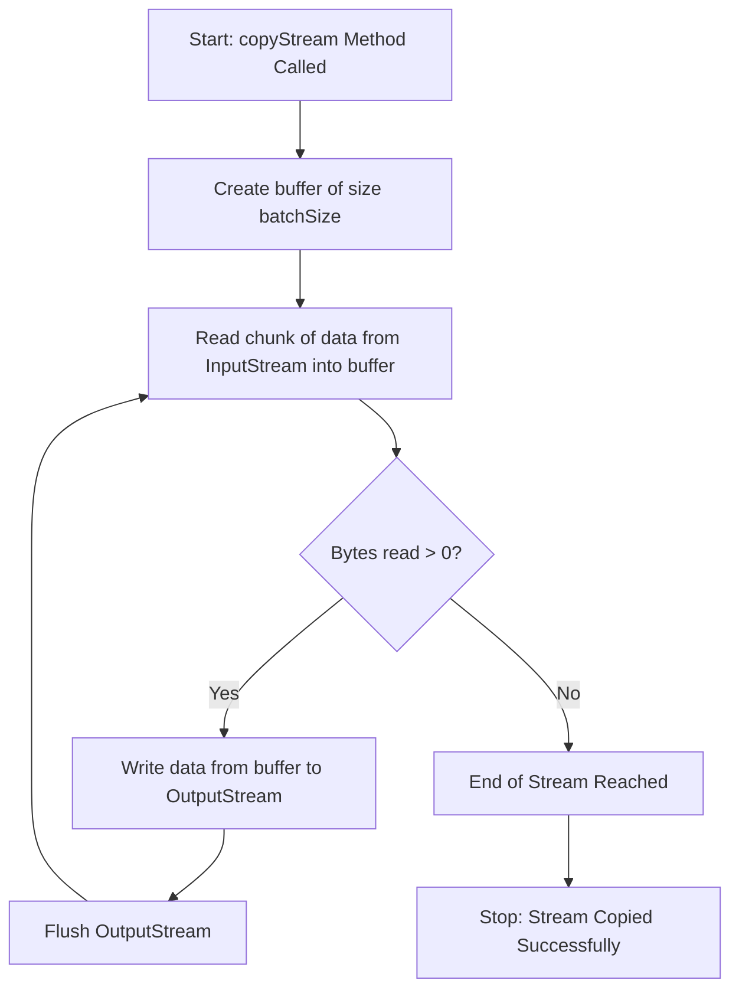

- **Using Java I/O API** 📚: Work with input and output operations in Java.
- **Read and write console and file data using I/O Streams** 💻📄: Handle data input and output from the console or files with streams.
- **Serialize and de-serialize Java objects** 🧳🔄: Convert Java objects into byte streams and restore them back to their original form.
- **Create, traverse, read, and write Path objects and their properties using `java.nio.file` API** 📂🛠️: Manage file system paths, including creation, reading, writing, and traversal with the `java.nio.file` API.
![[Java IO-roadmap.jpg]]

- [[#Introduction to File and Path Objects|Introduction to File and Path Objects]]
- [[#Using Shared Functionality|Using Shared Functionality]]
- [[#File/Directory Instance Method Comparison|File/Directory Instance Method Comparison]]
- [[#Common File and Files Operations (Table 14.4)|Common File and Files Operations (Table 14.4)]]
- [[#Providing NIO.2 Optional Parameters|Providing NIO.2 Optional Parameters]]
	- [[#Providing NIO.2 Optional Parameters#Common NIO.2 Method Arguments (Table 14.5)|Common NIO.2 Method Arguments (Table 14.5)]]
- [[#Interacting with NIO.2 Paths|Interacting with NIO.2 Paths]]
	- [[#Interacting with NIO.2 Paths#Viewing the Path|Viewing the Path]]
	- [[#Interacting with NIO.2 Paths#creating a path of path|creating a path of path]]
	- [[#Interacting with NIO.2 Paths#Accessing Path Elements|Accessing Path Elements]]
		- [[#Accessing Path Elements#Output:|Output:]]
	- [[#Interacting with NIO.2 Paths#Resolving Path|Resolving Path]]
		- [[#Resolving Path#Key Point:|Key Point:]]
	- [[#Interacting with NIO.2 Paths#Relativizing a Path|Relativizing a Path]]
		- [[#Relativizing a Path#Key Points:|Key Points:]]
	- [[#Interacting with NIO.2 Paths#Normalizing Path|Normalizing Path]]
	- [[#Interacting with NIO.2 Paths#Retrieving the Real File System Path|Retrieving the Real File System Path]]
- [[#Creating, Moving, and Deleting Files and Directories|Creating, Moving, and Deleting Files and Directories]]
	- [[#Creating, Moving, and Deleting Files and Directories#Making Directories|Making Directories]]
	- [[#Creating, Moving, and Deleting Files and Directories#Copying Files|Copying Files]]
		- [[#Copying Files#Copying and Replacing File|Copying and Replacing File]]
		- [[#Copying Files#Copying Files with I/O Streams|Copying Files with I/O Streams]]
		- [[#Copying Files#Copying Files into a Directory|Copying Files into a Directory]]
	- [[#Creating, Moving, and Deleting Files and Directories#Moving or Renaming Paths with _move()_|Moving or Renaming Paths with _move()_]]
		- [[#Moving or Renaming Paths with _move()_#Similarities with copy()|Similarities with copy()]]
		- [[#Moving or Renaming Paths with _move()_#Atomic Move|Atomic Move]]
	- [[#Creating, Moving, and Deleting Files and Directories#Deleting a File with delete() and deleteIfExists()|Deleting a File with delete() and deleteIfExists()]]
	- [[#Creating, Moving, and Deleting Files and Directories#Comparing Files with _isSameFile__()_ and _mismatch()_|Comparing Files with _isSameFile__()_ and _mismatch()_]]
- [[#Introducing I/O Streams|Introducing I/O Streams]]
	- [[#Introducing I/O Streams#Understanding I/O Stream Fundamentals|Understanding I/O Stream Fundamentals]]
	- [[#Introducing I/O Streams#Learning I/O Stream Nomenclature|Learning I/O Stream Nomenclature]]
		- [[#Learning I/O Stream Nomenclature#Storing Data as Bytes|Storing Data as Bytes]]
		- [[#Learning I/O Stream Nomenclature#Byte vs. Character I/O Streams:|Byte vs. Character I/O Streams:]]
		- [[#Learning I/O Stream Nomenclature#Input vs. Output Streams:|Input vs. Output Streams:]]
		- [[#Learning I/O Stream Nomenclature#Low-Level vs. High-Level Streams:|Low-Level vs. High-Level Streams:]]
		- [[#Learning I/O Stream Nomenclature#Stream Base Classes:|Stream Base Classes:]]
		- [[#Learning I/O Stream Nomenclature#Decoding I/O Class Names:|Decoding I/O Class Names:]]
- [[#Reading and Writing Files|Reading and Writing Files]]
	- [[#Reading and Writing Files#Using  I/O Streams|Using  I/O Streams]]
	- [[#Reading and Writing Files#Combining with _newBufferedReader__()_ and _newBufferedWriter__()_|Combining with _newBufferedReader__()_ and _newBufferedWriter__()_]]
	- [[#Reading and Writing Files#Reviewing Common Read and Write Methods|Reviewing Common Read and Write Methods]]
- [[#Serializing Data|Serializing Data]]
	- [[#Serializing Data#Applying the _Serializable_ Interface|Applying the _Serializable_ Interface]]
	- [[#Serializing Data#Marking Data _transient_|Marking Data _transient_]]
	- [[#Serializing Data#Ensuring That a Class Is Serializable|Ensuring That a Class Is Serializable]]
		- [[#Ensuring That a Class Is Serializable#How to Make a Class Serializable|How to Make a Class Serializable]]
	- [[#Serializing Data#Storing Data with _ObjectOutputStream_ and _ObjectInputStream_|Storing Data with _ObjectOutputStream_ and _ObjectInputStream_]]
	- [[#Serializing Data#Understanding the Deserialization Creation Process|Understanding the Deserialization Creation Process]]
	- [[#Serializing Data#1. **Object Serialization and Saving**|1. **Object Serialization and Saving**]]
	- [[#Serializing Data#2. **What Happens During Deserialization?**|2. **What Happens During Deserialization?**]]
	- [[#Serializing Data#3. **Steps in Deserialization**|3. **Steps in Deserialization**]]
	- [[#Serializing Data#4. **What Doesn't Happen?**|4. **What Doesn't Happen?**]]
	- [[#Serializing Data#Example:|Example:]]
	- [[#Serializing Data#Summary|Summary]]
- [[#Interacting with Users|Interacting with Users]]
	- [[#Interacting with Users#Printing Data to the User|Printing Data to the User]]
	- [[#Interacting with Users#Using Logging APIs|Using Logging APIs]]
	- [[#Interacting with Users#Reading Input as an I/O Stream|Reading Input as an I/O Stream]]
	- [[#Interacting with Users#Closing System Streams|Closing System Streams]]
	- [[#Interacting with Users#Acquiring Input with Console|Acquiring Input with Console]]
	- [[#Interacting with Users#Obtaining Underlying I/O Streams|Obtaining Underlying I/O Streams]]
	- [[#Interacting with Users#Summary of `Console` Methods for User Input|Summary of `Console` Methods for User Input]]
	- [[#Interacting with Users#Example Usage of Console Methods|Example Usage of Console Methods]]
	- [[#Interacting with Users#Key Points|Key Points]]
	- [[#Interacting with Users#Formatting Console Data|Formatting Console Data]]
		- [[#Formatting Console Data#PrintStream and PrintWriter format Methods:|PrintStream and PrintWriter format Methods:]]
	- [[#Interacting with Users#Example: Printing with Console Formatting|Example: Printing with Console Formatting]]
	- [[#Interacting with Users#Using Console with a Locale|Using Console with a Locale]]
	- [[#Interacting with Users#Reading Console Data|Reading Console Data]]
	- [[#Interacting with Users#Example: Asking User for Name, Address, and Password|Example: Asking User for Name, Address, and Password]]
	- [[#Interacting with Users#Summary of Key Console Methods:|Summary of Key Console Methods:]]
- [[#Working with Advanced APIs|Working with Advanced APIs]]
	- [[#Working with Advanced APIs#Advanced I/O Streams and NIO.2 Concepts|Advanced I/O Streams and NIO.2 Concepts]]
		- [[#Advanced I/O Streams and NIO.2 Concepts#Manipulating Input Streams|Manipulating Input Streams]]
	- [[#Working with Advanced APIs#Example:|Example:]]
		- [[#Example:#Marking Data|Marking Data]]
	- [[#Working with Advanced APIs#Code Breakdown:|Code Breakdown:]]
	- [[#Working with Advanced APIs#The `100` in `mark(100)`:|The `100` in `mark(100)`:]]
	- [[#Working with Advanced APIs#Tip:|Tip:]]
		- [[#Tip:#Skipping Data|Skipping Data]]
	- [[#Working with Advanced APIs#Code Breakdown:|Code Breakdown:]]
	- [[#Working with Advanced APIs#Return Value of `skip()`:|Return Value of `skip()`:]]
		- [[#Return Value of `skip()`:#Reviewing Manipulation APIs|Reviewing Manipulation APIs]]
	- [[#Working with Advanced APIs#Discovering File Attributes|Discovering File Attributes]]
	- [[#Working with Advanced APIs#Reading File Attributes|Reading File Attributes]]
		- [[#Reading File Attributes#Checking for Symbolic Links:|Checking for Symbolic Links:]]
		- [[#Reading File Attributes#Checking File Accessibility:|Checking File Accessibility:]]
	- [[#Working with Advanced APIs#Improving Attribute Access|Improving Attribute Access]]
	- [[#Working with Advanced APIs#Attribute and View Types|Attribute and View Types]]
	- [[#Working with Advanced APIs#Example of Commonly Used Attribute and View Types|Example of Commonly Used Attribute and View Types]]
	- [[#Working with Advanced APIs#Retrieving Attributes|Retrieving Attributes]]
	- [[#Working with Advanced APIs#Modifying Attributes|Modifying Attributes]]
	- [[#Working with Advanced APIs#Important Note|Important Note]]
	- [[#Working with Advanced APIs#Traversing a Directory Tree|Traversing a Directory Tree]]
	- [[#Working with Advanced APIs#Directory Structure|Directory Structure]]
	- [[#Working with Advanced APIs#Selecting a Search Strategy|Selecting a Search Strategy]]
	- [[#Working with Advanced APIs#Files.walk() Method(Walking Directory)|Files.walk() Method(Walking Directory)]]
	- [[#Working with Advanced APIs#Example: Calculating the Total Size of Files in a Directory Tree|Example: Calculating the Total Size of Files in a Directory Tree]]
	- [[#Working with Advanced APIs#Output Example:|Output Example:]]
	- [[#Working with Advanced APIs#Conclusion|Conclusion]]
	- [[#Working with Advanced APIs#Applying a Depth Limit|Applying a Depth Limit]]
	- [[#Working with Advanced APIs#Avoiding Circular Paths|Avoiding Circular Paths]]
	- [[#Working with Advanced APIs#Example of a Directory Cycle with Symbolic Links|Example of a Directory Cycle with Symbolic Links]]
	- [[#Working with Advanced APIs#Conclusion|Conclusion]]
- [[#Review of Key APIs|Review of Key APIs]]
	- [[#Review of Key APIs#Summary|Summary]]
	- [[#Review of Key APIs#Exam Essentials|Exam Essentials]]


# Creating file


```java
File zooFile1 = new File("/home/tiger/data/stripes.txt");
File zooFile2 = new File("/home/tiger", "data/stripes.txt");
 
File parent = new File("/home/tiger");
File zooFile3 = new File(parent, "data/stripes.txt");
 
System.out.println(zooFile1.exists());
```

# creating a path 

```java
Path zooPath1 = Path.of("/home/tiger/data/stripes.txt");
Path zooPath2 = Path.of("/home", "tiger", "data", "stripes.txt");
 
Path zooPath3 = Paths.get("/home/tiger/data/stripes.txt");
Path zooPath4 = Paths.get("/home", "tiger", "data", "stripes.txt");
 
System.out.println(Files.exists(zooPath1));
```

Both methods allow passing a varargs parameter to add path elements, which are combined and separated by the system's file separator. The Files helper class can also check if the file exists.

Java 11 introduced the static `Path.of() `method, while the Paths class provides a `get()` method. We use both interchangeably in this chapter.

# Switching between File and Path 

```java
File file = new File("rabbit");
Path nowPath = file.toPath();
File backToFile = nowPath.toFile();
```

# Obtaining a Path from FileSystems Class 

NIO.2 makes extensive use of creating objects with factory classes. The `FileSystems` class creates instances of the abstract `FileSystem` class. The latter includes methods for working with the file system directly. Both `Paths.get()` and `Path.of()` are shortcuts for this `FileSystem` method. Let's rewrite our earlier examples one more time to see how to obtain a `Path` instance the long way:

```java
Path zooPath1 = FileSystems.getDefault()
   .getPath("/home/tiger/data/stripes.txt");
Path zooPath2 = FileSystems.getDefault()
   .getPath("/home", "tiger", "data", "stripes.txt");
```

# Reviewing I/O and NIO.2 relationship 

- The model for I/O is smaller and you only need to understand the File
- NIO.2 has more features and make extensive use of the factory pattern.

![[Pasted image 20241231131200.png|I/O and NIO.2 class and interface relationship]]
# Operating on File and Path

## Introduction to File and Path Objects

Having learned how to create File and Path objects, we can now utilize them for various practical applications. This section focuses on the functionalities related to directory operations.

## Using Shared Functionality

Both the I/O and NIO.2 libraries offer a range of operations that can be performed on File and Path objects. The following tables summarize many common APIs available for these operations:

- **Table 14.3:** Lists common methods available in I/O and NIO.2 libraries.
    
- **Table 14.4:** Provides additional methods and functionalities for file and path operations.
    

While the tables may appear extensive, many of the methods are intuitive and self-explanatory. It is important to note that you can temporarily disregard the vararg parameters, as they will be explained in detail later in the chapter.


Here is the requested table formatted for better readability and comparison:

---

## File/Directory Instance Method Comparison

| **Description**                            | **I/O File Instance Method** | **NIO.2 Path Instance Method** |
| ------------------------------------------ | ---------------------------- | ------------------------------ |
| Gets name of file/directory                | `getName()`                  | `getFileName()`                |
| Retrieves parent directory or null if none | `getParent()`                | `getParent()`                  |
| Checks if file/directory is absolute path  | `isAbsolute()`               | `isAbsolute()`                 |

---

## Common File and Files Operations (Table 14.4)

| **Description**                                 | **I/O File Instance Method** | **NIO.2 Files Static Method**                                      |
| ----------------------------------------------- | ---------------------------- | ------------------------------------------------------------------ |
| Deletes file/directory                          | `delete()`                   | `deleteIfExists(Path p)` (throws IOException)                      |
| Checks if file/directory exists                 | `exists()`                   | `exists(Path p, LinkOption… o)`                                    |
| Retrieves absolute path of file/directory       | `getAbsolutePath()`          | `toAbsolutePath()`                                                 |
| Checks if resource is directory                 | `isDirectory()`              | `isDirectory(Path p, LinkOption… o)`                               |
| Checks if resource is file                      | `isFile()`                   | `isRegularFile(Path p, LinkOption… o)`                             |
| Returns the time the file was last modified     | `lastModified()`             | `getLastModifiedTime(Path p, LinkOption… o)` (throws IOException)  |
| Retrieves number of bytes in file               | `length()`                   | `size(Path p)` (throws IOException)                                |
| Lists contents of directory                     | `listFiles()`                | `list(Path p)` (throws IOException)                                |
| Creates directory                               | `mkdir()`                    | `createDirectory(Path p, FileAttribute… a)` (throws IOException)   |
| Creates directory including nonexistent parents | `mkdirs()`                   | `createDirectories(Path p, FileAttribute… a)` (throws IOException) |
| Renames file/directory                          | `renameTo(File dest)`        | `move(Path src, Path dest, CopyOption… o)` (throws IOException)    |

---

## Providing NIO.2 Optional Parameters

### Common NIO.2 Method Arguments (Table 14.5)

| **Enum Type**          | **Interface Inherited** | **Enum Value**      | **Details**                                                                        |
| ---------------------- | ----------------------- | ------------------- | ---------------------------------------------------------------------------------- |
| **LinkOption**         | **CopyOption**          | `NOFOLLOW_LINKS`    | Do not follow symbolic links.                                                      |
| **StandardCopyOption** | **CopyOption**          | `ATOMIC_MOVE`       | Move file as an atomic file system operation.                                      |
|                        |                         | `COPY_ATTRIBUTES`   | Copy existing attributes to the new file.                                          |
|                        |                         | `REPLACE_EXISTING`  | Overwrite file if it already exists.                                               |
| **StandardOpenOption** | **OpenOption**          | `APPEND`            | If the file is already open for write, append to the end.                          |
|                        |                         | `CREATE`            | Create a new file if it does not exist.                                            |
|                        |                         | `CREATE_NEW`        | Create a new file only if it does not exist; fail otherwise.                       |
|                        |                         | `READ`              | Open for read access.                                                              |
|                        |                         | `TRUNCATE_EXISTING` | If the file is already open for write, erase the file and append to the beginning. |
|                        |                         | `WRITE`             | Open for write access.                                                             |
| **FileVisitOption**    | **N/A**                 | `FOLLOW_LINKS`      | Follow symbolic links.                                                             |

---

This table outlines the various NIO.2 enum types, their associated interfaces, and the values with their corresponding behaviors, which are essential for Java file operations.

## Interacting with NIO.2 Paths

- Path instances are immutable

 ```java
 Path p = Path.of("whale");
p.resolve("krill");
System.out.println(p);  // whale
```

- resolve return a Path object but doesn't modify the current instance


### Viewing the Path

In the `Path` interface, there are methods to retrieve basic information about the path. These methods help in understanding the structure and components of the path representation.

- **toString()**: Returns the entire path as a `String`.
- **getNameCount()**: Retrieves the number of elements in the path (excluding the root).
- **getName()**: Accesses specific path elements by index.

These methods are useful for analyzing and manipulating path structures in file systems.

### creating a path of path

- Path interface include subpath() to select portion  of a path
- take two params (beginIndex, endIndex)
<u>code example</u>

```java
var p = Paths.get("/mammal/omnivore/raccoon.image");
System.out.println("Path is: " + p);
for (int i = 0; i < p.getNameCount(); i++) {
   System.out.println("   Element " + i + " is: " + p.getName(i));
}
System.out.println();
System.out.println("subpath(0,3): " + p.subpath(0, 3));
System.out.println("subpath(1,2): " + p.subpath(1, 2));
System.out.println("subpath(1,3): " + p.subpath(1, 3));
```

### Accessing Path Elements


The `Path` interface provides methods to retrieve specific elements of a path as `Path` objects.

- **getFileName()**: Returns the file or directory name.
- **getParent()**: Returns the containing directory's full path, or `null` for root or top-level paths.
- **getRoot()**: Returns the root element, or `null` for relative paths.

Example method to print path elements:

```java
public void printPathInformation(Path path) {
   System.out.println("Filename is: " + path.getFileName());
   System.out.println("   Root is: " + path.getRoot());
   Path currentParent = path;
   while((currentParent = currentParent.getParent()) != null)
      System.out.println("   Current parent is: " + currentParent);
   System.out.println();
}
```

#### Output:

- `getRoot()` differs between absolute and relative paths.
- `getParent()` doesn’t traverse relative paths outside the current directory.
- Path symbols (e.g., `.` or `..`) are not resolved by these methods.


### Resolving Path


The `resolve()` method concatenates paths, similar to string concatenation, and can take either a `Path` or `String` as an argument. The base path becomes the foundation, with the input appended.

Example:

```java
Path path1 = Path.of("/cats/../panther");
Path path2 = Path.of("food");
System.out.println(path1.resolve(path2));  // Output: /cats/../panther/food
```

- `resolve()` does not clean up path symbols (e.g., `..`).

If an absolute path is provided, it overrides the base path:

```java
Path path3 = Path.of("/turkey/food");
System.out.println(path3.resolve("/tiger/cage"));  // Output: /tiger/cage
```

#### Key Point:

- Absolute paths override relative ones in `resolve()`, and two absolute paths cannot be combined.


### Relativizing a Path

The `relativize()` method constructs a relative path from one `Path` to another, using path symbols. For example:

```java
var path1 = Path.of("fish.txt");
var path2 = Path.of("friendly/birds.txt");
System.out.println(path1.relativize(path2));  // Output: ../friendly/birds.txt
System.out.println(path2.relativize(path1));  // Output: ../../fish.txt
```

- For relative paths, it computes steps as if both are in the same directory.
- For absolute paths, it calculates the relative path from one absolute location to another.

On Windows:

```java
Path path3 = Paths.get("E:\\habitat");
Path path4 = Paths.get("E:\\sanctuary\\raven\\poe.txt");
System.out.println(path3.relativize(path4));  // Output: ..\sanctuary\raven\poe.txt
System.out.println(path4.relativize(path3));  // Output: ..\..\..\habitat
```

#### Key Points:

- `relativize()` requires both paths to be either absolute or relative.
- Mixing path types or different roots (like different drives on Windows) throws an `IllegalArgumentException`.

### Normalizing Path 

The `normalize()` method in Java removes unnecessary redundancies in a path, such as `..` (parent directory) and `.` (current directory). Here are examples:

```java
var p1 = Path.of("./armadillo/../shells.txt");
System.out.println(p1.normalize());  // shells.txt

var p2 = Path.of("/cats/../panther/food");
System.out.println(p2.normalize());  // /panther/food

var p3 = Path.of("../../fish.txt");
System.out.println(p3.normalize());  // ../../fish.txt
```

The method simplifies paths by reducing redundant symbols but won't remove all symbols.

It also helps compare equivalent paths:

```java
var p1 = Paths.get("/pony/../weather.txt");
var p2 = Paths.get("/weather.txt");
System.out.println(p1.equals(p2));  // false
System.out.println(p1.normalize().equals(p2.normalize()));  // true
```

The `normalize()` method allows better comparison by reducing paths to their simplest form.


### Retrieving the Real File System Path


The `toRealPath()` method resolves a path, eliminating redundant symbols and following symbolic links. It behaves like `normalize()` and `toAbsolutePath()`, but throws an exception if the path doesn't exist. Optionally, you can ignore symbolic links with `LinkOption`.

For example, given a symbolic link from `/zebra` to `/horse` and a current working directory of `/horse/schedule`, the following code prints:

```java
System.out.println(Paths.get("/zebra/food.txt").toRealPath());
System.out.println(Paths.get(".././food.txt").toRealPath());
```

Output:

```
/horse/food.txt
```

Additionally, you can access the current working directory as a `Path` object:

```java
System.out.println(Paths.get(".").toRealPath());
```


|Description|Method or constructor|
|---|---|
|File path as string|```<br>public String toString()<br>```|
|Single segment|```<br>public Path getName(int index)<br>```|
|Number of segments|```<br>public int getNameCount()<br>```|
|Segments in range|```<br>public Path subpath(int beginIndex, int endIndex)<br>```|
|Final segment|```<br>public Path getFileName()<br>```|
|Immediate parent|```<br>public Path getParent()<br>```|
|Top-level segment|```<br>public Path getRoot()<br>```|
|Concatenate paths|```<br>public Path resolve(String p) <br>```|
|Construct path to one provided|```<br>public Path relativize(Path p)<br>```|
|Remove redundant parts of path|```<br>public Path normalize()<br>```|
|Follow symbolic links to find path on file system|```<br>public Path toRealPath()<br>```|


## Creating, Moving, and Deleting Files and Directories

### Making Directories

To create directories, use the `createDirectory()` and `createDirectories()` methods:

- `createDirectory()` creates a directory but throws an exception if it already exists or if the parent directories are missing.
- `createDirectories()` creates the target directory and any missing parent directories. If they exist, it does nothing.

Example:

```java
Files.createDirectory(Path.of("/bison/field"));
Files.createDirectories(Path.of("/bison/field/pasture/green"));
```

The first creates `/bison/field` (if `/bison` exists), while the second creates `/bison/field/pasture/green` along with any missing parents.


### Copying Files

The `Files.copy()` method copies files or directories from one location to another. It supports optional `CopyOption` parameters.

Example:

```java
Files.copy(Paths.get("/panda/bamboo.txt"), Paths.get("/panda-save/bamboo.txt"));
Files.copy(Paths.get("/turtle"), Paths.get("/turtleCopy"));
```

When copying directories, it performs a shallow copy (does not copy files/subdirectories). To perform a deep copy, recursion is needed:

```java
public void copyPath(Path source, Path target) {
   try {
      Files.copy(source, target);
      if(Files.isDirectory(source)) {
         try (Stream<Path> s = Files.list(source)) {
            s.forEach(p -> copyPath(p, target.resolve(p.getFileName())));
         }
      }
   } catch(IOException e) {
      // Handle exception
   }
}
```

This method performs a shallow copy and, if a directory is encountered, recursively copies its contents. Symbolic links are not followed when using `Files.list()`.


#### Copying and Replacing File


By default, `Files.copy()` throws an exception if the target exists. To overwrite the file, use `StandardCopyOption.REPLACE_EXISTING`:

```java
Files.copy(Paths.get("book.txt"), Paths.get("movie.txt"), StandardCopyOption.REPLACE_EXISTING);
```

Without this option, an exception will be thrown if the file exists.


#### Copying Files with I/O Streams

The Files class has two copy() methods that work with I/O streams:

- `long copy(InputStream in, Path target, CopyOption... options) throws IOException`
- `long copy(Path source, OutputStream out) throws IOException`

The first method copies data from an I/O stream to a file, while the second method writes data from a file to an I/O stream. These methods are useful for quick file I/O operations.

Examples:

```java
try (var is = new FileInputStream("source-data.txt")) {
    Files.copy(is, Paths.get("/mammals/wolf.txt"));
}

Files.copy(Paths.get("/fish/clown.xsl"), System.out);
```

The I/O stream can be any valid stream, such as web connections or in-memory resources. The second example prints the contents of a file to the console.

#### Copying Files into a Directory

When copying files into a directory, if the target path is a directory and not a file, an exception is thrown. For example:

```java
var file = Paths.get("food.txt");
var directory = Paths.get("/enclosure");
Files.copy(file, directory);
```

This throws an exception because the target is a directory. The correct approach is:

```java
var file = Paths.get("food.txt");
var directory = Paths.get("/enclosure/food.txt");
Files.copy(file, directory);
```


### Moving or Renaming Paths with _move()_


The Files class offers a `move()` method for moving or renaming files and directories:

```java
public static Path move(Path source, Path target, CopyOption... options) throws IOException
```

Example usage:

```java
Files.move(Path.of("C:\\zoo"), Path.of("C:\\zoo-new"));
Files.move(Path.of("C:\\user\\addresses.txt"), Path.of("C:\\zoo-new\\addresses2.txt"));
```

The first example renames the "zoo" directory to "zoo-new" while keeping the contents. The second moves "addresses.txt" to "zoo-new" and renames it "addresses2.txt."

#### Similarities with copy()

Like `copy()`, `move()` requires `REPLACE_EXISTING` to overwrite the target, and it throws an exception if the source is a file and the target is a directory.

#### Atomic Move

The `ATOMIC_MOVE` option ensures that a file move is atomic, meaning it's treated as a single operation without partial writes. If unsupported, an `AtomicMoveNotSupportedException` is thrown:

```java
Files.move(Path.of("mouse.txt"), Path.of("gerbil.txt"), StandardCopyOption.ATOMIC_MOVE);
```

Note: `ATOMIC_MOVE` works with `move()`, not `copy()`.


### Deleting a File with delete() and deleteIfExists()

The Files class provides two methods for deleting files or empty directories:

```java
public static void delete(Path path) throws IOException
public static boolean deleteIfExists(Path path) throws IOException
```

Both methods throw an exception if the directory is not empty. If the path is a symbolic link, only the link is deleted, not the target.

- `delete()` throws an exception if the path doesn't exist.
- `deleteIfExists()` returns `true` if successful, or `false` otherwise, without throwing an exception.

Example:

```java
Files.delete(Paths.get("/vulture/feathers.txt"));
Files.deleteIfExists(Paths.get("/pigeon"));
```

The first deletes `feathers.txt` and throws an exception if it doesn't exist. The second deletes the `pigeon` directory if empty, but does not throw an exception if the directory does not exist.

### Comparing Files with _isSameFile__()_ and _mismatch()_

The `isSameFile()` method compares two `Path` objects to check if they refer to the same file or directory, resolving symbolic links and path symbols. It returns `true` if the paths are equal, even if the files don't exist, in which case it won't check the file's existence.

Example:

```java
Files.isSameFile(Path.of("/animals/cobra"), Path.of("/animals/snake")); // true
Files.isSameFile(Path.of("/animals/monkey/ears.png"), Path.of("/animals/wolf/ears.png")); // false
```

The `mismatch()` method, introduced in Java 12, compares file contents byte by byte. It returns `-1` if the files are the same, or the index of the first differing byte.

Example:

```java
Files.mismatch(Path.of("/animals/monkey.txt"), Path.of("/animals/wolf.txt")); // 1
Files.mismatch(Path.of("/animals/wolf.txt"), Path.of("/animals/monkey.txt")); // 1
```

## Introducing I/O Streams

- I/O streams allow reading and writing data from/to resources.
- "I/O" refers to input (reading) and output (writing) operations.
- In this section, we focus on I/O streams from the `java.io` API.
- The term "streams" in this chapter refers to those from Chapter 10.


### Understanding I/O Stream Fundamentals

- **I/O streams** allow sequential access to file data, reading or writing **one block at a time**.

![[Pasted image 20250102035614.png|Visual representation of a  I/Ostream]]
- Data in I/O streams can be read or written as individual **bytes**, **characters**, or larger **blocks**, with **Buffered** streams handling larger chunks.
- Streams are primarily used for **file I/O** but can handle any **sequential data source**, such as sending or receiving data from a **website**.
- I/O streams help manage **large data** by focusing on small portions at a time, making it possible to process **large files** without loading everything into **memory**.

### Learning I/O Stream Nomenclature

The `java.io` API offers many classes for creating, accessing, and manipulating I/O streams, which can be overwhelming for new developers. Don’t worry! This section highlights key differences between stream classes and their naming conventions to help you recognize their functions. Even unfamiliar stream names often provide enough clues about their purpose. The goal is to familiarize you with I/O terminology and conventions, which we will explain in detail throughout the chapter.


#### Storing Data as Bytes

Data is stored in a file system (and memory) as a `0` or `1`, called a _bit_. Since it's really hard for humans to read/write data that is just `0`s and `1`s, they are grouped into a set of 8 bits, called a _byte_.

What about the Java `byte` primitive type? As you learn later, when we use I/O streams, values are often read or written using `byte` values and arrays.

#### Byte vs. Character I/O Streams:

- **Byte I/O Streams** read/write binary data (0s and 1s) and end in `InputStream` or `OutputStream`.
- **Character I/O Streams** read/write text data and end in `Reader` or `Writer`.

Both types have similar classes, e.g., `FileInputStream` vs. `FileReader`, but differ in how data is read/written.

- **Byte I/O**: Used for binary data (e.g., images, executables).
- **Character I/O**: Used for text files (e.g., writing Strings).

Despite lacking the word “Stream” in their names, `Reader`/`Writer` classes are still I/O streams.

**Character Encoding in Java**:

- Java supports various encodings like `UTF-8`, `UTF-16`, and `US-ASCII`.
- You can specify encoding using `Charset.forName()`:
    - `Charset.forName("US-ASCII")`, `Charset.forName("UTF-8")`, etc.


#### Input vs. Output Streams:

- Most **InputStream** classes have a corresponding **OutputStream** class (e.g., `FileInputStream`/`FileOutputStream`).
- Similarly, most **Reader** classes have a corresponding **Writer** class (e.g., `FileReader`/`FileWriter`).

Exceptions:

- **PrintWriter** has no corresponding **PrintReader**.
- **PrintStream** is an **OutputStream** without a corresponding **InputStream** and lacks "Output" in its name.

#### Low-Level vs. High-Level Streams:

- **Low-level streams**: Directly connect to data sources (e.g., `FileInputStream`) and process raw data. They read/write data byte by byte.
- **High-level streams**: Built on top of low-level streams, often adding functionality like filtering or performance enhancements (e.g., `BufferedReader` wraps `FileReader`).

Example:

```java
try (var br = new BufferedReader(new FileReader("zoo-data.txt"))) {
   System.out.println(br.readLine());
}
```

Here, `FileReader` is low-level, and `BufferedReader` is high-level.

High-level streams can wrap other high-level streams, e.g.,:

```java
try (var ois = new ObjectInputStream(
      new BufferedInputStream(
         new FileInputStream("zoo-data.txt")))) {
   System.out.print(ois.readObject());
}
```

For the exam, focus on low-level stream classes that operate on files; others are high-level streams.

#### Stream Base Classes:

- The `java.io` library defines four abstract classes: `InputStream`, `OutputStream`, `Reader`, and `Writer`.
- High-level I/O streams often use references to these abstract classes. For example, `BufferedWriter` accepts a `Writer` object as input.

**Common Mistakes**:

- Mixing incompatible I/O stream classes can cause compilation errors:
    - `new BufferedInputStream(new FileReader("z.txt"))` (Reader/Writer with InputStream/OutputStream).
    - `new BufferedWriter(new FileOutputStream("z.txt"))` (Reader/Writer with OutputStream/InputStream).
    - `new ObjectInputStream(new FileOutputStream("z.txt"))` (Mixing OutputStream with InputStream).
    - `new BufferedInputStream(new InputStream())` (Cannot instantiate an abstract class).

#### Decoding I/O Class Names:

- Class names often provide clues about their function. For example, `FileReader` reads data from a file as characters, and `ObjectOutputStream` writes object data to a byte stream.

**Abstract Base Classes**:

|Class Name|Description|
|---|---|
|`InputStream`|Abstract class for all input byte streams|
|`OutputStream`|Abstract class for all output byte streams|
|`Reader`|Abstract class for all input character streams|
|`Writer`|Abstract class for all output character streams|

- Table 14.8 lists the concrete I/O streams to know for the exam, where their function can often be inferred from the class name.

|Class name|Low/High level|Description|
|---|---|---|
|`FileInputStream`|Low|Reads file data as bytes|
|`FileOutputStream`|Low|Writes file data as bytes|
|`FileReader`|Low|Reads file data as characters|
|`FileWriter`|Low|Writes file data as characters|
|`BufferedInputStream`|High|Reads byte data from existing `InputStream` in buffered manner, which improves efficiency and performance|
|`BufferedOutputStream`|High|Writes byte data to existing `OutputStream` in buffered manner, which improves efficiency and performance|
|`BufferedReader`|High|Reads character data from existing `Reader` in buffered manner, which improves efficiency and performance|
|`BufferedWriter`|High|Writes character data to existing `Writer` in buffered manner, which improves efficiency and performance|
|`ObjectInputStream`|High|Deserializes primitive Java data types and graphs of Java objects from existing `InputStream`|
|`ObjectOutputStream`|High|Serializes primitive Java data types and graphs of Java objects to existing `OutputStream`|
|`PrintStream`|High|Writes formatted representations of Java objects to binary stream|
|`PrintWriter`|High|Writes formatted representations of Java objects to character stream|
## Reading and Writing Files

- Severals way to read/write files in Java

### Using  I/O Streams 

I/O streams in Java focus on reading and writing data. The key methods are:

- **`read()`**: Declared in `InputStream` and `Reader` for reading bytes or characters.
- **`write()`**: Defined in `OutputStream` and `Writer` for writing bytes or characters.

Example: The `copyStream()` method demonstrates reading from an `InputStream`/`Reader` and writing to an `OutputStream`/`Writer`, using `-1` to signal the end of the stream.


```java
void copyStream(InputStream in, OutputStream out) throws IOException {
   int b;
   while ((b = in.read()) != -1) {
      out.write(b);
   }
}
 
void copyStream(Reader in, Writer out) throws IOException {
   int b;
   while ((b = in.read()) != -1) {
      out.write(b);
   }
}

```

Java's `read()` and `write()` methods use `int` instead of `byte` to accommodate special values like `-1` for end-of-stream markers, as `byte` lacks the range for this. Output streams also use `int` for consistency.

Reading/writing one byte at a time is inefficient, so overloaded methods support multiple bytes/characters at once. These methods use an offset and length to specify where to start in the array and how many bytes/characters to process (e.g., offset 3, length 5 processes 5 bytes starting at index 3).

<u>Example: </u>

```java
void copyStream(InputStream in, OutputStream out) throws IOException {
11:    int batchSize = 1024;
12:    var buffer = new byte[batchSize];
13:    int lengthRead;
14:    while ((lengthRead = in.read(buffer, 0, batchSize))> 0) {
15:       out.write(buffer, 0, lengthRead);
16:       out.flush();
17:    }
```


Instead of processing one byte at a time, reading/writing in chunks (e.g., 1024 bytes) improves efficiency. The **return value `lengthRead`** is essential for detecting the end of the stream and determining how many bytes to write. If ignored, overwriting errors can occur in the output (e.g., writing leftover bytes from previous loops).

For example, with a 1024-byte buffer and a 1054-byte file, the last read writes only 30 bytes. Ignoring `lengthRead` would write incorrect data.

Using **`flush()`** ensures buffered data is immediately written to disk, minimizing data loss if the program crashes. However, frequent use can slow down the application, especially with large files. It’s best used sparingly for critical data.

High-level streams (e.g., for Reader/Writer) simplify these tasks, as they work with characters instead of bytes and abstract away many low-level details.

```java
26: void copyTextFile(File src, File dest) throws IOException {
27:    try (var reader = new BufferedReader(new FileReader(src));
28:       var writer = new BufferedWriter(new FileWriter(dest))) {
29:       String line = null;
30:       while ((line = reader.readLine()) != null) {
31:          writer.write(line);
32:          writer.newLine();
33:       } } }
```


For file operations, use **FileReader** and **FileWriter** for character data. They accept either a `String` or a `File` as input. If the source file doesn't exist, a **FileNotFoundException** is thrown. A destination file will be overwritten unless an append flag is passed to **FileWriter**.

For reading lines efficiently, use **BufferedReader** and **BufferedWriter**, which handle reading and writing in batches. The **try-with-resources** statement ensures automatic resource management.

For byte data, use **BufferedInputStream**, **BufferedOutputStream**, **FileInputStream**, and **FileOutputStream**. Instead of `readLine()`, use `readAllBytes()` and store the result in a byte array.

To further optimize, use **PrintStream** and **PrintWriter**, which offer methods like `print()`, `println()`, `format()`, and `printf()` for printing and formatting data.

```java
void copyTextFile(File src, File dest) throws IOException {
   try (var reader = new BufferedReader(new FileReader(src));
      var writer = new PrintWriter(new FileWriter(dest))) {
      String line = null;
      while ((line = reader.readLine()) != null)
          writer.println(line);
      }
}
```

The **println()** method has multiple overloaded versions that accept primitives, Strings, or objects. Internally, they typically use **String.valueOf()**.

Unlike other output stream classes, **PrintStream** doesn’t have a corresponding input stream class, and its name lacks "Output." A notable feature is that **System.out** and **System.err** are **PrintStream** objects, while **System.in** is an **InputStream**.

The **PrintStream** methods don't throw checked exceptions, unlike most other I/O methods, so there’s no need to catch exceptions when using **System.out.print()**.

The line separator used by **println()** depends on the OS (\n or \r\n), and if needed, you can directly access it through system properties.

```java
System.getProperty("line.separator");
System.lineSeparator();
```

# Enhancing with Files

- NIO.2 has an eaier way to read/write files using Files lcass.
<u>example</u>

```java
private void copyPathAsString(Path input, Path output) throws IOException {
   String string = Files.readString(input);
   Files.writeString(output, string);
}
private void copyPathAsBytes(Path input, Path output) throws IOException {
    byte[] bytes = Files.readAllBytes(input);
    Files.write(output, bytes);
}
private void copyPathAsLines(Path input, Path output) throws IOException {
   List<String> lines = Files.readAllLines(input);
   Files.write(output, lines);
}
```

You can read a **Path** as a **String**, **byte array**, or **List**, but these methods load the entire file into memory, which may cause an **OutOfMemoryError** for large files. As an alternative, you can read and print the file incrementally to avoid this issue.

```java
private void readLazily(Path path) throws IOException {
   try (Stream<String> s = Files.lines(path)) {
      s.forEach(System.out::println);
   }
}
```

The file contents are read and processed lazily, storing only a small portion in memory at any given time. This method can be further enhanced by using additional stream methods for more efficient processing.

```java
try (var s = Files.lines(path)) {
   s.filter(f -> f.startsWith("WARN:"))
      .map(f -> f.substring(5))
      .forEach(System.out::println);
}
```

- This sample code look for a log line that start with `WARN`.
- for example a input file **sharks.log**
```txt
INFO:Server starting
DEBUG:Processes available = 10
WARN:No database could be detected
DEBUG:Processes available reset to 0
WARN:Performing manual recovery
INFO:Server successfully started
```
then the example output
```shell
No database could be detected
Performing manual recovery
```

⚠️ For the exam  u should  know  `readAllLines()`  and `lines()`

```java
Files.readAllLines(Paths.get("birds.txt")).forEach(System.out::println);
       Files.lines(Paths.get("birds.txt")).forEach(System.out::println);
```

- The first line reads the entire file into memory and prints the result.
- The second line processes each line lazily, printing it as it is read.
- The advantage of the second approach is that it does not require loading the entire file into memory.

Regarding the compilation issue: Mixing incompatible types often causes compilation errors. Without the exact code, I can't pinpoint the specific issue, but typically, this happens when types do not match, such as attempting to assign a `String` to a variable expecting a `byte[]` or vice versa.

<mark style="background: #FF5582A6;">why this code is invalid  :</mark>

```java
   Files.readAllLines(Paths.get("birds.txt"))
          .filter(s -> s.length()> 2)
          .forEach(System.out::println);
```

The `readAllLines()` method returns a `List`, not a `Stream`, so the `filter()` method is not available.

### Combining with _newBufferedReader__()_ and _newBufferedWriter__()_

Sometimes you need to mix I/O streams and NIO.2. Conveniently, `Files` includes two convenience methods for getting I/O streams.

```java
private void copyPath(Path input, Path output) throws IOException {
   try (var reader = Files.newBufferedReader(input);
        var writer = Files.newBufferedWriter(output)) {
 
      String line = null;
      while ((line = reader.readLine()) != null)
         writer.write(line);
         writer.newLine();
      } } }
```

### Reviewing Common Read and Write Methods

|Class|Method name|Description|
|---|---|---|
|All input streams|`public int **read**()`|Reads single byte or returns `-1` if no bytes available.|
|`InputStream`|`public int **read**(byte[] b)`|Reads values into buffer. Returns number of bytes or characters read.|
|`Reader`|`public int **read**(char[] c)`|
|`InputStream`|`public int **read**(byte[] b, int offset, int length)`|Reads up to `length` values into buffer starting from position `offset`. Returns number of bytes or characters read.|
|`Reader`|`public int **read**(char[] c, int offset, int length)`|
|All output streams|`public void **write**(int b)`|Writes single byte.|
|`OutputStream`|`public void **write**(byte[] b)`|Writes array of values into stream.|
|`Writer`|`public void **write**(char[] c)`|
|`OutputStream`|`public void **write**(byte[] b, int offset, int length)`|Writes `length` values from array into stream, starting with `offset` index.|
|`Writer`|`public void **write**(char[] c, int offset, int length)`|
|`BufferedInputStream`|`public byte[] **readAllBytes**()`|Reads data in bytes.|
|`BufferedReader`|`public String **readLine**()`|Reads line of data.|
|`BufferedWriter`|`public void **write**(String line)`|Writes line of data.|
|`BufferedWriter`|`public void **newLine**()`|Writes new line.|
|All output streams|`public void **flush**()`|Flushes buffered data through stream.|
|All streams|`public void **close**()`|Closes stream and releases resources.|

---

## Serializing Data

- In this book, we've been managing data using **classes**, and it makes sense to save these objects between program executions to avoid re-entering data, such as the zoo animals' health information.
    
- While you can use **I/O stream classes** for storing text or binary data, you would need to handle the encoding and decoding yourself.
    
- **Serialization** solves this problem by converting objects into a **byte stream** (serialization) and converting a **byte stream** back into an object (deserialization). This is useful for storing or transmitting objects without having to manually handle formats like **XML** or **CSV**.
    
- **Figure 14.6** visually represents the process of **serializing** and **deserializing** a **Giraffe** object to and from a **giraffe.txt** file.
![[Pasted image 20250103144457.png|Serialization process]]
### Applying the _Serializable_ Interface

- All **Java primitives** and many of the built-in **Java classes** that you have worked with throughout this book are **Serializable**.
<u>Example</u>

```java
import java.io.Serializable;
public class Gorilla implements Serializable {
   private static final long serialVersionUID = 1L;
   private String name;
   private int age;
   private Boolean friendly;
   private transient String favoriteFood;
 
   // Constructors/Getters/Setters/toString() omitted
}
```

- In this example, the **Gorilla** class contains three instance members (**name**, **age**, **friendly**) that will be saved to an I/O stream when the class is **serialized**.
    
- Since **Serializable** is not part of the **java.lang** package, it must be imported or referenced with the package name.
    
- The **favoriteFood** field, marked as **transient**, will not be saved to an I/O stream during serialization. Fields marked as **transient** are excluded from serialization, which will be discussed in more detail next.


- It's recommended to declare a **static serialVersionUID** in every class implementing **Serializable**.
    
- **serialVersionUID** is stored with the object during serialization and updated when the class structure changes.
    
- For example, if the **Gorilla** class adds a **banana** field or renames **age**, it may be serialized with an older version and deserialized with a newer one.
    
- **serialVersionUID** informs the JVM of potential mismatches between the stored data and the new class. If an older class version is used, a **java.io.InvalidClassException** may be thrown.
    
- Some APIs support converting data between versions to manage these changes.

### Marking Data _transient_

- The **transient** modifier is used for sensitive data, like passwords, or objects that don't need serialization, such as an in-memory **Thread** state. These fields are ignored during serialization when marked as **transient**.
    
- During **deserialization**, **transient** data reverts to its default Java values (e.g., `0.0` for `double`, or `null` for objects).
    
- Marking **static** fields as **transient** has little effect on serialization, as only instance members (except **serialVersionUID**) are serialized.

### Ensuring That a Class Is Serializable

Since `Serializable` is a marker interface, you might think there are no rules to using it. Not quite! Any process attempting to serialize an object will throw a `NotSerializableException` if the class does not implement the `Serializable` interface properly

#### How to Make a Class Serializable

- To make a class **Serializable**, you need to:
    
    1. Mark the class with `implements Serializable`.
    2. Ensure all instance members are serializable, marked `transient`, or have a `null` value during serialization.
- **Problem with the Cat class**:
    
    - The `Cat` class contains an instance of `Tail`, and `Tail` contains an instance of `Fur`.
    - Since `Fur` is not marked as `Serializable`, this breaks serialization.
- **Fixes**:
    
    1. Mark `Fur` as `Serializable`:
        
        ```java
        public class Fur implements Serializable {}
        ```
        
    2. Mark `Fur` as `transient` in `Tail`:
        
        ```java
        public class Tail implements Serializable {
           private transient Fur fur = new Fur();
        }
        ```
        
- **Serializing Records**:
    
    - A `record` is **not serializable** unless it explicitly implements `Serializable`.
    - Example:
        
        ```java
        record Record(String name) implements Serializable {}
        ```

### Storing Data with _ObjectOutputStream_ and _ObjectInputStream_

- **ObjectInputStream and ObjectOutputStream** are used for **serialization** and **deserialization**:
    
    - **Serialization (writing objects)**: `ObjectOutputStream.writeObject(Object obj)`
    - **Deserialization (reading objects)**: `ObjectInputStream.readObject()`
- **Serialization Example**:
    
    - **Method** to save a List of `Gorilla` objects to a file:
        
        ```java
        void saveToFile(List<Gorilla> gorillas, File dataFile) throws IOException {
           try (var out = new ObjectOutputStream(new BufferedOutputStream(new FileOutputStream(dataFile)))) {
              for (Gorilla gorilla : gorillas)
                 out.writeObject(gorilla);
           }
        }
        ```
        
    - **Deserialization Example**:
        
        ```java
        List<Gorilla> readFromFile(File dataFile) throws IOException, ClassNotFoundException {
           var gorillas = new ArrayList<Gorilla>();
           try (var in = new ObjectInputStream(new BufferedInputStream(new FileInputStream(dataFile)))) {
              while (true) {
                 var object = in.readObject();
                 if (object instanceof Gorilla g)
                    gorillas.add(g);
              }
           } catch (EOFException e) {
              // File end reached
           }
           return gorillas;
        }
        ```
        
- **Deserialization Process**:
    
    - Use `readObject()` inside a `while` loop until an `EOFException` is thrown, which signals the end of the stream.
    - After deserializing, you need to check the type of the object with `instanceof` before accessing its properties, as `readObject()` returns a generic `Object`.
- **Serialization Call Example**:
    
    ```java
    var gorillas = new ArrayList<Gorilla>();
    gorillas.add(new Gorilla("Grodd", 5, false));
    gorillas.add(new Gorilla("Ishmael", 8, true));
    File dataFile = new File("gorilla.data");
    
    saveToFile(gorillas, dataFile);
    var gorillasFromDisk = readFromFile(dataFile);
    System.out.print(gorillasFromDisk);
    ```
    
- **Note on `ObjectInputStream`**:
    
    - The `available()` method from `InputStream` is **not reliable** for checking the end of the stream. It returns the number of bytes that can be read without blocking, but this does not necessarily reflect whether the end of the stream has been reached. Therefore, the **EOFException** is used to detect the end of the data.

### Understanding the Deserialization Creation Process

Deserialization is the process of converting a serialized (saved) object back into a usable object in memory. Here's a simpler breakdown of how it works:

### 1. **Object Serialization and Saving**

- **Serialization** is when an object is converted into a stream of bytes (saved to a file or sent over a network).
- **Deserialization** is the reverse process: taking those bytes and turning them back into the original object.

### 2. **What Happens During Deserialization?**

- **No Constructor Called**: The constructor of the class **is not called** during deserialization. So, any code in the constructor will not be run.
- **No Instance Initializers**: Any initialization code (like `{ this.age = 14; }`) will **not run** either.
- **Default Values**: For any fields not marked as `transient`:
    - **Primitive fields** (e.g., `int`, `double`) will be set to their default values (`0`, `0.0`).
    - **Object fields** (e.g., `String`, `List`) will be set to `null`.
- **Static Fields**: Fields marked as `static` (shared by all instances) are **not serialized**, but they **keep their value** across instances.

### 3. **Steps in Deserialization**

1. **Read the bytes** from the file (or stream) where the object was saved.
2. **Create a new object** in memory, but the constructor isn’t used. Instead, Java uses the **default values** (e.g., `null`, `0`) for the object fields.
3. **Assign the values** from the saved data to the appropriate fields in the object (except for `transient` fields).
4. The object is now **deserialized** and can be used in the program.

### 4. **What Doesn't Happen?**

- **Constructors and Initializers**: Not called. This means any setup or default values you’ve set in constructors or instance initializers won't apply.
- **`transient` Fields**: These fields are **ignored** during serialization, so during deserialization, they are set to their **default values** (e.g., `null`, `0`).

### Example:

Let’s say we have a `Chimpanzee` object:

```java
public class Chimpanzee implements Serializable {
   private String name;
   private transient int age;
   private static char type;
   
   public Chimpanzee() {
      this.name = "Unknown";
      this.age = 10;
      this.type = 'C';
   }
}
```

After deserialization:

- `name` will be `null` (since it's not `transient`).
- `age` will be `0` (because it's marked `transient` and wasn't serialized).
- `type` will keep its last value (e.g., `C`), but if it's deserialized later, it may be reset depending on other actions.

### Summary

- **Serialization**: Converts object to bytes and saves it.
- **Deserialization**: Recreates the object from the bytes, but with **default values** for fields and no constructor or initializers executed.

## Interacting with Users

### Printing Data to the User

Java provides two streams for displaying information to the user: `System.out` and `System.err`. While `System.out` is used for normal output, `System.err` is for error messages. Both are used similarly, but `System.err` displays errors in a separate stream.

Example:

```java
try (var in = new FileInputStream("zoo.txt")) {
   System.out.println("Found file!");
} catch (FileNotFoundException e) {
   System.err.println("File not found!");
}
```

The difference in practice is that errors printed with `System.err` might appear in a different color in an IDE or be logged separately on a server.

### Using Logging APIs

While `System.out` and `System.err` are helpful for debugging, professional software often uses logging APIs. These APIs allow logging at different levels, like `debug()`, `info()`, `warn()`, and `error()`. This helps track useful messages without always showing errors.


### Reading Input as an I/O Stream

`System.in` returns an `InputStream`, which can be wrapped with an `InputStreamReader` and a `BufferedReader` to use the `readLine()` method to fetch text input from the user.

```java
var reader = new BufferedReader(new InputStreamReader(System.in));
String userInput = reader.readLine();
System.out.println("You entered: " + userInput);
```

When this code runs, it will wait for the user to input a line of text and then print it back to the screen.

### Closing System Streams

The `System.out`, `System.err`, and `System.in` streams are static and are managed by the JVM. These streams are shared across the entire application. Closing them is not recommended because they are permanently closed and unavailable to other threads in the program.

For instance, consider the following code:

```java
try (var out = System.out) {}
System.out.println("Hello");
```

This prints nothing. Since `System.out` is closed within the `try-with-resources` block, the call to `println()` silently fails without printing anything.

Similarly, for `System.err`:

```java
try (var err = System.err) {}
System.err.println("Hello");
```

This also prints nothing because the `System.err` stream is closed, and any potential errors would be hidden.

For `System.in`, closing the input stream can result in an exception:

```java
var reader = new BufferedReader(new InputStreamReader(System.in));
try (reader) {}
String data = reader.readLine(); // IOException
```

This will throw an `IOException` because attempting to read from a closed `InputStream` causes the exception.

### Acquiring Input with Console

`java.io.Console` is specifically designed for user interactions. It offers methods that handle user input and output more effectively than `System.in` and `System.out`. However, the `Console` class is a singleton, accessible via `System.console()`.

Here’s an example of using `Console` to retrieve user input:

```java
Console console = System.console();
if (console != null) {
   String userInput = console.readLine();
   console.writer().println("You entered: " + userInput);
} else {
   System.err.println("Console not available");
}
```

If the `Console` is available, the program will prompt the user for input and print the result. If not, it will print an error message indicating that the console is unavailable.

### Obtaining Underlying I/O Streams

The `Console` class provides access to two streams:

- `reader()`: Returns a `Reader` for reading input.
- `writer()`: Returns a `PrintWriter` for writing output.

These streams are better suited for handling text data as they use character streams, which are more appropriate than byte streams (like `System.in` and `System.out`).

### Summary of `Console` Methods for User Input

- **`readLine()`**: Reads a line of text input.
- **`readPassword()`**: Reads password input, hiding the text from the screen.

Both of these methods have an overloaded version that allows for formatted prompts.

### Example Usage of Console Methods

```java
Console console = System.console();
if (console != null) {
   String name = console.readLine("Please enter your name: ");
   console.writer().format("Hi %s", name);
   console.writer().println();
 
   console.format("What is your address? ");
   String address = console.readLine();
 
   char[] password = console.readPassword("Enter a password between %d and %d characters: ", 5, 10);
   char[] verify = console.readPassword("Enter the password again: ");
   console.printf("Passwords %s", 
      (Arrays.equals(password, verify) ? "match" : "do not match"));
}
```

This program asks the user for their name, address, and a password, and then prints the result. If the passwords match, it prints "Passwords match"; otherwise, it prints "Passwords do not match."

### Key Points

- The `Console` class offers a more user-friendly way to handle I/O compared to `System.in` and `System.out`.
- The `Console` methods allow for formatted output, password masking, and more secure handling of user input.
- Always check for `null` when using `System.console()` because the console may not be available in all environments (e.g., when running the program in an IDE).
### Formatting Console Data

Java provides the `format()` method for formatting text output, which works similarly to the `String.format()` method. These `format()` methods are available on both `PrintStream` and `PrintWriter` objects, including those returned by `Console.writer()`.

#### PrintStream and PrintWriter format Methods:

```java
// PrintStream
public PrintStream format(String format, Object... args);
public PrintStream format(Locale loc, String format, Object... args);

// PrintWriter
public PrintWriter format(String format, Object... args);
public PrintWriter format(Locale loc, String format, Object... args);
```

For convenience, `printf()` methods exist, which function identically to the `format()` methods. They are interchangeable.

### Example: Printing with Console Formatting

```java
Console console = System.console();
if (console == null) {
   throw new RuntimeException("Console not available");
} else {
   console.writer().println("Welcome to Our Zoo!");
   console.format("It has %d animals and employs %d people", 391, 25);
   console.writer().println();
   console.printf("The zoo spans %5.1f acres", 128.91);
}
```

If the `Console` is available at runtime, it prints:

```
Welcome to Our Zoo!
It has 391 animals and employs 25 people
The zoo spans 128.9 acres.
```

### Using Console with a Locale

While `Console` does not support the `format(Locale loc, String format, Object... args)` method directly, you can specify a locale by formatting the output using `Writer`:

```java
Console console = System.console();
console.writer().format(new Locale("fr", "CA"), "Hello World");
```

This would print the message "Hello World" in French Canadian, depending on the system locale settings.

### Reading Console Data

The `Console` class includes methods to retrieve input from the user:

```java
public String readLine();
public String readLine(String fmt, Object... args);
public char[] readPassword();
public char[] readPassword(String fmt, Object... args);
```

- `readLine()`: Reads a line of text input from the user.
- `readLine(String fmt, Object... args)`: Displays a formatted message before requesting input.
- `readPassword()`: Reads password input securely, without echoing the typed characters.
- `readPassword(String fmt, Object... args)`: Displays a formatted prompt before reading the password.

The `readPassword()` method returns the input as a `char[]` instead of a `String` to avoid exposing sensitive data through the String pool.

### Example: Asking User for Name, Address, and Password

```java
Console console = System.console();
if (console == null) {
   throw new RuntimeException("Console not available");
} else {
   String name = console.readLine("Please enter your name: ");
   console.writer().format("Hi %s", name);
   console.writer().println();
 
   console.format("What is your address? ");
   String address = console.readLine();
 
   char[] password = console.readPassword("Enter a password "
      + "between %d and %d characters: ", 5, 10);
   char[] verify = console.readPassword("Enter the password again: ");
   console.printf("Passwords "
      + (Arrays.equals(password, verify) ? "match" : "do not match"));
}
```

**Sample output:**

```
Please enter your name: Max
Hi Max
What is your address? Spoonerville
Enter a password between 5 and 10 characters:
Enter the password again:
Passwords match
```

### Summary of Key Console Methods:

- **`readLine()`**: Reads a line of text input from the user.
- **`readLine(String fmt, Object... args)`**: Reads a line of text with a formatted prompt.
- **`readPassword()`**: Reads password input securely without echoing characters.
- **`readPassword(String fmt, Object... args)`**: Reads password input with a formatted prompt.

These methods make it easy to interact with users through the command line, while also providing formatting capabilities and secure password handling.

## Working with Advanced APIs
Files, paths, I/O streams: you've worked with a lot this chapter! In this final section, we cover some advanced features of I/O streams and NIO.2 that can be quite <mark style="background: #FF5582A6;">useful in practice—and have been known to appear on the exam from time to time!</mark>
### Advanced I/O Streams and NIO.2 Concepts

#### Manipulating Input Streams
These methods help control how data is read from an input stream:

1. **markSupported()**: Checks if the stream can support marking (saving a position to return to later).
    
2. **mark(int readLimit)**: Saves the current position in the stream, allowing you to return to it later with `reset()`. The `readLimit` tells the stream how many bytes you can read before the mark is no longer valid.
    
3. **reset()**: Goes back to the position where `mark()` was called, so you can re-read the data.
    
4. **skip(long n)**: Skips over `n` bytes in the stream.
    

### Example:

If you're reading characters and mark the position after reading "L", you can later reset the stream to go back and read "I", "O", "I", "O" again.

**Key point**: Always check `markSupported()` before using `mark()` or `reset()`, as not all streams support these methods.
#### Marking Data

Here’s the explanation with the code included:

### Code Breakdown:

```java
public void readData(InputStream is) throws IOException {
   System.out.print((char) is.read());     // L
   if (is.markSupported()) {
      is.mark(100); // Marks up to 100 bytes
      System.out.print((char) is.read());  // I
      System.out.print((char) is.read());  // O
      is.reset(); // Resets stream to position before I
   }
   System.out.print((char) is.read());     // I
   System.out.print((char) is.read());     // O
   System.out.print((char) is.read());     // N
}
```

- The code reads and prints characters from the `InputStream`. If the stream supports `mark()`, it "marks" the position after reading the first character ("L"). Then, it reads and prints "I" and "O".
- After that, `reset()` is called to go back to the marked position, before "I", and the code continues by reading and printing "I", "O", and "N" again.
- **Output**: The output is `LIOION` if `mark()` is supported; otherwise, it is `LION`.

### The `100` in `mark(100)`:

- The number `100` is the _readLimit_, which tells the stream that the program will reset within 100 bytes. If more bytes are read, calling `reset()` could throw an error.

### Tip:

- `mark()` and `reset()` don't put data back into the stream but store the position in memory. Avoid using a very large number for `mark()` as it could use too much memory.


#### Skipping Data

Here’s the explanation with the code included:

### Code Breakdown:

```java
System.out.print((char) is.read()); // T
is.skip(2);  // Skips I and G
is.read();   // Reads E but doesn't output it
System.out.print((char) is.read());  // R
System.out.print((char) is.read());  // S
```

- The code starts by reading and printing the first character, `T`.
- Then, `is.skip(2)` skips the next two characters, `I` and `G`, without reading them.
- After skipping, `is.read()` reads `E`, but it doesn't print or use it, so it's like skipping 1 character.
- Finally, it reads and prints `R` and `S`.

**Output**: The code prints `TRS` because `I` and `G` are skipped, and `E` is read but not used.

### Return Value of `skip()`:

- The `skip()` method returns the number of characters actually skipped. For example, if you call `skip(1000)` near the end of the stream, it might return `20`, indicating that only 20 characters could be skipped before reaching the end.
- The return value helps track how many characters have been processed, which is useful when managing the state of an I/O stream.

#### Reviewing Manipulation APIs

| Method name                      | Description                                       |
| -------------------------------- | ------------------------------------------------- |
| `public boolean markSupported()` | Returns `true` if stream class supports `mark()`  |
| `public mark(int readLimit)`     | Marks current position in stream                  |
| `public void reset()`            | Attempts to reset stream to `mark()` position     |
| `public long skip(long n)`       | Reads and discards specified number of characters |
### Discovering File Attributes

### Reading File Attributes

These methods help you check file attributes in any file system. However, they might behave differently depending on the file system.

#### Checking for Symbolic Links:

- The `Files.isDirectory()` and `Files.isRegularFile()` methods check if a path refers to a directory or a regular file, respectively. However, if the path is a symbolic link, these methods might still return `true` if the link points to a directory or a regular file.
- To check if a path is a symbolic link, use `Files.isSymbolicLink()`. For example:

```java
System.out.print(Files.isDirectory(Paths.get("/canine/fur.jpg"))); // Checks if it's a directory or symbolic link to one
System.out.print(Files.isSymbolicLink(Paths.get("/canine/coyote"))); // Checks if it's a symbolic link
System.out.print(Files.isRegularFile(Paths.get("/canine/types.txt"))); // Checks if it's a regular file or symbolic link to one
```

- **Output**:
    - The first example checks if `fur.jpg` is a directory or symbolic link to one.
    - The second checks if `coyote` is a symbolic link.
    - The third checks if `types.txt` is a regular file or symbolic link to one.

#### Checking File Accessibility:

- File systems may mark files with attributes like hidden, readable, writable, or executable. The `Files` class has methods to check these attributes: `isHidden()`, `isReadable()`, `isWritable()`, and `isExecutable()`.
    - **Hidden**: A file that isn't visible when listing files in a directory.
    - **Readable**: A file that can be opened to view its contents.
    - **Writable**: A file that can be modified.
    - **Executable**: A file that can be run as a program.

Example:

```java
System.out.print(Files.isHidden(Paths.get("/walrus.txt"))); // Checks if the file is hidden
System.out.print(Files.isReadable(Paths.get("/seal/baby.png"))); // Checks if the file is readable
System.out.print(Files.isWritable(Paths.get("dolphin.txt"))); // Checks if the file is writable
System.out.print(Files.isExecutable(Paths.get("whale.png"))); // Checks if the file is executable
```

- **Output**:
    - The first checks if `walrus.txt` is hidden.
    - The second checks if `baby.png` is readable.
    - The third checks if `dolphin.txt` is writable.
    - The fourth checks if `whale.png` is executable (file extension doesn't determine executability).

**Note**: These methods return `false` if the file doesn’t exist, except for `isHidden()`, which might throw an exception.

### Improving Attribute Access

Previously, we accessed individual file attributes using multiple method calls (like `isReadable()`, `isWritable()`, etc.). While this works, it can be inefficient because each method call involves a round trip to the file system. Instead of checking one attribute at a time, it’s more efficient to get all relevant attributes at once. This is where NIO.2 comes in, providing a better way to access file attributes in bulk.

NIO.2 allows you to create _views_ that group related attributes together for a specific file system. Views help reduce the number of requests to the file system, making attribute access faster. However, if you only need one attribute, requesting a view may be unnecessary.

### Attribute and View Types

NIO.2 provides two methods for working with file attributes:

1. **Read-only attributes method**: Allows reading attributes without modifying them.
2. **Updatable view method**: Lets you both read and write attributes with the same object.

Each method requires a _file system type object_, which tells NIO.2 which set of attributes (or view) you're working with.

### Example of Commonly Used Attribute and View Types

For the exam, you should focus on the basic file attribute types. Advanced views for operating system–specific attributes are beyond the scope.

Using views effectively can help you improve performance when dealing with file system attributes, especially when you need to access multiple attributes at once.

lists the commonly used attributes and view types. <mark style="background: #FF5582A6;">For the exam, you only need to know about the basic file attribute types</mark>. The other views are for managing operating system–specific information.

| ttributes interface   | View interface           | Description                                                                                         |
| --------------------- | ------------------------ | --------------------------------------------------------------------------------------------------- |
| `BasicFileAttributes` | `BasicFileAttributeView` | Basic set of attributes supported by all file systems                                               |
| `DosFileAttributes`   | `DosFileAttributeView`   | Basic set of attributes along with those supported by DOS/Windows-based systems                     |
| `PosixFileAttributes` | `PosixFileAttributeView` | Basic set of attributes along with those supported by POSIX systems, such as Unix, Linux, Mac, etc. |
### Retrieving Attributes

The `Files` class provides a method to read file attributes in a read-only way:

```java
public static <A extends BasicFileAttributes> A readAttributes(
   Path path,
   Class<A> type,
   LinkOption… options) throws IOException
```

To use this, you provide the file path and the type of attributes you want to read, typically `BasicFileAttributes.class`:

```java
var path = Paths.get("/turtles/sea.txt");
BasicFileAttributes data = Files.readAttributes(path, BasicFileAttributes.class);

System.out.println("Is a directory? " + data.isDirectory());
System.out.println("Is a regular file? " + data.isRegularFile());
System.out.println("Is a symbolic link? " + data.isSymbolicLink());
System.out.println("Size (in bytes): " + data.size());
System.out.println("Last modified: " + data.lastModifiedTime());
```

This code will print out details such as whether the file is a directory, regular file, or symbolic link, its size, and the last modified time. The advantage of using `readAttributes()` is that it retrieves all the attributes at once, improving efficiency.

### Modifying Attributes

To modify file attributes, you use the `getFileAttributeView()` method, which provides an updatable view:

```java
public static <V extends FileAttributeView> V getFileAttributeView(
   Path path,
   Class<V> type,
   LinkOption… options)
```

For example, to modify a file's last modified time:

```java
var path = Paths.get("/turtles/sea.txt");
BasicFileAttributeView view = Files.getFileAttributeView(path, BasicFileAttributeView.class);
BasicFileAttributes attributes = view.readAttributes();

// Modify file's last modified time
FileTime lastModifiedTime = FileTime.fromMillis(
   attributes.lastModifiedTime().toMillis() + 10_000); // Add 10 seconds
view.setTimes(lastModifiedTime, null, null);
```

Here’s how it works:

1. Retrieve the file's attributes with `readAttributes()`.
2. Create a new `FileTime` object with the updated time.
3. Use `setTimes()` to apply the new time, passing `null` for values you don’t want to change (like `lastAccessTime` or `createTime`).

### Important Note

Not all attributes can be modified. For example, you can’t change a file into a directory or modify its size without altering its content.

### Traversing a Directory Tree

When working with file systems, traversing a directory tree is a common task. This involves visiting all files and directories within a specified directory, recursively descending through subdirectories. The process can be complex, especially when you need to filter files based on certain conditions or calculate specific information, such as the total size of all files in a directory.

### Directory Structure

In a file system, directories are arranged hierarchically, with directories containing other directories and files. This hierarchical structure can be represented as a tree, where directories are internal nodes and files are leaf nodes. Traversing a directory tree means visiting all of these nodes in a specific order.

### Selecting a Search Strategy

There are two main strategies for traversing a directory tree:

1. **Depth-first search (DFS)**: This strategy starts from the root directory and moves downward through the directory tree, fully exploring each path before backtracking to previous nodes. DFS typically requires less memory but can be slower in large file systems.
2. **Breadth-first search (BFS)**: This strategy explores all elements at a given depth level before moving to the next level. BFS can be more predictable but uses more memory, as it requires storing a list of visited nodes.

Java's NIO.2 methods for walking directory trees typically use a depth-first search by default, though you can specify a maximum depth if needed.

### Files.walk() Method(Walking Directory)

The `Files` class offers two methods for walking a directory tree:

1. `walk(Path start, FileVisitOption… options)`: This method starts walking from the specified `start` directory and traverses the entire directory tree (default depth is `Integer.MAX_VALUE`).
2. `walk(Path start, int maxDepth, FileVisitOption… options)`: This method allows you to specify a maximum depth, which is useful when you know that the files you're interested in are located close to the root directory.

These methods use lazy evaluation, meaning directories and files are processed only when they are encountered, resulting in low memory usage even for large directory structures.

### Example: Calculating the Total Size of Files in a Directory Tree

You can use the `Files.walk()` method to perform various tasks while traversing a directory. Here’s an example where we calculate the total size of all files in a directory tree:

```java
private long getSize(Path p) {
   try {
      return Files.size(p);
   } catch (IOException e) {
      throw new UncheckedIOException(e);
   }
}

public long getPathSize(Path source) throws IOException {
   try (var s = Files.walk(source)) {
      return s.parallel()
            .filter(p -> !Files.isDirectory(p))  // Filter only regular files
            .mapToLong(this::getSize)  // Get the size of each file
            .sum();  // Sum up all sizes
   }
}
```

In this example:

- `getSize()` is a helper method to get the size of a file, with error handling wrapped in an unchecked exception.
- `getPathSize()` uses `Files.walk()` to traverse the directory tree, filters out directories, and sums the sizes of all regular files.

To display the total size:

```java
var size = getPathSize(Path.of("/fox/data"));
System.out.format("Total Size: %.2f megabytes", (size / 1000000.0));
```

This will print the total size of the files in the specified directory, converting the size from bytes to megabytes.

### Output Example:

```plaintext
Total Size: 15.30 megabytes
```

### Conclusion

Using `Files.walk()` with the Stream API provides a powerful and memory-efficient way to traverse directories and perform actions like filtering or accumulating results, such as calculating the total size of files. By leveraging the Stream API, you can efficiently handle large directory trees with minimal code.


### Applying a Depth Limit

When working with very deep directory trees, you might want to limit the depth of your directory traversal to avoid unnecessary processing. The `Files.walk()` method allows you to specify a maximum depth for the traversal.

For example, in the `getPathSize()` method, you can apply a depth limit by changing the `Files.walk()` method call as follows:

```java
try (var s = Files.walk(source, 5)) {
    // Traverse up to a depth of 5
    return s.parallel()
            .filter(p -> !Files.isDirectory(p))  // Only regular files
            .mapToLong(this::getSize)  // Get size of each file
            .sum();  // Sum all sizes
}
```

Here, the depth limit is set to `5`, meaning the method will traverse only up to 5 levels deep from the starting directory. A depth value of `0` would mean only the starting directory itself, and the size calculation would likely be zero unless files are present in the root directory.

### Avoiding Circular Paths

When traversing directories, you must be careful with symbolic links, as they can potentially create cycles in the directory structure. For example, a symbolic link may point back to the root or any ancestor directory, leading to an infinite loop of visits.

By default, `Files.walk()` **does not follow symbolic links**. However, if you need to follow symbolic links, you can enable this behavior by adding the `FileVisitOption.FOLLOW_LINKS` option:

```java
try (var s = Files.walk(source, FileVisitOption.FOLLOW_LINKS)) {
    // Traverse directory tree and follow symbolic links
    return s.parallel()
            .filter(p -> !Files.isDirectory(p))  // Only regular files
            .mapToLong(this::getSize)  // Get size of each file
            .sum();  // Sum all sizes
}
```

This change allows symbolic links to be followed during the directory traversal. However, you need to be cautious when doing this because symbolic links can potentially create cycles in the directory structure, which could cause your program to enter an infinite loop.

![[Pasted image 20250103155837.png]]
### Example of a Directory Cycle with Symbolic Links

Consider the following directory structure:

```
/birds
    /robin
        /allBirds (symbolic link to /birds)
```

If you start traversing from `/birds/robin` and follow symbolic links, you would visit paths like this:

1. `/birds/robin`
2. `/birds/robin/allBirds` (symbolic link to `/birds`)
3. `/birds`

At this point, `/birds` will be revisited due to the symbolic link pointing back to the root of the `/birds` directory, creating a **circular dependency**.

To avoid such infinite loops, you could introduce checks to ensure that a path is not visited more than once, or you could use the `NOFOLLOW_LINKS` option to prevent following symbolic links entirely.

### Conclusion

- **Depth Limit**: You can control the depth of the directory traversal using `Files.walk()` by specifying a maximum depth. This helps when you know the files you need are not far from the root.
- **Symbolic Links**: Be cautious when following symbolic links. Use `FileVisitOption.FOLLOW_LINKS` to follow them, but be aware of the potential for circular paths, which can lead to infinite loops. Consider using cycle detection mechanisms or simply avoid following symbolic links in some cases by using `NOFOLLOW_LINKS`.

## Review of Key APIs

|Class|Purpose|
|---|---|
|`File`|I/O representation of location in file system|
|`Files`|Helper methods for working with `Path`|
|`Path`|NIO.2 representation of location in file system|
|`Paths`|Contains factory methods to get `Path`|
|`URI`|Uniform resource identifier for files, URLs, etc.|
|`FileSystem`|NIO.2 representation of file system|
|`FileSystems`|Contains factory methods to get `FileSystem`|
|`InputStream`|Superclass for reading files based on bytes|
|`OuputStream`|Superclass for writing files based on bytes|
|`Reader`|Superclass for reading files based on characters|
|`Writer`|Superclass for writing files based on characters|
Additionally, [Figure 14.8](https://learning.oreilly.com/library/view/ocp-oracle-certified/9781119864585/c14.xhtml#c14-fig-0008) shows all of the I/O stream classes that you should be familiar with for the exam, with the exception of the filter streams. `FilterInputStream` and `FilterOutputStream` are high-level superclasses that filter or transform data. They are rarely used directly

![[Pasted image 20250103155929.png]]The InputStreamReader and OutputStreamWriter are incredibly convenient and are also unique in that they are the only I/O stream classes to have both `InputStream`/`OutputStream` and `Reader`/`Writer` in their name.

### Summary

This chapter focused on reading and writing data in Java, particularly through the use of both the traditional I/O (Input/Output) and the newer NIO.2 (New Input/Output) APIs. The key concepts covered include:

- **Creating Files and Paths**: We explored how to create files using I/O and NIO.2's `File` and `Path` objects.
- **Path Operations**: NIO.2 offers functionality to resolve and combine `Path` objects, and it includes stream-based methods for processing files and directories.
- **Files Helper Class**: We reviewed several methods available in the `Files` class, which helps in file manipulation. Most of these methods throw `IOException`, and many take enum values as optional arguments.
- **I/O Streams**: We covered the different types of I/O streams, explaining the difference between byte vs. character streams, input vs. output streams, and low-level vs. high-level streams. This includes how to wrap low-level streams (like file streams) with buffered streams to improve performance and apply high-level streams (such as object streams) for data manipulation and serialization.
- **Serialization**: We learned about Java's serialization mechanism for saving and loading objects directly to and from storage using `ObjectInputStream` and `ObjectOutputStream`.
- **User Input**: We discussed interacting with the user through system streams (`System.in`, `System.out`, and `System.err`) and the `Console` class, which offers features like password handling and formatting.
- **File Metadata**: NIO.2 provides methods to read and write file attributes, including retrieving all attributes in one call, supporting operating system-specific views, and modifying attributes via updatable views.

### Exam Essentials

1. **Files and Directories**: Understand that files store data persistently, while directories organize files. The root directory is the highest level of the file system.
    
2. **File and Path Usage**:
    
    - `File` objects are created through constructors and offer methods for file manipulation.
    - `Path` is an immutable object created via methods like `Paths.get()` or `Path.of()`, and offers methods to manipulate abstract paths.
3. **I/O Streams**:
    
    - Streams are classified by the type of data they handle (byte vs. character), their direction (input vs. output), and their level of abstraction (low-level vs. high-level).
    - Byte streams handle binary data and end in `Stream`, while character streams handle text data and end in `Reader` or `Writer`.
4. **Java Serialization**:
    
    - A class is serializable if it implements `Serializable` and all its instance members are serializable (or marked transient).
    - Use `ObjectInputStream` and `ObjectOutputStream` to read/write serializable objects to/from streams.
5. **User Interaction**:
    
    - Use system streams (`System.out`, `System.in`, `System.err`) and the `Console` class for formatted user input and output, including password handling.
6. **Managing File Attributes**:
    
    - NIO.2 allows reading single or multiple file attributes (like size, type, symbolic links) and supports reading all attributes at once.
    - File attributes can be read in different views (including OS-specific ones) and can be updated through updatable views.