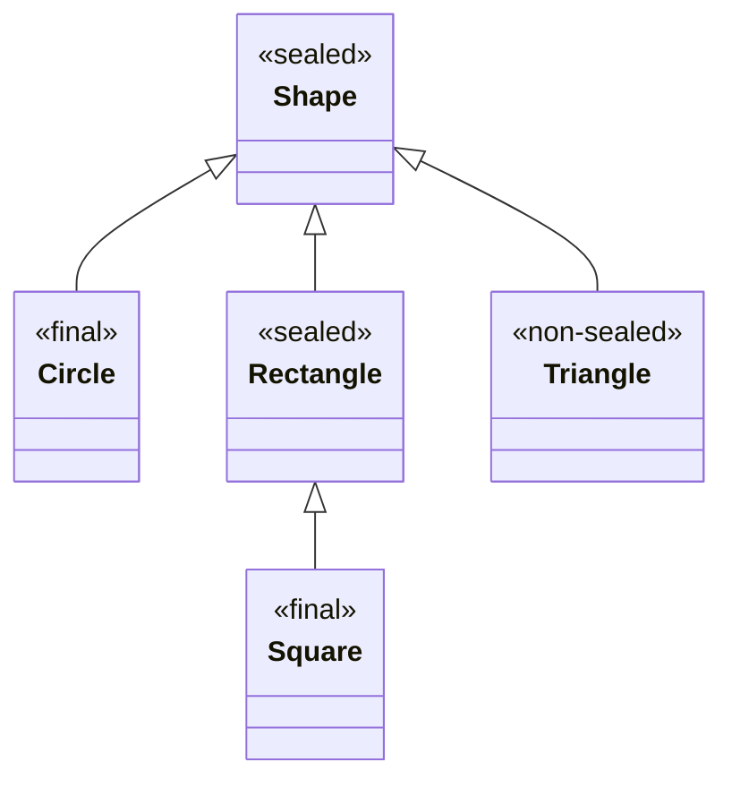

### **Sealed Classes in Java**

Sealed classes, introduced in **Java 15** (as a preview feature, finalized in Java 17), restrict which other classes or interfaces can extend or implement them. They help enforce a strict hierarchy and provide better control over the inheritance model.

---

### **Key Characteristics**

1. **Definition**:
    
    - A class or interface is declared as `sealed` using the `sealed` keyword.
    - It explicitly specifies the permitted subclasses or implementations.
2. **Permitted Subclasses**:
    
    - The `permits` clause lists the classes or interfaces allowed to extend or implement the sealed class/interface.
3. **Subclasses' Modifiers**: Permitted subclasses must declare one of the following:
    
    - `final`: No further subclassing.
    - `sealed`: To continue restricting the hierarchy.
    - `non-sealed`: To allow unrestricted subclassing beyond that point.
4. **Compilation Check**:
    
    - The compiler ensures that only the permitted subclasses extend or implement the sealed class/interface.

---

### **Syntax**

#### **Sealed Class**

```java
public sealed class Shape permits Circle, Rectangle, Triangle { }

final class Circle extends Shape { }

sealed class Rectangle extends Shape permits Square { }

non-sealed class Triangle extends Shape { }

final class Square extends Rectangle { }
```

---

### **Use Cases**

1. **Domain Modeling**:
    - Define strict hierarchies, such as in financial applications (e.g., Account types).
2. **Enhanced Pattern Matching**:
    - Combine with pattern matching to provide exhaustive switch-case logic.

---

### **Mermaid UML Diagram**

Here's a UML diagram illustrating the sealed class hierarchy:



---

### **Explanation of the Hierarchy**

1. `Shape` is a `sealed` class that permits three subclasses:
    
    - `Circle`: Declared as `final`, meaning no further subclassing.
    - `Rectangle`: Declared as `sealed`, allowing only `Square` as its subclass.
    - `Triangle`: Declared as `non-sealed`, meaning unrestricted subclassing is allowed.
2. `Square` is a `final` subclass of `Rectangle`, concluding the inheritance chain.
    

---

### **Code Example with Pattern Matching**

```java
public sealed class Shape permits Circle, Rectangle, Triangle {}

public final class Circle extends Shape {
    public double radius;
    public Circle(double radius) { this.radius = radius; }
}

public sealed class Rectangle extends Shape permits Square {
    public double length, width;
    public Rectangle(double length, double width) {
        this.length = length;
        this.width = width;
    }
}

public non-sealed class Triangle extends Shape {
    public double base, height;
    public Triangle(double base, double height) {
        this.base = base;
        this.height = height;
    }
}

public final class Square extends Rectangle {
    public Square(double side) {
        super(side, side);
    }
}

// Pattern Matching in Action
public class Main {
    public static void main(String[] args) {
        Shape shape = new Circle(5.0);
        
        String result = switch (shape) {
            case Circle c -> "Circle with radius: " + c.radius;
            case Rectangle r -> "Rectangle with dimensions: " + r.length + " x " + r.width;
            case Triangle t -> "Triangle with base: " + t.base + ", height: " + t.height;
        };
        
        System.out.println(result);
    }
}
```

---

### **Benefits**

1. **Controlled Inheritance**: Restricts who can extend or implement the sealed class/interface.
2. **Enhanced Readability**: Clear and explicit relationships in the hierarchy.
3. **Better Exhaustiveness Checking**: Especially useful with `switch` expressions and pattern matching.

Let me know if you'd like more examples or further clarification!