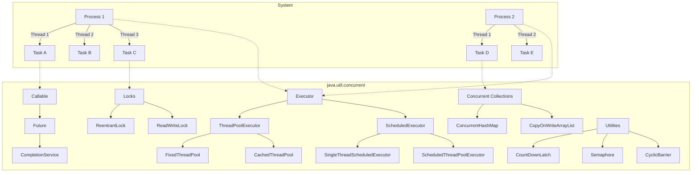

- concurrency :  executing tasks in the same time
- Multiple CPU (three chef working at the same time)
- single CPU multitasking (one  chef on his own preparing a meal)
- Multi threading separate part of your program can use independent threads 

Here's a table summarizing the advantages and disadvantages of concurrency in Java:

|**Aspect**|**Advantages**|**Disadvantages**|
|---|---|---|
|**Performance**|- Better CPU utilization by parallelizing tasks.|- Overhead due to thread creation and context switching.|
|**Responsiveness**|- Improves responsiveness in applications, particularly in GUI-based apps.|- Complexity in handling race conditions and deadlocks can lead to unresponsive applications.|
|**Scalability**|- Makes applications more scalable by effectively utilizing multi-core processors.|- Difficult to scale if not designed properly, leading to bottlenecks and resource contention.|
|**Resource Sharing**|- Allows multiple threads to share resources like memory and files, enabling efficient data processing.|- Risk of data inconsistency and corruption due to improper synchronization.|
|**Background Tasks**|- Enables running background tasks (e.g., garbage collection, logging) without interrupting the main application flow.|- Errors in background threads may go unnoticed, affecting application stability.|
|**Concurrency Utilities**|- Rich concurrency utilities in `java.util.concurrent` simplify implementation of thread-safe and parallel processing.|- Misusing these utilities can lead to performance degradation or unexpected behavior.|
|**Complexity**|- Supports advanced patterns like fork/join for parallel computation and asynchronous processing for non-blocking I/O.|- Increased complexity in debugging and testing concurrent code.|
|**Robustness**|- Java’s thread management and synchronization mechanisms (e.g., `synchronized`, `Lock`, `ExecutorService`) make it easier to handle threads.|- Poor handling can lead to resource leaks, starvation, or thread-safety issues.|
|**Development Time**|- Can reduce execution time for tasks that can be performed in parallel.|- Increases development time due to the need for careful design and testing.|
|**Error Handling**|- Mechanisms like thread groups and `Thread.UncaughtExceptionHandler` help manage errors in multithreaded environments.|- Errors can propagate silently if not properly handled, leading to inconsistent states or application crashes.|

Let me know if you’d like details on any specific point!

**Concurrency in Java** refers to the ability to run multiple tasks or threads simultaneously, enabling a program to make better use of resources like multi-core processors and provide efficient multitasking. It allows a Java application to perform multiple operations concurrently, such as handling multiple users, background tasks, or long-running computations.
Here’s a visual representation of Java's `java.util.concurrent` package and how processes and threads work in a system using a **Mermaid diagram**.

### **Mermaid Code**



---

### **Explanation**

1. **System (Processes and Threads)**:
    
    - Each process can have multiple threads performing different tasks concurrently.
    - In this diagram:
        - `Process 1` has three threads (`Thread 1`, `Thread 2`, `Thread 3`) executing tasks A, B, and C.
        - `Process 2` has two threads (`Thread 1` and `Thread 2`) executing tasks D and E.
2. **Java Concurrency Framework**:
    
    - **Executors**:
        
        - The `Executor` framework is the foundation of managing threads.
        - `ThreadPoolExecutor`: Manages thread pools.
            - `FixedThreadPool`: A pool with a fixed number of threads.
            - `CachedThreadPool`: Dynamically adjusts the number of threads.
        - `ScheduledExecutor`: Schedules tasks for future execution.
            - `SingleThreadScheduledExecutor`: A single-threaded executor for scheduled tasks.
            - `ScheduledThreadPoolExecutor`: A pool for scheduled tasks.
    - **Callables and Futures**:
        
        - `Callable` represents a task that returns a result.
        - `Future` represents the result of an asynchronous computation.
    - **Locks**:
        
        - `ReentrantLock`: Provides explicit lock control.
        - `ReadWriteLock`: Separates read and write locks for better concurrency.
    - **Concurrent Collections**:
        
        - Thread-safe collections like `ConcurrentHashMap` and `CopyOnWriteArrayList`.
    - **Utilities**:
        
        - `CountDownLatch`: Allows threads to wait for a condition.
        - `Semaphore`: Limits access to resources.
        - `CyclicBarrier`: Synchronizes threads at a common barrier point.

---

# Creating a Thread

- extend `Thread`
- implement ``Runnable``
- implement `Callable` (requires ExecutorService)

Here’s a Java code example demonstrating the creation of threads using the three different methods: extending `Thread`, implementing `Runnable`, and implementing `Callable`. Each approach is explained with comments.

```java
// Example: Creating Threads in Java

import java.util.concurrent.Callable;
import java.util.concurrent.ExecutorService;
import java.util.concurrent.Executors;
import java.util.concurrent.Future;

public class ThreadExamples {
    public static void main(String[] args) {
        // 1. Extending the Thread class
        class MyThread extends Thread {
            @Override
            public void run() {
                System.out.println("Thread running: " + Thread.currentThread().getName());
            }
        }

        MyThread thread1 = new MyThread();
        thread1.start(); // Start the thread

        // 2. Implementing the Runnable interface
        class MyRunnable implements Runnable {
            @Override
            public void run() {
                System.out.println("Runnable running: " + Thread.currentThread().getName());
            }
        }

        Thread thread2 = new Thread(new MyRunnable());
        thread2.start(); // Start the thread

        // 3. Implementing the Callable interface
        class MyCallable implements Callable<String> {
            @Override
            public String call() throws Exception {
                return "Callable executed on: " + Thread.currentThread().getName();
            }
        }

        // Use ExecutorService to manage Callable tasks
        ExecutorService executorService = Executors.newSingleThreadExecutor();
        Future<String> future = executorService.submit(new MyCallable());

        try {
            // Retrieve and print the result of the Callable
            String result = future.get();
            System.out.println(result);
        } catch (Exception e) {
            e.printStackTrace();
        } finally {
            executorService.shutdown(); // Shut down the ExecutorService
        }
    }
}
```

### Explanation

1. **Extending the `Thread` class**:
    
    - Create a class that extends `Thread`.
    - Override the `run()` method to define the task.
    - Instantiate and call `start()` to execute the thread.
2. **Implementing the `Runnable` interface**:
    
    - Create a class that implements `Runnable`.
    - Implement the `run()` method with the desired logic.
    - Use `Thread` to wrap the `Runnable` object and start the thread.
3. **Implementing the `Callable` interface**:
    
    - Create a class that implements `Callable<T>` (where `T` is the return type).
    - Implement the `call()` method to return a result or throw an exception.
    - Use `ExecutorService` to execute the `Callable` and retrieve results using `Future`.

# Sleep() and join()

Here’s a short summary:

- **`sleep()`**: Pauses the current thread for a specified time. It doesn’t release resources or wait for other threads.
    
    ```java
    Thread.sleep(1000);  // Sleep for 1 second
    ```
    
- **`join()`**: Makes the current thread wait until the specified thread finishes its execution.
    
    ```java
    thread.join();  // Wait for 'thread' to finish
    ```
    

In short:

- `sleep()` is used to pause a thread temporarily.
- `join()` is used to wait for another thread to complete.

# ExecutorService

### What is `ExecutorService`?

- It is part of the `java.util.concurrent` package.
- Provides a higher-level, more flexible framework for managing threads compared to manually creating and managing them.
- An implementation of the **Executor** interface that manages and controls thread execution.

---

### Key Features

- **Thread Management**: Simplifies thread lifecycle management (creation, execution, and termination).
- **Thread Pooling**: Reuses a pool of threads to execute tasks, reducing overhead of thread creation.
- **Task Submission**: Supports submitting tasks for execution using methods like `submit()` and `execute()`.
- **Scheduling**: Provides advanced scheduling features with `ScheduledExecutorService`.
- **Graceful Shutdown**: Offers methods to shut down the thread pool (`shutdown()` and `shutdownNow()`).

---

### Common Methods

- **`submit()`**: Submits a task (callable or runnable) and returns a `Future` object.
- **`execute()`**: Executes a runnable task but does not return a result.
- **`shutdown()`**: Initiates an orderly shutdown, disallowing new tasks but completing existing ones.
- **`shutdownNow()`**: Attempts to stop all tasks immediately.
- **`invokeAll()`**: Executes a collection of tasks and waits for all to complete.
- **`invokeAny()`**: Executes a collection of tasks and returns the result of one that completes first.

---
##  Future Interface

The **`Future`** interface in Java, part of the `java.util.concurrent` package, represents the result of an asynchronous computation. It's used with the **Executor Framework** to manage and retrieve results of tasks executed asynchronously. Here's a breakdown of its key aspects:
Here are the methods of the `Future` interface in a table format:

| **Method**                                      | **Description**                                                                               |
| ----------------------------------------------- | --------------------------------------------------------------------------------------------- |
| `boolean cancel(boolean mayInterruptIfRunning)` | Attempts to cancel the execution of the task.                                                 |
| `boolean isCancelled()`                         | Checks if the task was canceled before completion.                                            |
| `boolean isDone()`                              | Checks if the task is completed.                                                              |
| `V get()`                                       | Waits for the computation to complete and retrieves the result.                               |
| `V get(long timeout, TimeUnit unit)`            | Waits for at most the given timeout for the computation to complete and retrieves the result. |

### Types of Thread Pools (via `Executors` Factory Methods)

- **`newFixedThreadPool(n)`**: A pool with a fixed number of threads.
- **`newCachedThreadPool()`**: A pool with dynamically created threads for high-load tasks.
- **`newSingleThreadExecutor()`**: A single-threaded executor for sequential task execution.
- **`newScheduledThreadPool(n)`**: A pool for scheduling tasks at fixed rates or delays.

---

### Example Usage

```java
ExecutorService executorService = Executors.newFixedThreadPool(3);

executorService.submit(() -> {
    System.out.println("Task executed by: " + Thread.currentThread().getName());
});

executorService.shutdown();  // Gracefully shut down the executor
```

---

### Benefits

- Simplifies thread handling.
- Improves performance with thread reuse.
- Reduces risks of errors (e.g., deadlocks, resource leaks).

### Limitations

- Requires explicit shutdown to release resources.
- Misconfiguration of thread pools can lead to bottlenecks.

Would you like to see a specific use case?


# Atomic classes 

In Java, the **`atomic`** classes in the `java.util.concurrent.atomic` package provide low-level synchronization primitives that allow atomic (indivisible) operations on single variables or collections of variables. These classes are a key part of Java's concurrency model and help ensure thread safety without requiring explicit locks or synchronization.

---

### **Key Characteristics of Atomic Classes**

1. **Atomicity**:
    
    - Operations on atomic variables (e.g., increment, decrement, compare-and-set) are performed atomically, meaning they are uninterruptible and visible to other threads.
2. **Non-blocking**:
    
    - These classes use **compare-and-swap (CAS)** operations, which avoid traditional locking mechanisms, reducing contention and overhead.
3. **Thread-safe**:
    
    - They guarantee correct behavior when accessed by multiple threads concurrently.
4. **High Performance**:
    
    - The non-blocking nature of atomic operations often leads to better performance compared to using locks.

---

### **Common Atomic Classes**

Here are some commonly used atomic classes and their purposes:

#### 1. **Atomic Variables**

- **`AtomicInteger`**:
    
    - Provides atomic operations on integers.
    - Example methods: `incrementAndGet()`, `decrementAndGet()`, `addAndGet()`, `compareAndSet()`.
- **`AtomicLong`**:
    
    - Provides atomic operations on long integers.
    - Similar methods as `AtomicInteger`.
- **`AtomicBoolean`**:
    
    - Provides atomic operations on boolean values.
    - Methods: `get()`, `set()`, `compareAndSet()`.

#### 2. **Atomic Arrays**

- **`AtomicIntegerArray`**, **`AtomicLongArray`**, and **`AtomicReferenceArray`**:
    - Provide atomic operations on arrays of integers, longs, or object references.

#### 3. **Atomic References**

- **`AtomicReference<T>`**:
    
    - Provides atomic operations on objects.
    - Example: You can atomically update a reference to an object.
- **`AtomicStampedReference<T>`**:
    
    - Combines an object reference with a stamp (e.g., version number) to avoid the ABA problem.

#### 4. **Atomic Accumulators**

- **`LongAdder`** and **`DoubleAdder`**:
    - Designed for high-performance updates in scenarios with high contention. These accumulate values efficiently.
- **`LongAccumulator`** and **`DoubleAccumulator`**:
    - General-purpose accumulators where you can specify a custom function to combine values.

---

### **Key Methods in Atomic Classes**

#### 1. **`get()` and `set()`**

- Used to retrieve and update the value.

```java
AtomicInteger atomicInt = new AtomicInteger(10);
System.out.println(atomicInt.get()); // 10
atomicInt.set(20);
System.out.println(atomicInt.get()); // 20
```

#### 2. **`compareAndSet(expectedValue, newValue)`**

- Performs a **CAS operation**. Updates the value only if it matches the expected value.

```java
AtomicInteger atomicInt = new AtomicInteger(10);
boolean updated = atomicInt.compareAndSet(10, 15); // Returns true
System.out.println(atomicInt.get()); // 15
```

#### 3. **`incrementAndGet()` and `getAndIncrement()`**

- Atomically increments the value.

```java
AtomicInteger atomicInt = new AtomicInteger(10);
System.out.println(atomicInt.incrementAndGet()); // 11
System.out.println(atomicInt.getAndIncrement()); // 11 (returns the previous value)
```

#### 4. **`addAndGet(delta)` and `getAndAdd(delta)`**

- Adds a value to the current value atomically.

```java
AtomicInteger atomicInt = new AtomicInteger(10);
System.out.println(atomicInt.addAndGet(5)); // 15
```

---

### **Example: Using `AtomicInteger`**

```java
import java.util.concurrent.atomic.AtomicInteger;

public class AtomicExample {
    private static final AtomicInteger counter = new AtomicInteger(0);

    public static void main(String[] args) throws InterruptedException {
        Runnable task = () -> {
            for (int i = 0; i < 1000; i++) {
                counter.incrementAndGet(); // Atomic increment
            }
        };

        Thread thread1 = new Thread(task);
        Thread thread2 = new Thread(task);

        thread1.start();
        thread2.start();

        thread1.join();
        thread2.join();

        System.out.println("Final counter value: " + counter.get()); // Should be 2000
    }
}
```

---

### **ABA Problem**

The **ABA problem** occurs when a value changes from `A` to another value and back to `A`. While it looks unchanged, this may cause issues in certain scenarios.

**Solution**:

- Use **`AtomicStampedReference`**, which adds a version or timestamp to the reference.

```java
import java.util.concurrent.atomic.AtomicStampedReference;

public class AtomicStampedExample {
    public static void main(String[] args) {
        AtomicStampedReference<Integer> atomicRef = new AtomicStampedReference<>(10, 0);

        int[] stamp = new int[1];
        Integer currentValue = atomicRef.get(stamp);

        // Compare-and-swap using the current value and stamp
        boolean success = atomicRef.compareAndSet(10, 20, stamp[0], stamp[0] + 1);

        System.out.println("Update successful: " + success);
        System.out.println("New value: " + atomicRef.getReference());
        System.out.println("New stamp: " + atomicRef.getStamp());
    }
}
```

---

### **Advantages of Atomic Classes**

1. Simplifies synchronization for single variables.
2. Offers better performance than synchronized blocks in most cases.
3. Avoids explicit lock handling, reducing code complexity.
4. Useful for counters, flags, or shared objects in concurrent applications.

---

### **Limitations**

1. Limited to operations on single variables. For complex logic, explicit locks or higher-level constructs like `synchronized` or `ReentrantLock` may be needed.
2. Still susceptible to contention under heavy load.
3. Does not solve all concurrency problems; developers must carefully design thread-safe logic.

---

### **Conclusion**

Java's `atomic` classes are powerful tools for handling single-variable thread-safe operations. By leveraging non-blocking algorithms, they enable efficient and scalable solutions in multi-threaded environments. However, understanding their scope and limitations is essential for designing robust concurrent applications.


# Synchronized Java

The `synchronized` keyword in Java is used to control access to critical sections of code by multiple threads, ensuring that only one thread can execute the synchronized block or method at a time. This prevents race conditions and ensures thread safety.

### 1. **Instance Methods**

Marking an instance method as `synchronized` ensures that only one thread can execute any synchronized instance method of that object at a time.

#### Syntax:

```java
public synchronized void instanceMethod() {
    // Critical section
}
```

- **Lock Used**: The intrinsic lock (monitor) of the instance (`this`) is used.
- **Usage**: When you want to synchronize access to instance-specific shared resources.

#### Example:

```java
class SharedResource {
    public synchronized void display(String message) {
        System.out.print("[");
        try {
            Thread.sleep(100); // Simulate some work
        } catch (InterruptedException e) {
            e.printStackTrace();
        }
        System.out.println(message + "]");
    }
}
```

### 2. **Static Methods**

Marking a static method as `synchronized` ensures that only one thread can execute any synchronized static method of the class at a time.

#### Syntax:

```java
public static synchronized void staticMethod() {
    // Critical section
}
```

- **Lock Used**: The intrinsic lock (monitor) of the `Class` object representing the class is used.
- **Usage**: When you want to synchronize access to class-level shared resources.

#### Example:

```java
class SharedResource {
    public static synchronized void log(String message) {
        System.out.print("{");
        try {
            Thread.sleep(100); // Simulate some work
        } catch (InterruptedException e) {
            e.printStackTrace();
        }
        System.out.println(message + "}");
    }
}
```

### 3. **Synchronized Blocks**

You can synchronize a specific block of code within a method. This is more flexible and allows you to use custom locks, synchronize only part of the method, or optimize synchronization.

#### Syntax:

```java
public void method() {
    synchronized (lockObject) {
        // Critical section
    }
}
```

- **Lock Used**: Any object reference (`lockObject`) can be used as the lock.
- **Usage**: When you need fine-grained control over synchronization, such as synchronizing access to specific parts of the code or using multiple locks.

#### Example:

```java
class SharedResource {
    private final Object lock = new Object();

    public void display(String message) {
        synchronized (lock) {
            System.out.print("[");
            try {
                Thread.sleep(100); // Simulate some work
            } catch (InterruptedException e) {
                e.printStackTrace();
            }
            System.out.println(message + "]");
        }
    }
}
```

### 4. **Synchronization on `this`**

If you use `this` as the lock object in a synchronized block, it behaves similarly to synchronizing an instance method.

#### Syntax:

```java
public void method() {
    synchronized (this) {
        // Critical section
    }
}
```

- **Lock Used**: The intrinsic lock of the current instance.
- **Usage**: When you want to synchronize code on the current instance but not the entire method.

#### Example:

```java
class SharedResource {
    public void display(String message) {
        synchronized (this) {
            System.out.print("[");
            try {
                Thread.sleep(100);
            } catch (InterruptedException e) {
                e.printStackTrace();
            }
            System.out.println(message + "]");
        }
    }
}
```

### 5. **Synchronization on a Class Object**

If you use the `Class` object as the lock in a synchronized block, it behaves similarly to synchronizing a static method.

#### Syntax:

```java
public void method() {
    synchronized (SharedResource.class) {
        // Critical section
    }
}
```

- **Lock Used**: The intrinsic lock of the `Class` object.
- **Usage**: When you want to synchronize code at the class level but not the entire static method.

#### Example:

```java
class SharedResource {
    public void log(String message) {
        synchronized (SharedResource.class) {
            System.out.print("{");
            try {
                Thread.sleep(100);
            } catch (InterruptedException e) {
                e.printStackTrace();
            }
            System.out.println(message + "}");
        }
    }
}
```

### 6. **Reentrant Synchronization**

Java's intrinsic locks are **reentrant**, meaning a thread can acquire the same lock multiple times if needed.

#### Example:

```java
class SharedResource {
    public synchronized void outerMethod() {
        innerMethod();
    }

    public synchronized void innerMethod() {
        System.out.println("Inner method");
    }
}
```

Here, the `outerMethod` calls `innerMethod`. Since both methods are synchronized, the same thread can re-acquire the lock without blocking itself.

### Summary

|Use Case|Synchronization Type|Lock Used|
|---|---|---|
|Synchronize entire instance method|`synchronized` keyword in method|`this`|
|Synchronize entire static method|`synchronized` keyword in static method|`Class` object|
|Synchronize specific code block|`synchronized(lockObject)`|Custom lock object|
|Synchronize instance methods only|`synchronized (this)` in a block|`this`|
|Synchronize class methods only|`synchronized(ClassName.class)`|`Class` object|

Choose the appropriate method depending on whether the resource is shared at the instance or class level and how granular the synchronization needs to be.


## Lock  in Java

In Java, a **Lock** is a more advanced thread synchronization mechanism than the traditional synchronized keyword. Locks are part of the `java.util.concurrent.locks` package and provide greater flexibility in handling concurrent threads. Here's an overview:

---

### **What is a Lock?**

- **Definition**: A lock is a tool for controlling access to shared resources by multiple threads. It ensures that only one thread can access a critical section at a time.
- **Key Interface**: The primary interface for locks in Java is **`Lock`**, provided by the `java.util.concurrent.locks` package.
- **Key Implementations**:
    - **`ReentrantLock`**
    - **`ReentrantReadWriteLock`**

---

### **Key Methods of `Lock` Interface**

|**Method**|**Description**|
|---|---|
|`void lock()`|Acquires the lock, blocking the thread until the lock becomes available.|
|`void lockInterruptibly()`|Acquires the lock unless the thread is interrupted.|
|`boolean tryLock()`|Attempts to acquire the lock without blocking, returning `true` if successful.|
|`boolean tryLock(long time, TimeUnit unit)`|Attempts to acquire the lock, waiting for the specified time if necessary.|
|`void unlock()`|Releases the lock, allowing other threads to acquire it.|
|`Condition newCondition()`|Returns a `Condition` instance associated with the lock for thread communication.|

---

### **Using Locks in Java**

Locks are typically used in scenarios where:

1. **Explicit Lock Control**: You need finer control over locking mechanisms than what `synchronized` provides.
2. **Non-blocking Lock Acquisition**: You want to try acquiring a lock without waiting indefinitely.
3. **Fairness Policies**: You want to enforce fairness in thread scheduling.
4. **Interruptible Locking**: Threads should be able to respond to interrupts while waiting for a lock.

---

### **Example: Using `ReentrantLock`**

```java
import java.util.concurrent.locks.Lock;
import java.util.concurrent.locks.ReentrantLock;

public class LockExample {
    private final Lock lock = new ReentrantLock();

    public void criticalSection() {
        lock.lock(); // Acquire the lock
        try {
            System.out.println(Thread.currentThread().getName() + " is executing the critical section.");
            Thread.sleep(1000); // Simulate some work
        } catch (InterruptedException e) {
            e.printStackTrace();
        } finally {
            lock.unlock(); // Always release the lock in a finally block
        }
    }

    public static void main(String[] args) {
        LockExample example = new LockExample();

        Runnable task = example::criticalSection;

        Thread t1 = new Thread(task, "Thread 1");
        Thread t2 = new Thread(task, "Thread 2");

        t1.start();
        t2.start();
    }
}
```

**Output** (order may vary):

```
Thread 1 is executing the critical section.
Thread 2 is executing the critical section.
```

---

### **ReentrantLock**

- **Reentrancy**: A thread that already holds the lock can acquire it again without deadlock.
- **Fairness**: `ReentrantLock` can be constructed with a fairness policy to grant locks to the longest-waiting thread (`new ReentrantLock(true)`).

---

### **`ReentrantReadWriteLock`**

- Used when you have read-heavy operations.
- **Read Lock**: Allows multiple threads to read simultaneously as long as no thread is writing.
- **Write Lock**: Only one thread can write at a time, and no reads are allowed during writing.

---

### **Advantages of Lock over `synchronized`**

|**Feature**|**Lock**|**`synchronized`**|
|---|---|---|
|Non-blocking acquisition|Yes (via `tryLock()`)|No|
|Interruptible locking|Yes (via `lockInterruptibly()`)|No|
|Condition variables|Yes (via `newCondition()`)|Limited (`wait()`/`notify()`)|
|Fairness|Yes (optional in `ReentrantLock`)|No|
|Explicit locking and unlocking|Required (with `lock()`/`unlock()`)|Automatic|

---

### **Key Considerations**

- Always use `unlock()` in a `finally` block to ensure the lock is released even if an exception occurs.
- Use locks when more flexibility or advanced features (e.g., fairness, conditions) are needed.
- Overuse of locks can lead to **deadlocks**, **starvation**, or **livelocks**; ensure proper design to avoid these issues.