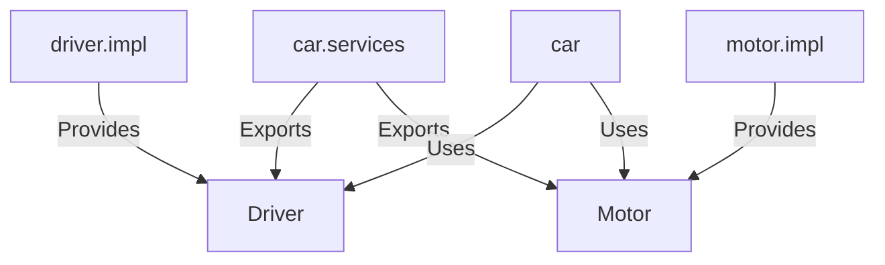
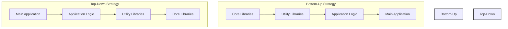

# Java modules  command


In Java, the `java` command-line tool includes a `--module` option to support the **Java Platform Module System** introduced in Java 9. This system allows developers to group related classes and interfaces into modules for better encapsulation and maintainability. Modules also help control dependencies and reduce runtime overhead.

### **`java` Command with `--module`**

The `--module` option specifies the module and optionally the class within the module to execute. For example:

```bash
java --module moduleName/mainClass
```

This command instructs the Java launcher to run the specified `mainClass` in the given `moduleName`.

---

### **Key Options for Module Commands**

|**Option**|**Description**|
|---|---|
|`--module`|Specifies the module to execute. The syntax is `moduleName/className`.|
|`--module-path` or `-p`|Specifies the location of module definitions. Similar to the `-classpath` option but designed for modules.|
|`--add-modules`|Includes additional modules in the application that are not resolved by default.|
|`--list-modules`|Lists all available modules in the runtime image or those specified by `--module-path`.|
|`--describe-module`|Provides detailed information about a specific module (e.g., `--describe-module moduleName`).|
|`--add-reads`|Allows one module to read another module explicitly. The syntax is `moduleName=otherModuleName`.|
|`--add-exports`|Exports a package from one module to another module. The syntax is `moduleName/package=otherModuleName`.|
|`--patch-module`|Replaces or augments classes in a module with classes from a given JAR or directory.|
|`--limit-modules`|Restricts the modules resolved by the module system to those specified.|
|`--show-module-resolution`|Displays detailed information about how the module system resolves dependencies during startup.|

---

### **Example Usage**

1. **Running a Modular Application:**
    
    ```bash
    java --module-path mods --module com.example.app/com.example.Main
    ```
    
2. **Listing Available Modules:**
    
    ```bash
    java --list-modules
    ```
    
3. **Describing a Module:**
    
    ```bash
    java --describe-module java.base
    ```
    

The modular system provides flexibility and control over dependencies, making it a key feature for large-scale Java applications.

# Modular Jar


A **modular JAR** is a JAR file that includes a **module descriptor** (`module-info.class`) in its root directory. This descriptor defines the module's name, dependencies, and other metadata, making the JAR file part of the **Java Platform Module System** introduced in Java 9.

### **Key Characteristics of a Modular JAR**

1. **Module Descriptor**:
    
    - Located in the root of the JAR file.
    - Compiled from a `module-info.java` file.
    - Defines the module's metadata, such as:
        - Module name.
        - Dependencies on other modules (`requires`).
        - Packages to export (`exports`).
        - Services provided or consumed (`provides`/`uses`).
2. **Compatibility**:
    
    - A modular JAR can still be used as a regular (non-modular) JAR in Java 8 or earlier because the module descriptor is ignored by these versions.
3. **Improved Encapsulation**:
    
    - Modular JARs allow developers to control which packages are accessible to other modules, reducing unintended usage of internal APIs.
4. **Resolution in Module Path**:
    
    - A modular JAR is resolved as a module when placed in the `module-path`.
    - If placed in the `classpath`, it behaves like a traditional JAR file.

---

### **Structure of a Modular JAR**

Example: A modular JAR file for a `com.example.app` module.

```
com.example.app.jar
├── META-INF/
│   └── MANIFEST.MF
├── module-info.class
└── com/example/app/
    ├── Main.class
    └── Utils.class
```

---

### **`module-info.java` Example**

Here is a sample `module-info.java` file for a module:

```java
module com.example.app {
    requires java.base;          // Declares dependency on the java.base module (implicit for all modules).
    exports com.example.app.api; // Exports a package for other modules to use.
    uses com.example.app.Service; // Declares that this module uses a service.
    provides com.example.app.Service with com.example.app.impl.ServiceImpl; // Provides a service implementation.
}
```

When compiled, it becomes `module-info.class` and is included in the root of the JAR.

---

### **Benefits of Modular JARs**

1. **Strong Encapsulation**:
    
    - Exposes only the necessary packages, protecting internal implementations.
2. **Clear Dependencies**:
    
    - Dependencies are explicitly declared, reducing runtime errors.
3. **Reduced Startup Time**:
    
    - The module system resolves only the required modules, skipping unused ones.
4. **Scalability**:
    
    - Helps manage complex applications with many interdependent components.

---

### **Creating a Modular JAR**

1. Write a `module-info.java` file for your module.
2. Compile the module:
    
    ```bash
    javac -d mods/com.example.app src/com.example.app/module-info.java src/com.example.app/**/*.java
    ```
    
3. Package it into a JAR:
    
    ```bash
    jar --create --file=mods/com.example.app.jar --module-version=1.0 -C mods/com.example.app .
    ```
    

Now, `com.example.app.jar` is a modular JAR file that can be used with the `module-path`.


Here’s a comprehensive list of all possible directives that can be used in a `module-info.java` file, covering every functionality, including **module relationships**, **exports**, **opens**, and **service-related directives**.

---

### **Directives in `module-info.java`**

#### 1. **Module Declaration**

```java
module <module-name> {
    // Other directives
}
```

Defines the module and serves as the container for all other directives.

---

#### 2. **Dependencies**

- **`requires`**: Specifies a module dependency.
    
    ```java
    requires <module-name>;
    ```
    
- **`requires transitive`**: Exposes the dependency to consumers of this module.
    
    ```java
    requires transitive <module-name>;
    ```
    
- **`requires static`**: Specifies an optional dependency that is only required at compile-time, not runtime.
    
    ```java
    requires static <module-name>;
    ```
    

---

#### 3. **Exporting Packages**

- **`exports`**: Makes a package accessible to all modules.
    
    ```java
    exports <package-name>;
    ```
    
- **`exports ... to`**: Makes a package accessible only to specific modules.
    
    ```java
    exports <package-name> to <module-name1>, <module-name2>;
    ```
    

---

#### 4. **Opening Packages**

- **`opens`**: Makes a package accessible for reflection to all modules (used by frameworks like Jackson, Hibernate, etc.).
    
    ```java
    opens <package-name>;
    ```
    
- **`opens ... to`**: Restricts reflective access to specific modules.
    
    ```java
    opens <package-name> to <module-name1>, <module-name2>;
    ```
    

---

#### 5. **Services**

- **`uses`**: Declares that the module consumes a service.
    
    ```java
    uses <fully-qualified-service-class>;
    ```
    
- **`provides ... with`**: Declares that the module provides an implementation of a service.
    
    ```java
    provides <fully-qualified-service-class> with <fully-qualified-implementation-class>;
    ```
    

---

#### 6. **Allowing Reflection and Deep Access**

- **`opens`**: Opens a package for deep reflection (explained earlier).
    
- **`exports` vs. `opens`**:
    
    - `exports` exposes the package for use by other modules but does not allow reflection.
    - `opens` allows reflection but does not expose the package for normal use by other modules.

---

#### 7. **Additional Options**

- **`module version`**: (Optional) Add version information (not enforced by the JVM).
    
    ```java
    module <module-name> @1.0 {
        // Directives
    }
    ```
    
- **`limit modules`**: (Specified via command-line, not in `module-info.java`) Restricts the modules available at runtime.
    

---

### **Complete Example**

Here’s a `module-info.java` file that combines all possible functionalities:

```java
module com.example.app {
    // Dependencies
    requires java.base;                    // Implicit for all modules
    requires java.sql;                     // Requires java.sql module
    requires static com.example.logging;   // Optional compile-time dependency
    requires transitive com.example.utils; // Exposes com.example.utils to consumers

    // Exported Packages
    exports com.example.app.api;           // Publicly accessible package
    exports com.example.app.internal to com.example.tests; // Restricted to specific module

    // Opened Packages
    opens com.example.app.model;           // Accessible for reflection by all
    opens com.example.app.config to com.example.framework; // Reflective access for specific module

    // Service Usage
    uses com.example.service.MyService;    // Consumes MyService

    // Service Provision
    provides com.example.service.MyService with com.example.impl.MyServiceImpl; // Provides MyService implementation
}
```

---

### **Summary of All Keywords**

|**Keyword**|**Purpose**|
|---|---|
|`module`|Declares the module name.|
|`requires`|Specifies a dependency on another module.|
|`requires transitive`|Exposes a dependency to consumers of this module.|
|`requires static`|Marks a compile-time-only dependency.|
|`exports`|Makes a package accessible to all modules.|
|`exports ... to`|Makes a package accessible to specific modules.|
|`opens`|Makes a package accessible for reflection to all modules.|
|`opens ... to`|Makes a package accessible for reflection to specific modules.|
|`uses`|Declares that the module consumes a service.|
|`provides ... with`|Declares that the module provides an implementation for a service.|

This exhaustive breakdown ensures you understand the full potential of `module-info.java`.


# Operation in a Module

Here’s a detailed explanation of the operations and tools related to Java modules:

---

## **1. Packaging a Module**

### **Creating and Executing a Modular JAR**

1. **Structure**:
    
    - A module requires a `module-info.java` file in its root directory.
    - Example structure for `com.example.module`:
        
        ```
        src/
        └── com.example.module/
            ├── module-info.java
            └── com/example/module/
                └── Main.java
        ```
        
2. **Compilation**: Compile the module with `javac`, specifying the module source path:
    
    ```bash
    javac -d out --module-source-path src $(find src -name "*.java")
    ```
    
    - `-d out`: Specifies the output directory.
    - `--module-source-path src`: Defines the root directory for module source files.
3. **Packaging**: Create a JAR file using `jar`:
    
    ```bash
    jar --create --file=module.jar --main-class=com.example.module.Main -C out .
    ```
    
    - `--main-class`: Specifies the main class (optional if not executable).
    - `-C out .`: Packages the compiled files from the `out` directory.
4. **Execution**: Run the JAR using `java`:
    
    ```bash
    java --module-path . --module com.example.module
    ```
    
    - `--module-path .`: Specifies the directory containing the JAR.
    - `--module com.example.module`: Indicates the module to execute.

---

## **2. Describing a Module**

### **Java Source Level Description (`module-info.java`)**:

- Defines the module's name, exports, and dependencies.

```java
module com.example.module {
    exports com.example.module.api;   // Makes this package accessible
    requires java.sql;               // Depends on the java.sql module
}
```

### **JAR-Level Description**:

- A modular JAR contains the `module-info.class` file at its root.
- Use `jar --describe-module` to view module details:
    
    ```bash
    jar --describe-module --file=module.jar
    ```
    
    Output includes:
    - Module name
    - Exports
    - Dependencies (`requires`)

---

## **3. Discovering Module Dependencies with `jdeps`**

The `jdeps` tool analyzes dependencies of Java classes or modules.

### **Basic Usage**:

```bash
jdeps --module-path . --module com.example.module
```

- `--module-path`: Specifies where to find the modules.
- `--module`: Analyzes the specified module.

### **Outputs**:

- **Classes** and **modules** that the target depends on.
- Example:
    
    ```
    com.example.module -> java.base
    com.example.module -> java.sql
    ```
    

### **Dependency Analysis Options**:

- List **packages**:
    
    ```bash
    jdeps --list-deps module.jar
    ```
    
- Show **class-level dependencies**:
    
    ```bash
    jdeps --verbose:class module.jar
    ```
    
- Generate dependency summary for a module:
    
    ```bash
    jdeps --generate-module-info out-dir module.jar
    ```
    

---

## **4. Working with `jmod`**

The `jmod` tool creates a `.jmod` file, an alternative to `.jar`, used for modular applications.

### **Key Characteristics**:

- **Includes native libraries**: `.so`, `.dll`, or `.dylib` files.
- **Not executable**: Unlike a JAR, a `.jmod` file cannot be run with the `java` command.
- **Custom runtime images**: Designed for use with the `jlink` tool to build custom Java runtime images.

### **Creating a JMOD File**:

```bash
jmod create --class-path out --module-version 1.0 com.example.module.jmod
```

- `--class-path out`: Specifies the compiled classes.
- `--module-version 1.0`: Assigns a version to the module.

### **Viewing Contents of a `.jmod` File**:

```bash
jmod describe com.example.module.jmod
```

### **Typical Use Case with `jlink`**:

- Combine `.jmod` files to build a custom runtime image:
    
    ```bash
    jlink --module-path $JAVA_HOME/jmods:. --add-modules com.example.module --output custom-runtime
    ```
    
- `--add-modules`: Includes specified modules in the runtime.
- `--output`: Specifies the output directory for the runtime image.

---

### **Summary**

|**Operation**|**Tool**|**Purpose**|
|---|---|---|
|Packaging a module|`javac`, `jar`|Compile and package a module as a modular JAR.|
|Describing a module|`module-info.java`, `jar`|Define module dependencies and view details of a modular JAR.|
|Discovering dependencies|`jdeps`|Analyze dependencies of a module or JAR file.|
|Creating a `.jmod` file|`jmod`|Package native libraries and module resources; used with `jlink` for runtime images.|
|Building runtime images|`jlink`|Create a custom Java runtime containing only the required modules.|

This modular approach ensures encapsulation, dependency management, and optimized runtime environments.


# Services 

Let's use the **cars** example to illustrate **Java services with modules**. The car needs services like a **Driver** and **Motor**, and we'll implement these using Java modules.

---

### **Designing the Example**

1. **Service Interface**:
    
    - `Driver` and `Motor` are the interfaces that define the required behavior for car-related operations.
2. **Service Providers**:
    
    - Modules like `driver.impl` and `motor.impl` provide implementations for the `Driver` and `Motor` services.
3. **Service Consumer**:
    
    - The `car` module consumes the `Driver` and `Motor` services to assemble and operate the car.
4. **Module Descriptors (`module-info.java`)**:
    
    - Used to declare the relationships between modules (e.g., `requires`, `uses`, and `provides`).

---

### **Step-by-Step Implementation**

#### **1. Define the Service Interfaces**

Create a module named `car.services` that exports the interfaces.

**`car.services/module-info.java`:**

```java
module car.services {
    exports com.example.car.driver;
    exports com.example.car.motor;
}
```

**`car.services/com/example/car/driver/Driver.java`:**

```java
package com.example.car.driver;

public interface Driver {
    String drive();
}
```

**`car.services/com/example/car/motor/Motor.java`:**

```java
package com.example.car.motor;

public interface Motor {
    String start();
}
```

---

#### **2. Provide Implementations**

##### **Driver Implementation**

Create a module named `driver.impl` that provides an implementation of `Driver`.

**`driver.impl/module-info.java`:**

```java
module driver.impl {
    requires car.services;

    provides com.example.car.driver.Driver
        with com.example.car.driver.impl.AutoDriver;
}
```

**`driver.impl/com/example/car/driver/impl/AutoDriver.java`:**

```java
package com.example.car.driver.impl;

import com.example.car.driver.Driver;

public class AutoDriver implements Driver {
    @Override
    public String drive() {
        return "Driving with AutoDriver";
    }
}
```

##### **Motor Implementation**

Create a module named `motor.impl` that provides an implementation of `Motor`.

**`motor.impl/module-info.java`:**

```java
module motor.impl {
    requires car.services;

    provides com.example.car.motor.Motor
        with com.example.car.motor.impl.ElectricMotor;
}
```

**`motor.impl/com/example/car/motor/impl/ElectricMotor.java`:**

```java
package com.example.car.motor.impl;

import com.example.car.motor.Motor;

public class ElectricMotor implements Motor {
    @Override
    public String start() {
        return "Starting with ElectricMotor";
    }
}
```

---

#### **3. Consume the Services**

Create a module named `car` that uses the `Driver` and `Motor` services.

**`car/module-info.java`:**

```java
module car {
    requires car.services;

    uses com.example.car.driver.Driver;
    uses com.example.car.motor.Motor;
}
```

**`car/com/example/car/Main.java`:**

```java
package com.example.car;

import com.example.car.driver.Driver;
import com.example.car.motor.Motor;

import java.util.ServiceLoader;

public class Main {
    public static void main(String[] args) {
        ServiceLoader<Driver> drivers = ServiceLoader.load(Driver.class);
        ServiceLoader<Motor> motors = ServiceLoader.load(Motor.class);

        drivers.findFirst().ifPresent(driver -> System.out.println(driver.drive()));
        motors.findFirst().ifPresent(motor -> System.out.println(motor.start()));
    }
}
```

---

### **How It Works**

1. **`ServiceLoader`**:
    
    - The `car` module dynamically loads the `Driver` and `Motor` implementations at runtime.
    - The `findFirst` method retrieves the first available provider for each service.
2. **Decoupling**:
    
    - The `car` module does not know which specific implementations of `Driver` or `Motor` are being used. It only depends on the interfaces.

---

### **Mermaid Diagram Representation**



---

### **Output Example**

If you run the `car` module, the output will be:

```
Driving with AutoDriver
Starting with ElectricMotor
```

---

### **Advantages**

1. **Dynamic Service Loading**:
    
    - The car can dynamically switch between different implementations of `Driver` or `Motor`.
2. **Loose Coupling**:
    
    - The `car` module only depends on the `Driver` and `Motor` interfaces, not their implementations.
3. **Extensibility**:
    
    - Additional drivers (e.g., `ManualDriver`) or motors (e.g., `GasMotor`) can be added as separate modules without modifying the `car` module.

Would you like to explore adding multiple providers or prioritizing them?


# Types of module Java


### **1. Named Modules**

- **Definition**: Modules with a specific name defined in a `module-info.java` file.
- **Features**:
    - Explicitly declared and well-structured.
    - Includes metadata about dependencies (`requires`) and exported packages (`exports`).
    - Helps in encapsulating and organizing code.
- **Example**:
    
    java
    
    Copy code
    
    `// module-info.java module com.example.myapp {     requires java.sql;     exports com.example.myapp.service; }`
    
- **Usage**:
    - The `module-info.java` file is mandatory.
    - Named modules can depend on other named modules by using `requires`.

---

### **2. Unnamed Modules**

- **Definition**: Legacy JARs or code not packaged as a module but placed on the **classpath**.
    
- **Features**:
    
    - Acts as a catch-all module.
    - Reads all other modules and exports all its packages by default.
    - Ensures backward compatibility with non-modular Java code.
- **How It Works**:
    
    - Any JAR or class file on the **classpath** becomes part of the unnamed module.
    - Unnamed modules are compatible with both modular and non-modular code.
- **Limitations**:
    
    - Cannot `require` other modules.
    - Packages in unnamed modules cannot be explicitly exported.

---

### **3. Automatic Modules**

- **Definition**: JAR files that are placed on the **module path** but lack a `module-info.java` file.
    
- **Features**:
    
    - Automatically converted into modules by inferring the module name from the JAR filename.
    - They can read all other modules and export all their packages by default.
    - A stepping stone for transitioning legacy code to a modular architecture.
- **Example**: Suppose you have a JAR file named `mylibrary.jar` and place it in the module path:
    
    - The inferred module name would be `mylibrary`.
    - You can declare `requires mylibrary;` in other modules.
- **Advantages**:
    
    - Helps integrate legacy libraries into a modular application without immediate changes.
    - Provides backward compatibility.
- **Limitations**:
    
    - Less control compared to named modules.
    - Automatically exposes all packages, potentially breaking encapsulation.

---

### Summary of Key Differences:

|**Feature**|**Named Modules**|**Unnamed Modules**|**Automatic Modules**|
|---|---|---|---|
|**Definition**|Declared in `module-info.java`.|Classes/JARs on classpath.|JARs on module path without `module-info.java`.|
|**Encapsulation**|Controlled with `exports`.|No control over exports.|All packages exported by default.|
|**Dependencies**|Explicit `requires`.|Cannot declare dependencies.|Implicitly reads all modules.|
|**Usage**|Fully modular.|Legacy code.|Transitional for legacy JARs.|

Would you like more detailed examples or guidance on transitioning legacy code to a modular system?

# Migration strategies

In **Java module migration**, two common strategies are **Bottom-Up** and **Top-Down**. These strategies help transition legacy Java applications to use the Java Module System.

---

### **1. Bottom-Up Migration**

- **Approach**: Start with the **lowest-level dependencies** (e.g., utility libraries) and move upward to higher-level modules.
- **Use Case**: Suitable when you have control over the codebase, and lower-level libraries are stable and reusable.
- **Advantages**:
    - Builds a strong foundation by modularizing core components first.
    - Higher-level modules benefit immediately from the encapsulation and structure.
- **Challenges**:
    - Progress may be slow if low-level libraries are extensive or complex.
You can use `jdeps` to generate module.info.java
---

### **2. Top-Down Migration**

- **Approach**: Start with the **main application module** (the entry point) and work downward to modularize its dependencies.
- **Use Case**: Ideal for large applications where higher-level modules need immediate modular benefits, even if some dependencies remain non-modular.
- **Advantages**:
    - Faster to see results in the main application.
    - Gradual adoption of the module system.
- **Challenges**:
    - May require more effort to deal with non-modular dependencies.
    - Potential for incomplete encapsulation if lower modules remain unnamed or automatic.

---

### **Mermaid Graph Illustration**

Below is a **Mermaid diagram** illustrating both strategies:



---

### **Implementation Example**

#### **Bottom-Up Example**

1. Modularize utility libraries (e.g., `com.example.util`):
    
    ```java
    module com.example.util {
        exports com.example.util;
    }
    ```
    
2. Refactor application logic to use `com.example.util`.
3. Modularize the main application after completing the dependencies.

#### **Top-Down Example**

1. Start with the main application:
    
    ```java
    module com.example.app {
        requires com.example.logic;
    }
    ```
    
2. Gradually refactor the application logic and its dependencies into modules.

---

Would you like detailed implementation steps for either strategy?