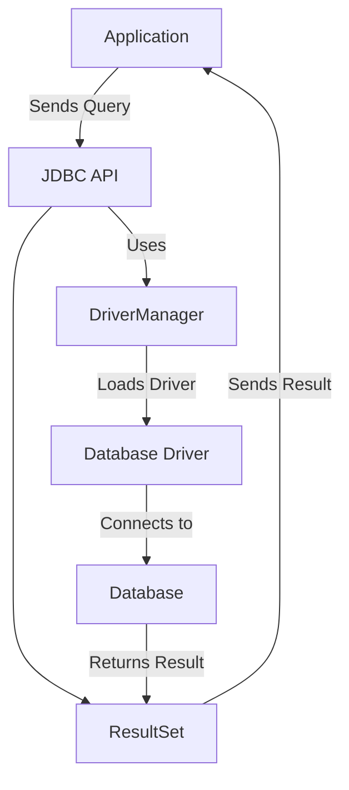
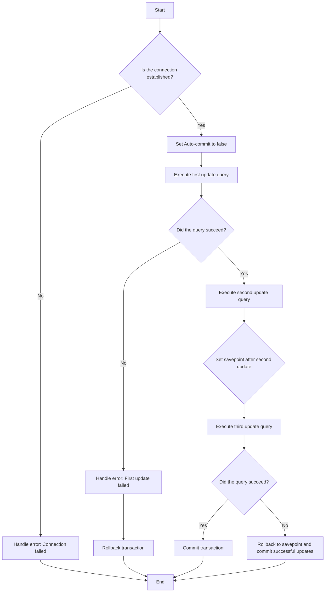

![[Java JDBC Cheatsheet for Java 17 OCP Exam.png]]

- [[#Flow of the process:|Flow of the process:]]
- [[#Java Example with Different Query Execution Methods|Java Example with Different Query Execution Methods]]
- [[#Explanation of the Different SQL Execution Methods:|Explanation of the Different SQL Execution Methods:]]
- [[#Key Points:|Key Points:]]
- [[#Key Methods of `ResultSet`:|Key Methods of `ResultSet`:]]
- [[#Other Important Methods:|Other Important Methods:]]
- [[#Example of Using `ResultSet` to Exploit Data|Example of Using `ResultSet` to Exploit Data]]
- [[#Explanation of the Code:|Explanation of the Code:]]
- [[#Other Ways to Exploit `ResultSet`:|Other Ways to Exploit `ResultSet`:]]
- [[#Conclusion:|Conclusion:]]
- [[#Explanation of the Changes:|Explanation of the Changes:]]
- [[#Types of Metadata in JDBC|Types of Metadata in JDBC]]
	- [[#Types of Metadata in JDBC#1. Database Metadata (`DatabaseMetaData`)|1. Database Metadata (`DatabaseMetaData`)]]
		- [[#1. Database Metadata (`DatabaseMetaData`)#Key Methods of `DatabaseMetaData`:|Key Methods of `DatabaseMetaData`:]]
		- [[#1. Database Metadata (`DatabaseMetaData`)#Example of `DatabaseMetaData` usage:|Example of `DatabaseMetaData` usage:]]
	- [[#Types of Metadata in JDBC#2. ResultSet Metadata (`ResultSetMetaData`)|2. ResultSet Metadata (`ResultSetMetaData`)]]
		- [[#2. ResultSet Metadata (`ResultSetMetaData`)#Key Methods of `ResultSetMetaData`:|Key Methods of `ResultSetMetaData`:]]
		- [[#2. ResultSet Metadata (`ResultSetMetaData`)#Example of `ResultSetMetaData` usage:|Example of `ResultSetMetaData` usage:]]
- [[#Benefits of Using Metadata in JDBC|Benefits of Using Metadata in JDBC]]
- [[#Conclusion|Conclusion]]
- [[#Benefits of Batch Processing:|Benefits of Batch Processing:]]
- [[#How to Use Batch Processing in JDBC|How to Use Batch Processing in JDBC]]
- [[#Example Code|Example Code]]
- [[#Key Steps in the Example:|Key Steps in the Example:]]
- [[#Conclusion|Conclusion]]


# JDBC architecture


Here’s a breakdown of each part of the JDBC architecture:

1. **Application**:
    
    - This is the software application that needs to interact with the database. It can be a Java application or any system that requires data retrieval or manipulation from a database.
2. **JDBC API**:
    
    - The JDBC (Java Database Connectivity) API is the interface that allows the application to interact with the database using Java. It provides a set of classes and methods that enable the sending of SQL queries and retrieval of results. The JDBC API is part of the `java.sql` package in Java.
3. **DriverManager**:
    
    - The `DriverManager` class manages a list of database drivers. It is responsible for establishing a connection between the application and the database by selecting the appropriate driver from the available list.
    - The `DriverManager` is used to load and connect to the specific database driver that matches the database the application is using (e.g., MySQL, PostgreSQL, Oracle, etc.).
4. **Database Driver**:
    
    - The database driver is a piece of software that enables the Java application to communicate with the database. It translates Java calls into database-specific calls. There are different types of drivers:
        - Type 1: JDBC-ODBC bridge driver (deprecated)
        - Type 2: Native API driver
        - Type 3: Network protocol driver
        - Type 4: Thin driver (most commonly used)
5. **Database**:
    
    - The database is where the actual data is stored. It can be any relational database system like MySQL, PostgreSQL, Oracle, etc. Once the query is sent through the driver, the database processes the request and returns the appropriate results.
6. **ResultSet**:
    
    - The `ResultSet` object is returned by the JDBC API after executing a query. It contains the data fetched from the database. The `ResultSet` object allows the application to iterate through the retrieved data, row by row, and access it using column names or indexes.
7. **Return to Application**:
    
    - After the `ResultSet` has been populated with the database results, it is sent back to the application. The application can then use the data for further processing, like displaying it to the user or using it in business logic.

### Flow of the process:

- The application sends a query to the JDBC API.
- The JDBC API interacts with the `DriverManager`, which selects the appropriate database driver.
- The driver establishes a connection to the database.
- The SQL query is sent to the database, and the database processes the request.
- The database sends the results back to the application in the form of a `ResultSet`.
- The application can then retrieve and use the data from the `ResultSet`.

This is the standard flow in JDBC for querying and retrieving data from a relational database.


# SQL exection 
Here’s an example of how to execute different types of SQL queries (e.g., `SELECT`, `INSERT`, `UPDATE`, and `DELETE`) using different methods provided by JDBC. Each query type requires a different approach in terms of how the SQL is executed and how the results are handled.

### Java Example with Different Query Execution Methods

```java
import java.sql.*;

public class JdbcExample {

    public static void main(String[] args) {
        // Database URL, username, and password
        String url = "jdbc:mysql://localhost:3306/mydatabase";  // Replace with your database URL
        String username = "root";  // Replace with your database username
        String password = "password";  // Replace with your database password

        // Connection object
        Connection conn = null;

        try {
            // 1. Establish connection to the database
            conn = DriverManager.getConnection(url, username, password);
            System.out.println("Connected to the database!");

            // 2. Create a statement object for SQL execution
            Statement stmt = conn.createStatement();

            // ---- SELECT QUERY (Retrieving Data) ----
            String selectSql = "SELECT id, name FROM employees";
            ResultSet rs = stmt.executeQuery(selectSql);  // Using executeQuery() for SELECT queries

            // Processing the result of SELECT query
            while (rs.next()) {
                int id = rs.getInt("id");  // Get 'id' column value
                String name = rs.getString("name");  // Get 'name' column value
                System.out.println("ID: " + id + ", Name: " + name);
            }
            rs.close();  // Close ResultSet

            // ---- INSERT QUERY (Inserting Data) ----
            String insertSql = "INSERT INTO employees (name) VALUES ('John Doe')";
            int rowsAffectedInsert = stmt.executeUpdate(insertSql);  // Using executeUpdate() for INSERT, UPDATE, DELETE queries
            System.out.println("Rows affected (INSERT): " + rowsAffectedInsert);

            // ---- UPDATE QUERY (Updating Data) ----
            String updateSql = "UPDATE employees SET name = 'Jane Smith' WHERE id = 1";
            int rowsAffectedUpdate = stmt.executeUpdate(updateSql);  // Using executeUpdate() for UPDATE queries
            System.out.println("Rows affected (UPDATE): " + rowsAffectedUpdate);

            // ---- DELETE QUERY (Deleting Data) ----
            String deleteSql = "DELETE FROM employees WHERE id = 2";
            int rowsAffectedDelete = stmt.executeUpdate(deleteSql);  // Using executeUpdate() for DELETE queries
            System.out.println("Rows affected (DELETE): " + rowsAffectedDelete);

            // 3. Close the statement
            stmt.close();

        } catch (SQLException e) {
            // Handle SQL exceptions
            e.printStackTrace();
        } finally {
            try {
                // 4. Close the connection
                if (conn != null) {
                    conn.close();
                }
            } catch (SQLException e) {
                e.printStackTrace();
            }
        }
    }
}
```

### Explanation of the Different SQL Execution Methods:

1. **SELECT Query (Retrieve Data)**:
    
    - **Method Used**: `executeQuery()`
    - This method is used when executing `SELECT` queries, which return data.
    - The result of the query is returned as a `ResultSet`, and you can iterate through it to access the data.
    - **Example**: `SELECT id, name FROM employees`
2. **INSERT Query (Insert Data)**:
    
    - **Method Used**: `executeUpdate()`
    - This method is used for `INSERT`, `UPDATE`, and `DELETE` queries, which modify the database.
    - The method returns an integer indicating the number of rows affected by the query.
    - **Example**: `INSERT INTO employees (name) VALUES ('John Doe')`
3. **UPDATE Query (Update Data)**:
    
    - **Method Used**: `executeUpdate()`
    - Similar to the `INSERT` query, `executeUpdate()` is used for `UPDATE` queries.
    - This method returns the number of rows affected by the update.
    - **Example**: `UPDATE employees SET name = 'Jane Smith' WHERE id = 1`
4. **DELETE Query (Delete Data)**:
    
    - **Method Used**: `executeUpdate()`
    - This method is also used for `DELETE` queries, and it returns the number of rows affected by the deletion.
    - **Example**: `DELETE FROM employees WHERE id = 2`

### Key Points:

- **`executeQuery()`** is used for SQL queries that return data, such as `SELECT`. It returns a `ResultSet` that contains the result.
- **`executeUpdate()`** is used for SQL queries that modify the database (e.g., `INSERT`, `UPDATE`, `DELETE`). It returns an integer indicating the number of rows affected by the operation.
- Always **close** the `ResultSet`, `Statement`, and `Connection` objects to free up resources after executing queries.

This example provides a simple and clear demonstration of how to execute different types of SQL queries with JDBC in Java.

# Understanding `ResultSet` in JDBC

In JDBC, a `ResultSet` represents the result of executing a query that retrieves data from the database. It holds the data returned by a `SELECT` SQL query. The `ResultSet` allows you to read the data and process it in various ways, such as iterating through the rows and extracting column values.

### Key Methods of `ResultSet`:

- **`next()`**: Moves the cursor to the next row in the result set. It returns `true` if there is another row to process and `false` when the end of the result set is reached.
- **`getInt(String columnName)` / `getInt(int columnIndex)`**: Retrieves an integer value from the specified column (either by column name or index).
- **`getString(String columnName)` / `getString(int columnIndex)`**: Retrieves a string value from the specified column.
- **`getDouble(String columnName)`**: Retrieves a double value from the specified column.
- **`getDate(String columnName)`**: Retrieves a `Date` object for a date column.
- **`getObject(String columnName)`**: Retrieves an object for a column if the type is unknown or if the column can hold different types of data.

### Other Important Methods:

- **`first()`**: Moves the cursor to the first row of the result set.
- **`last()`**: Moves the cursor to the last row of the result set.
- **`absolute(int row)`**: Moves the cursor to the specified row number.
- **`getMetaData()`**: Returns a `ResultSetMetaData` object that provides information about the columns in the result set (e.g., column names, types, etc.).

### Example of Using `ResultSet` to Exploit Data

Let's walk through a code example to explain how to use `ResultSet` and its methods.

```java
import java.sql.*;

public class ResultSetExample {

    public static void main(String[] args) {
        String url = "jdbc:mysql://localhost:3306/mydatabase";  // Database URL
        String username = "root";  // Database username
        String password = "password";  // Database password

        // SQL query
        String sql = "SELECT id, name, salary, hire_date FROM employees";

        Connection conn = null;
        Statement stmt = null;
        ResultSet rs = null;

        try {
            // 1. Establish the connection
            conn = DriverManager.getConnection(url, username, password);
            System.out.println("Connected to the database!");

            // 2. Create statement object
            stmt = conn.createStatement();

            // 3. Execute the query and get the result set
            rs = stmt.executeQuery(sql);

            // 4. Iterate through the result set
            while (rs.next()) {
                int id = rs.getInt("id");  // Get 'id' column value
                String name = rs.getString("name");  // Get 'name' column value
                double salary = rs.getDouble("salary");  // Get 'salary' column value
                Date hireDate = rs.getDate("hire_date");  // Get 'hire_date' column value

                // Display the retrieved data
                System.out.println("ID: " + id + ", Name: " + name + ", Salary: " + salary + ", Hire Date: " + hireDate);
            }

            // 5. Other ResultSet operations:
            // Move the cursor to the last row
            rs.last();
            System.out.println("\nLast row:");
            System.out.println("ID: " + rs.getInt("id") + ", Name: " + rs.getString("name"));

            // Move the cursor to the first row
            rs.first();
            System.out.println("\nFirst row:");
            System.out.println("ID: " + rs.getInt("id") + ", Name: " + rs.getString("name"));

        } catch (SQLException e) {
            e.printStackTrace();
        } finally {
            try {
                // 6. Close the resources
                if (rs != null) rs.close();
                if (stmt != null) stmt.close();
                if (conn != null) conn.close();
            } catch (SQLException e) {
                e.printStackTrace();
            }
        }
    }
}
```

### Explanation of the Code:

1. **Connection Setup**:
    
    - We establish a connection to the database using `DriverManager.getConnection()`. Ensure to replace the database URL, username, and password with your actual database credentials.
2. **Execute the SQL Query**:
    
    - We create a `Statement` object and execute a `SELECT` SQL query using `stmt.executeQuery(sql)`. This returns a `ResultSet` object that contains the result of the query.
3. **Iterate Through `ResultSet`**:
    
    - The `while (rs.next())` loop allows us to iterate through the result set row by row. The `next()` method moves the cursor to the next row in the result set.
    - We use various methods such as `getInt()`, `getString()`, `getDouble()`, and `getDate()` to retrieve column values based on their names.
4. **Access First and Last Rows**:
    
    - After iterating through the result set, we demonstrate how to move the cursor to the first and last rows using `rs.first()` and `rs.last()`.
    - We then print the data from the first and last rows to demonstrate how to access specific rows after the iteration.
5. **Closing Resources**:
    
    - Finally, we close the `ResultSet`, `Statement`, and `Connection` objects to release database resources. It’s a good practice to close resources in a `finally` block to ensure they are always closed, even if an exception occurs.

### Other Ways to Exploit `ResultSet`:

- **Metadata Retrieval**: You can use `ResultSetMetaData` to get information about the columns dynamically, such as their names and types. Here's an example:
    
    ```java
    ResultSetMetaData metaData = rs.getMetaData();
    int columnCount = metaData.getColumnCount();
    for (int i = 1; i <= columnCount; i++) {
        String columnName = metaData.getColumnName(i);
        String columnType = metaData.getColumnTypeName(i);
        System.out.println("Column " + i + ": " + columnName + " (" + columnType + ")");
    }
    ```
    
- **Scrolling Results**: By default, the `ResultSet` is forward-only. However, you can create a `ResultSet` with scrollable capabilities using `Statement` options like `ResultSet.TYPE_SCROLL_INSENSITIVE` or `ResultSet.TYPE_SCROLL_SENSITIVE`:
    
    ```java
    Statement stmt = conn.createStatement(ResultSet.TYPE_SCROLL_INSENSITIVE, ResultSet.CONCUR_READ_ONLY);
    ```
    
    This allows you to move the cursor backward or randomly within the result set.
    
- **Updating Results**: If your `ResultSet` is updatable (created with `ResultSet.CONCUR_UPDATABLE`), you can modify the data in the result set and then update the database:
    
    ```java
    rs.updateString("name", "Updated Name");
    rs.updateRow();  // Updates the current row in the database
    ```
    

### Conclusion:

`ResultSet` is a powerful object for navigating and extracting data from a query result. You can use it to read values of different data types, move the cursor, and even update the database when appropriate. Always ensure to close your resources (like `ResultSet`, `Statement`, and `Connection`) to avoid potential memory leaks and database connection issues.


# Transaction 
Here's the updated JDBC code with the addition of a **Savepoint** to provide finer control over rolling back to a certain point in the transaction, rather than rolling back the entire transaction.
-  atomicity
- savepoint
- rollback

```java
import java.sql.*;

public class TransactionWithSavepointExample {

    public static void main(String[] args) {
        // Database connection details
        String url = "jdbc:mysql://localhost:3306/mydatabase";
        String user = "root";
        String password = "password";

        // SQL queries to simulate a transaction
        String sqlUpdate1 = "UPDATE accounts SET balance = balance - 100 WHERE account_id = 1";
        String sqlUpdate2 = "UPDATE accounts SET balance = balance + 100 WHERE account_id = 2";
        String sqlUpdate3 = "UPDATE accounts SET balance = balance - 50 WHERE account_id = 3"; // This will fail intentionally

        // Connection and Statement objects
        Connection connection = null;
        Statement statement = null;

        try {
            // Step 1: Establish a connection to the database
            connection = DriverManager.getConnection(url, user, password);
            
            // Step 2: Disable auto-commit mode for transaction control
            connection.setAutoCommit(false);

            // Step 3: Create a statement object to execute the SQL queries
            statement = connection.createStatement();

            // Step 4: Execute the first update query
            int rowsAffected1 = statement.executeUpdate(sqlUpdate1);
            System.out.println("Rows affected by first update: " + rowsAffected1);

            // Step 5: Execute the second update query
            int rowsAffected2 = statement.executeUpdate(sqlUpdate2);
            System.out.println("Rows affected by second update: " + rowsAffected2);

            // Step 6: Set a savepoint after the second update
            Savepoint savepoint = connection.setSavepoint("AfterSecondUpdate");

            // Step 7: Execute the third update query (which will fail intentionally)
            int rowsAffected3 = statement.executeUpdate(sqlUpdate3);
            System.out.println("Rows affected by third update: " + rowsAffected3);

            // Step 8: Commit the transaction if all updates succeed
            connection.commit();
            System.out.println("Transaction committed successfully.");

        } catch (SQLException e) {
            // Step 9: In case of an error, rollback to the savepoint
            try {
                if (connection != null) {
                    connection.rollback(); // Rollback to the savepoint
                    System.out.println("Rolled back to savepoint after the third update failure.");
                    connection.commit(); // Commit the successful changes made before the savepoint
                }
            } catch (SQLException ex) {
                ex.printStackTrace();
            }

            // Print the error details
            e.printStackTrace();
        } finally {
            // Step 10: Close the resources
            try {
                if (statement != null) {
                    statement.close();
                }
                if (connection != null) {
                    connection.close();
                }
            } catch (SQLException e) {
                e.printStackTrace();
            }
        }
    }
}
```

### Explanation of the Changes:

1. **Savepoint Creation**:
    
    - After the second update (`sqlUpdate2`), a **Savepoint** is set using `connection.setSavepoint("AfterSecondUpdate")`. This marks a point in the transaction where we can later choose to roll back to if something goes wrong.
2. **Rollback to Savepoint**:
    
    - If an exception occurs after setting the savepoint, instead of rolling back the entire transaction, we can roll back to the savepoint with `connection.rollback(savepoint)`. This undoes only the operations after the savepoint, preserving the changes made up to that point.
3. **Committing the Transaction**:
    
    - If everything executes correctly, the transaction is committed.
    - If an error occurs after the savepoint, the rollback to the savepoint ensures that only successful operations before the error are kept.
4. **Simulating Failure**:
    
    - The third SQL update (`sqlUpdate3`) is designed to fail (e.g., if `account_id = 3` does not exist), triggering the rollback to the savepoint.

This approach gives you flexibility in handling partial failures within a transaction, allowing you to commit only the parts that are successful and roll back to a point where you know the state was valid.



# Metadata in JDBC

In JDBC (Java Database Connectivity), **metadata** refers to data that describes other data. Essentially, metadata provides information about the structure and characteristics of the database, its tables, columns, and other elements. JDBC allows you to retrieve metadata through specific classes and interfaces, such as `DatabaseMetaData` and `ResultSetMetaData`.

Metadata is useful because it enables you to dynamically discover details about the database and adjust your SQL queries or application logic accordingly, without hardcoding specific information like table names or column data types. This is particularly helpful in dynamic or flexible database applications.

### Types of Metadata in JDBC

JDBC provides two main types of metadata:

1. **Database Metadata (`DatabaseMetaData`)**
2. **ResultSet Metadata (`ResultSetMetaData`)**

#### 1. Database Metadata (`DatabaseMetaData`)

`DatabaseMetaData` provides detailed information about the database itself, including information about its capabilities, the structure of its tables, and more. It allows you to query for general properties of the database.

##### Key Methods of `DatabaseMetaData`:

- **`getDatabaseProductName()`**: Returns the name of the database product (e.g., MySQL, PostgreSQL).
- **`getDatabaseProductVersion()`**: Returns the version of the database product.
- **`getDriverName()`**: Returns the name of the JDBC driver used to connect to the database.
- **`getDriverVersion()`**: Returns the version of the JDBC driver.
- **`getURL()`**: Returns the URL of the database to which the connection was established.
- **`getUserName()`**: Returns the current username in use for the connection.

##### Example of `DatabaseMetaData` usage:

```java
Connection conn = DriverManager.getConnection(url, username, password);
DatabaseMetaData metaData = conn.getMetaData();

System.out.println("Database Product: " + metaData.getDatabaseProductName());
System.out.println("Database Version: " + metaData.getDatabaseProductVersion());
System.out.println("JDBC Driver: " + metaData.getDriverName());
System.out.println("JDBC Driver Version: " + metaData.getDriverVersion());
System.out.println("Database URL: " + metaData.getURL());
```

This metadata is helpful for understanding the characteristics of the database you are working with, especially if you're interacting with different types of databases and need to adjust your application logic accordingly.

#### 2. ResultSet Metadata (`ResultSetMetaData`)

`ResultSetMetaData` provides metadata about the `ResultSet` object. It helps you to discover information about the structure of the result set returned by a query, such as the number of columns, column names, and their data types. This is essential for working with `ResultSet` dynamically.

##### Key Methods of `ResultSetMetaData`:

- **`getColumnCount()`**: Returns the number of columns in the result set.
- **`getColumnName(int columnIndex)`**: Returns the name of the column at the given index.
- **`getColumnType(int columnIndex)`**: Returns the SQL type of the column (e.g., `VARCHAR`, `INTEGER`).
- **`getColumnTypeName(int columnIndex)`**: Returns the type name of the column as defined in the database (e.g., `VARCHAR`, `INT`).
- **`getColumnLabel(int columnIndex)`**: Returns the label (or alias) for the column, if any.

##### Example of `ResultSetMetaData` usage:

```java
Connection conn = DriverManager.getConnection(url, username, password);
Statement stmt = conn.createStatement();
ResultSet rs = stmt.executeQuery("SELECT id, name, salary FROM employees");

ResultSetMetaData rsMetaData = rs.getMetaData();
int columnCount = rsMetaData.getColumnCount();
for (int i = 1; i <= columnCount; i++) {
    System.out.println("Column " + i + ": " + rsMetaData.getColumnName(i)
                       + " (" + rsMetaData.getColumnTypeName(i) + ")");
}
```

In this example:

- `getColumnCount()` is used to find the number of columns in the result set.
- `getColumnName()` and `getColumnTypeName()` help in printing the name and type of each column dynamically, without hardcoding the column names.

This metadata is especially useful when you don't know the structure of the result set in advance, allowing you to work with dynamic queries or databases with varying schemas.

---

### Benefits of Using Metadata in JDBC

1. **Dynamic Query Building**: Metadata allows you to build dynamic queries based on the structure of the database. You don't need to hardcode values like table names, column names, or types, which makes your code more flexible.
    
2. **Database Independence**: You can write code that adapts to different database systems by using `DatabaseMetaData` to retrieve information about the underlying database. This helps avoid issues when porting your application to a different DBMS (e.g., switching from MySQL to PostgreSQL).
    
3. **Error Prevention**: By using metadata, you reduce the risk of hardcoding errors (like incorrect column names or data types), as you can query the database's actual schema for the necessary information.
    
4. **Ease of Integration**: Metadata can be useful for integrating with tools and frameworks that require access to the database schema, such as ORM frameworks, reporting tools, and ETL pipelines.
    
5. **Improved Data Handling**: With `ResultSetMetaData`, you can handle the result set dynamically and adjust your processing logic based on column types and names, making your data handling more adaptable.
    

---

### Conclusion

Metadata in JDBC allows you to retrieve essential information about the database and result sets. The two primary types of metadata—`DatabaseMetaData` and `ResultSetMetaData`—enable dynamic, flexible, and database-agnostic programming. By leveraging these features, you can make your Java database applications more robust, adaptable, and efficient.


# Batch Processing in JDBC

**Batch processing** in JDBC is used to execute a group of SQL statements in a single batch, reducing the number of database calls and improving performance. Instead of executing each SQL statement individually, batch processing sends multiple statements to the database at once, which minimizes network traffic and overhead.

### Benefits of Batch Processing:

- **Performance Improvement**: Reduces the number of round trips between the application and the database.
- **Efficiency**: Allows the database to optimize the execution of multiple statements together.
- **Resource Conservation**: Decreases the amount of time the application holds a connection to the database.

### How to Use Batch Processing in JDBC

1. **Create a `Statement` or `PreparedStatement`**.
2. **Add SQL queries to the batch using `addBatch()`**.
3. **Execute the batch using `executeBatch()`**.
4. **Handle results** (e.g., number of affected rows).

### Example Code

```java
import java.sql.*;

public class BatchProcessingExample {
    public static void main(String[] args) {
        String url = "jdbc:mysql://localhost:3306/mydb";
        String username = "root";
        String password = "password";

        String sql1 = "INSERT INTO employees (name, salary) VALUES ('John', 50000)";
        String sql2 = "INSERT INTO employees (name, salary) VALUES ('Alice', 60000)";
        String sql3 = "UPDATE employees SET salary = 70000 WHERE name = 'Bob'";

        try (Connection conn = DriverManager.getConnection(url, username, password);
             Statement stmt = conn.createStatement()) {

            // Start the batch
            stmt.addBatch(sql1);
            stmt.addBatch(sql2);
            stmt.addBatch(sql3);

            // Execute the batch
            int[] updateCounts = stmt.executeBatch();

            // Process the results
            System.out.println("Batch processed. Affected rows:");
            for (int count : updateCounts) {
                System.out.println(count);
            }

        } catch (SQLException e) {
            e.printStackTrace();
        }
    }
}
```

### Key Steps in the Example:

1. **Establish a Connection**: Use `DriverManager.getConnection()` to connect to the database.
2. **Create a Statement**: A `Statement` object is created to hold and execute SQL queries.
3. **Add Queries to the Batch**: Use `addBatch()` to add multiple SQL queries to the batch.
4. **Execute the Batch**: Call `executeBatch()` to send the batch of SQL queries to the database. It returns an array of update counts for each query.
5. **Handle Results**: The results are processed to check how many rows were affected by each statement in the batch.

### Conclusion

Batch processing in JDBC allows you to execute multiple SQL statements efficiently, reducing the overhead and improving performance, especially when handling large volumes of data. It is particularly useful in scenarios like bulk inserts, updates, or deletes.